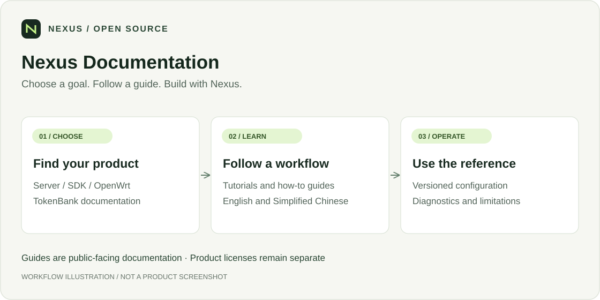

<div align="center">

# Nexus Documentation

**Choose a goal. Follow a guide. Build with Nexus.**

[](https://pypi.org/project/nexilume/)
[](LICENSE)
[](https://cloud.nexilume.com/)
[](https://nexilume-ai.github.io/nexus-docs/en/)
[](#citation)
[](https://github.com/Nexilume-AI/nexus-docs/actions/workflows/ci.yml)

`Guides` · `English / Chinese` · `Docusaurus`

**English** · [Chinese](README_zh.md)

[Highlights](#highlights) · [Quick start](#quick-start) · [Documentation](#documentation) · [Ecosystem](#ecosystem) · [Contributing](#contributing) · [Citation](#citation)

</div>

> **[Try Nexus Cloud online](https://cloud.nexilume.com/)**: Explore Nexus Cloud in your browser, or self-host to get started.

User guides, tutorials and reference material for Nexus Server, OpenWrt, the Python SDK and TokenBank, in English and Simplified Chinese.



*Workflow illustration, not a product screenshot. Connections require the setup and authorization described below.*

## Product walkthrough

**Live Enterprise capture · October 1, 2026.** Follow a Python Agent from an inline
question to a private Markdown output. The Docker-hosted example uses deterministic
logic, not an external model; no personal device is attached.


<details>
<summary>Preview the output</summary>


</details>

[Capture notes and reproducible source](docs/media/capture-notes.md). These are
real screenshots, not mockups. Enterprise menus and commercial features are not
included in Community merely because their documentation appears here.

## Highlights

| Reader | Start here |
| --- | --- |
| **Cloud operator** | [Server guides](docs-server) |
| **Agent developer** | [Python SDK guides](docs-sdk) |
| **Edge operator** | [OpenWrt guides](docs-openwrt) |
| **TokenBank user** | [TokenBank documentation](docs-tokenbank) |
| **Documentation contributor** | [Build and hosting reference](README_GUIDE.md) |

This repository contains documentation and examples, **not** the Server or TokenBank application source. Enterprise documentation does not make Enterprise implementation part of Community.

## Quick start

To build the documentation site locally, use Node.js 22 LTS and Python 3.12+:

```sh
npm ci --ignore-scripts
npm run check:docs
npm start
```

Open the address printed by Docusaurus. Use `npm run start:en` for English. No Cloud account, database or private source checkout is required for a normal docs build.

The Python SDK is published as [`nexilume`](https://pypi.org/project/nexilume/); import it as `nexus_agent`. Install the core SDK:

```sh
python -m pip install --upgrade nexilume
```

See [SDK installation](docs-sdk/quickstart/installation.md) for extras, migration from the older wheel and Computer setup.

## Documentation

The guides cover both English and Simplified Chinese. Historical versions are kept separately: check the version of the installed component before applying a command.

| Task | Where to go |
| --- | --- |
| Read source guides | Server / SDK / OpenWrt / TokenBank links above |
| Build the static site | [Local build](README_GUIDE.md#run-locally) |
| Publish behind your own domain | [Hosting](README_GUIDE.md#hosting) |
| Refresh SDK API references | [Maintenance](README_GUIDE.md#sdk-documentation-maintenance) |
| Follow contribution rules | [Contributing](CONTRIBUTING.md) |

Read the published site in [English](https://nexilume-ai.github.io/nexus-docs/en/) or [Simplified Chinese](https://nexilume-ai.github.io/nexus-docs/). Self-hosted deployments configure `DOCS_URL` and `DOCS_BASE_URL`; repository paths remain usable without a live website.

## Ecosystem

| Project | Role | Install separately? |
| --- | --- | --- |
| [Nexus Cloud](https://github.com/Nexilume-AI/nexus-cloud) | Server, Web Console and bundled Cloud Relay | Main workspace |
| [Python SDK](https://github.com/Nexilume-AI/nexus-agent-sdk-python) | Agent applications and outbound Computer Runtime | Yes |
| [OpenWrt](https://github.com/Nexilume-AI/nexus-openwrt) | Edge registration and capability routing | Optional |
| [Mobile](https://github.com/Nexilume-AI/nexus-mobile) | Authorized Android device integration | Optional |
| [Documentation](https://github.com/Nexilume-AI/nexus-docs) | User guides and reference | Read online or build locally |

Repository access, release availability and compatibility determine which integrations you can install. Cloud installation does not install device runtimes.

## Contributing

Start with [CONTRIBUTING.md](CONTRIBUTING.md). Small reproducible fixes, clearer tutorials, translations and sanitized examples are welcome. Use [Issues](https://github.com/Nexilume-AI/nexus-docs/issues) for reproducible bugs; include versions and redacted diagnostics, never credentials or private files.

Follow [SECURITY.md](SECURITY.md) for security reports. Release checks and CI are not a guarantee of production readiness on every platform.

## Citation

If Nexus supports your research or engineering work, please cite the technical report below, rather than the software repository. [CITATION.cff](CITATION.cff) provides the same report metadata through `preferred-citation`.

Nexilume Research. *Nexus: An Execution Fabric for AI Agents Across Cloud, Edge, and Devices*. Technical Report NX-SYS-2026-001, September 2026.

```bibtex
@techreport{nexilume2026nexus,
  author      = {{Nexilume Research}},
  title       = {{Nexus}: An Execution Fabric for {AI} Agents Across Cloud, Edge, and Devices},
  institution = {Nexilume Research},
  type        = {Technical Report},
  number      = {NX-SYS-2026-001},
  year        = {2026},
  month       = sep
}
```

## License

Nexus-authored source is distributed under [Apache License 2.0 (modified)](LICENSE). Third-party components retain their own licenses and notices. Documentation does not grant rights to separately distributed Enterprise implementation.

### Licensing conditions

Nexus is licensed under a modified version of the Apache License 2.0, with the following additional conditions. Multi-tenant service operation and removal of existing Nexus UI branding require prior written authorization. Earlier Apache-2.0 grants and third-party licenses remain unchanged. Contributions require explicit agreement permitting commercial use and future relicensing. See [LICENSING.md](LICENSING.md). Authorization contact: **cary.nexilume@outlook.com**.
