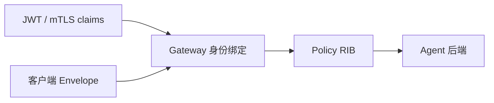

# Envelope、身份与认证边界

Envelope 把“如何路由”与“业务要处理什么”分开。SDK 帮你构造和传输 Envelope，但 Router 才是身份与策略的最终执行者。

## 路由头与业务载荷

典型字段包括：

- `intent`、`intent_version`：选择能力契约；
- `task_id`：一次逻辑任务的稳定身份；
- `source_agent`、`tenant`：调用主体上下文；
- `target_agent`：可选的精确路由约束；
- `hop_limit`、deadline、constraints：传播和资源边界；
- payload：业务数据，控制面不解析其语义。

MCP tool 和 A2A skill 也被适配为同一模型，因此路由行为可以跨协议保持一致。

## 谁可以相信哪些字段

调用方可以表达想调用的 intent、target、约束和 payload，但不能通过自报 tenant/source 获得身份。`agent-gw` 验证 JWT/mTLS 后，用 claims 覆盖这些字段。后端收到的是身份绑定后的 Envelope，也不会收到客户端原始 `Authorization` 或 transaction token。

## 三种 token 使用方式

- 固定 access token：简单，但轮换需要外部管理。
- `TokenProvider`：可在请求前提供 token；refreshable provider 遇到一次 401 时强制刷新并只重试一次。
- transaction token：绑定一次任务，不能与 access token/provider 同时使用，也不能用于需要重连的可恢复流。

401 映射为 `NexusAuthenticationError`，表示凭证缺失或无效；403 映射为 `NexusAuthorizationError`，表示身份有效但权限不足。不要把两者统一捕获后提示“网络故障”。

## TLS 身份与连接地址

连接 IP 与证书身份可以不同。`tls_server_name` 允许连接数值 IPv6，同时按指定 DNS SAN 验证证书；它只接受 HTTPS。直接 IPv6 helper 默认禁用环境代理，避免把 IPv6 literal 意外交给普通 HTTP proxy。

纯 HTTP 直接模式不接受 TLS 参数，也不会自动添加 token；它只适合已明确受控的网络边界。公共 Agent endpoint 若声明 HTTPS，SDK 会同时校验地址、端口、TLS 名称和 CA bundle 元数据完整性。

## 应用层仍需验证输入

认证证明“谁在调用”，不证明 payload 对业务安全。Server 可以启用 `input_validator`，验证失败返回 422 `INPUT_REJECTED`。业务处理器仍需做 schema、长度、权限细分和副作用控制。

配置方法见[认证指南](../guides/authentication.md)与[直接 IPv6](../guides/direct-ipv6.md)。
