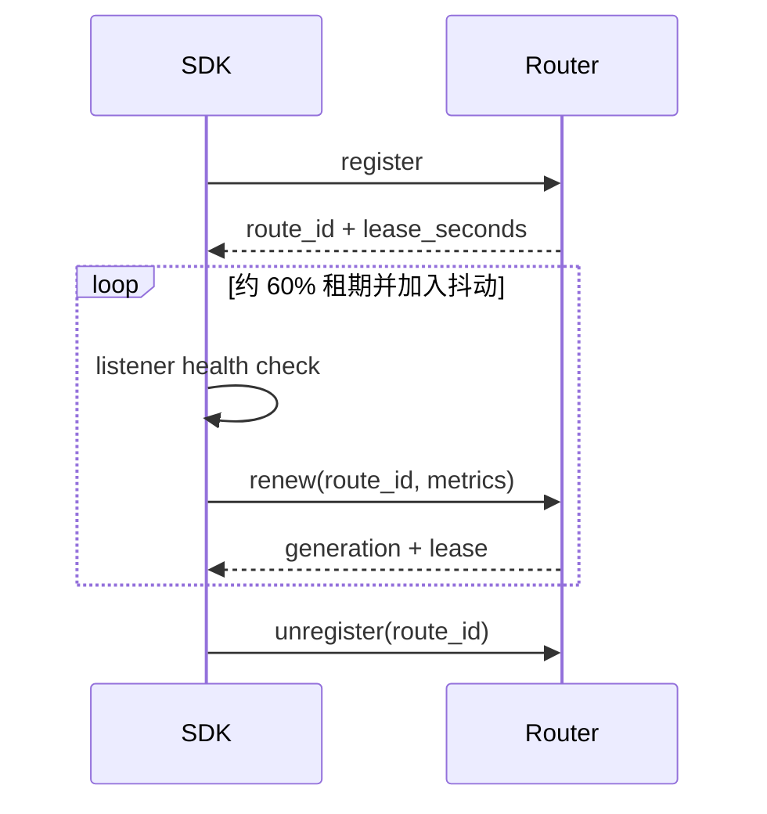

# 注册、续租与自愈

发布能力不是向目录写一条永久记录，而是建立一份需要持续续约的路由租约。SDK 用 `AgentLease` 把 route ID、续租线程、健康检查、自愈和退出撤销聚合为一个生命周期对象。

## 注册对象描述什么

`CapabilityRegistration` 包含 intent、origin、endpoint、tenant、版本、region、租期，以及成本、延迟、负载、信任、公共 IPv6 和可选后端 TLS 身份。Router 校验后返回 `LeaseInfo`：route ID、generation、实际租期、撤销状态和可能分配的公共 endpoint。

高层 `@agent.capability` 和 `@agent.stream_capability` 最终都会生成这样的注册对象。同步与流式处理器可以共享同一 intent，但声明的路由选项必须一致。

## 自动续租时间线

`renew_fraction` 必须在 0.2 到 0.8 之间，默认 0.6。每轮加入 0.9 到 1.1 的随机比例，避免所有 Agent 在同一秒续租。网络失败采用有上限的指数退避，并保留 `last_error` 供操作者查看。

## 健康失败为何主动撤销

当 health callback 返回 false 或抛出异常，续租线程会尝试 unregister、记录失败次数并停止。继续续租一个已知不健康的服务会让 Router 把请求发向故障处理器，因此 SDK 选择关闭式下线。

## Router 重启后的自愈

Router 可能重启并丢失内存 lease。健康 Agent 下一次 renew 收到 404 时，SDK 默认用原始注册信息重新 register，得到新的 route ID，并增加 `reregister_count`。更新后的 latency/load 会带入新注册。

如果 renew 明确报告 `healthy=False`，或 SDK 没有原始注册对象，则不会重新注册。这条边界防止自愈掩盖业务故障。

## 资源所有权

`with client.register(...) as lease` 会在退出上下文时注销。`NexusAgentHandle.close()` 逆序关闭所有 lease、停止 Server 并等待线程退出；重复 close 是安全的。异常退出无法执行清理时，Router 的 lease expiration 是最后兜底。

## 运维指标

至少观察 `route_id`、`lease_seconds`、`last_error`、`reregister_count`、`health_check_failures` 和 Router generation。不要把“进程仍在”当作健康，也不要依赖无限租期。

完整字段见[API 参考](../reference/api.md)，可视化实验见 OpenWrt [路由生命周期实验](/openwrt/tutorials/route-lifecycle-lab)。
