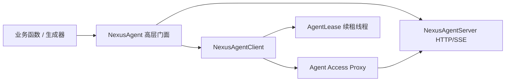

# SDK 运行时心智模型

以下原有生命周期说明针对 OpenWrt 模式。Python SDK 同时包含调用客户端和可被调用的 Agent Server。高层 `NexusAgent` 把监听、注册、续租、健康检查和退出清理组合起来；底层类仍可单独使用，方便集成已有 Web 服务或运行框架。

## 三层 API

### `NexusAgent`

适合从零构建 Agent。装饰器把 Python 函数声明为同步或流式能力；`start()` 先启动监听器，再逐项注册；`run()` 阻塞到 Ctrl+C，并在退出时撤销租约。

### `NexusAgentClient`

适合调用已有 Agent、手工管理注册或接入已有服务。它处理 JSON、SSE、TLS、token provider、错误类型和一次 401 刷新重试，但保持同步 I/O 模型。

### `NexusAgentServer`

适合需要直接控制 HTTP/SSE handler、请求上限、认证和恢复历史的开发者。它把 Envelope 解析为 `AgentEnvelope`，调用注册的处理器，再序列化有界响应。

## 启动顺序为何重要

高层门面先监听并确认健康，后注册 endpoint。若反过来，Router 可能在端口尚未开放时立即选中一条不可用路由。注册过程中任一能力失败，SDK 会逆序清理已成功的租约并关闭服务器，避免半启动状态。

## 同步模型与线程

SDK 核心没有第三方运行时依赖，兼容 Python 3.9+。HTTP 客户端是同步的；Server 使用线程化请求处理；每条自动续租 lease 有守护线程；可恢复流把生产者与订阅连接分开。业务代码仍需自行决定 CPU 密集任务、异步框架和进程隔离方式。

## 自动发现不是隐式信任

`router="auto"` 依次检查显式环境变量、`nexus-router.local` 和 Linux 默认 IPv4 网关。`advertise_address="auto"` 优先选择可用私有/ULA 地址。它们只减少地址配置，不替代 TLS、token、tenant 或 Router 策略。

## 选择哪一层

| 需求 | 建议入口 |
| --- | --- |
| 新建普通 Agent | `NexusAgent` |
| 只调用能力 | `NexusAgentClient` |
| 已有 HTTP 服务需要注册 | `CapabilityRegistration` + client |
| 自定义 handler/恢复容量 | `NexusAgentServer` |
| MCP/A2A 框架 | FastMCP/A2A 集成模块 |

接下来阅读[注册与租约生命周期](registration-lifecycle.md)，再完成[构建可恢复 Agent](../tutorials/resilient-agent.md)。

## 当前运行模式

| 入口 | 行为 |
| --- | --- |
| `NexusAgent(runtime="auto")` | 边缘环境走 Router；可信 Cloud launcher 可在导入前选择 hosted |
| `runtime="openwrt"` | 明确使用边缘注册和租约 |
| `runtime="hosted"` | 导出 MCP 工具，不启动边缘监听或 Router 注册 |
| `NexusAgent.public_ipv6(...)` | 独立直接 IPv6 Agent；Host Alias 由本地地址服务管理 |
| `nexus-computer` | 调用者电脑上的出站 WSS Runtime，不是 Agent listener |

Router 发现失败不会自动降级成 hosted。详见 [Hosted MCP](../guides/hosted-mcp.md) 与 [Computer Runtime](../guides/computer-runtime.md)。
