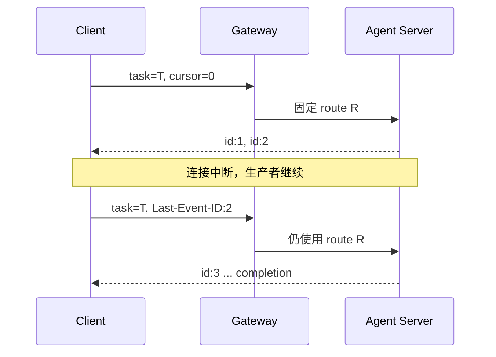

# 流式传输为什么能恢复但不重做

网络重连不应该变成新任务。可恢复流把业务生产者与某一条 HTTP 连接分开：连接可以消失，任务继续产生有编号的事件；新连接从最后确认的游标之后继续读取。

## 首次调用建立四个事实

1. 稳定且非空的 `task_id`；
2. tenant、source Agent 与 intent 组成的身份作用域；
3. 请求内容指纹，防止复用 task ID 改写任务；
4. 第一次选择的 route ID，恢复时不重新选路。

Server 为每个真实 SSE 事件分配从 1 开始递增的数字 ID，并在正常结束时写入 `: nexus-stream-complete`。调用端只在完整收到事件后推进游标。

## SDK 自动恢复算法

`invoke_stream(..., resume=True)` 要求 task ID。它记录最后数字事件 ID；连接异常或缺少 completion marker 时，在 `max_reconnects` 范围内重发相同 Envelope，同时发送 HTTP `Last-Event-ID` 与 `resume_from_event_id`。服务端提供的 SSE retry 可以调整等待时间。

若还没收到任何数字事件 ID，SDK 不知道安全游标，不能自动恢复。事件 ID 非数字或不递增也会失败，避免重复或乱序被静默接受。

## 为什么 transaction token 不能恢复

transaction token 是一次性凭证。重连重用它会变成 token replay，因此 SDK 在 `resume=True` 且允许重连时直接拒绝。可恢复流应使用 access JWT。

## 明确的失败边界

- task 不存在或进程已重启：404；
- 同 task ID 的请求指纹不同：`STREAM_TASK_CONFLICT`；
- 游标超过最后事件：`INVALID_RESUME_CURSOR`；
- 固定路由已不可用：`RESUME_ROUTE_UNAVAILABLE`；
- 所需历史已淘汰：`EVENT_HISTORY_EXPIRED`。

历史默认有任务数、每任务事件数、字节数和保留时间上限，存于内存。它解决短断线，不是持久任务队列。

## 与幂等的关系

恢复不会重新执行 handler，所以它比“失败后重新 invoke”更安全。若任务需要跨进程重启恢复，应引入持久化任务状态，而不是把同一业务调用盲目重发。

动手完成[构建可恢复 Agent](../tutorials/resilient-agent.md)，完整参数见[流式调用指南](../guides/streaming.md)。
