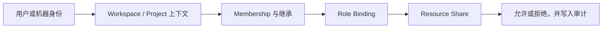

# Access

Access 管理谁可以在 Nexus 中做什么。不要为所有场景都创建同一种授权：成员关系适合加入 Project 或 Group，Role 适合长期职责，Resource Share 适合单个资源例外，Machine Identity 适合无人值守程序。

## 先选择正确的授权方式

| 需求 | 使用方式 | 从哪里开始 |
| --- | --- | --- |
| 邀请一个人进入 Project 或 Group | Membership | **Invite people** |
| 长期负责一个 Workspace、Project 或 Group | Role Binding | **Assign roles** |
| 临时使用单个 Agent、Dataset、Router 或 Model Pool | Resource Share / AccessGrant | 对应资源详情的 **Share** |
| CI、后台任务、CLI 集成 | Service Account + Token | **Machine identity** |
| 查询某个动作为什么允许或拒绝 | Access Explain | **Check access** |

## 权限计算顺序

Nexus 先确认凭据所属 Workspace 和请求头上下文，再计算 Membership、Role Binding、资源级 AccessGrant 和机器身份权限。可见某个资源不代表可以修改或调用它。

当前 IAM 采用 allow-based 模型：没有显式 deny rule，也没有基于时间、预算或网络条件的通用策略。

## 邀请成员

1. 打开 **Access → Invite people**。
2. 选择 Project 或 Group。
3. 搜索或输入用户邮箱，选择 Membership Role。
4. 邀请后在 **People with direct access** 检查结果。

成员详情会汇总风险信号、访问来源、资源共享、创建资源、费用和 API Key 使用。移除成员前使用 Review/Offboard 查看影响，不要只删除一条 Membership 后假设所有访问都已撤销。

## 分配长期 Role

打开 **Assign roles**，选择 Principal、Role、Scope type 和 Scope。Role 适合正常长期访问，并可能按 Workspace、Project 或 Group 层级继承。

高风险 Role 会要求额外确认。撤销前检查该用户是否仍通过其他 Role、Group Membership 或 Resource Share 获得相同权限。

## 共享单个资源

从 Agent、Data Asset、Router 或 Model Pool 详情点击 **Share**。Resource Share 必须精确匹配资源类型和 ID，适合一次性或临时例外。

长期负责一类资源时使用 Role，不要为每个资源重复创建 Share。所有现有 Share 可以在 **Access → Shared resources** 查看和撤销。

## 创建 Machine Identity

1. 打开 **Machine identity**，创建 Service Account。
2. 先给它分配最小 Role 或 Resource Share。
3. 创建 Token，可设置名称、过期时间和来源 IP Allowlist。
4. 立即保存一次性 `sa-nexus-...` 明文。

Token 明文和哈希都不会写入 Audit。删除 Service Account 或撤销 Token 会中断使用它的 CI 与集成，应先确认调用方。

普通项目 API Key 在 **Settings → API Keys** 管理；两者区别见[身份与请求路径](../concepts/identity-and-request-path.md)。

## 检查某次访问为什么允许或拒绝

在 **Check access** 中填写：

- Principal type 与 ID；
- Action，例如 `project.read` 或资源模块定义的动作；
- Resource type 与 ID。

结果会列出匹配的 Role Bindings、Resource Shares 和决策原因。排查 403 时，同时核对顶部 Workspace/Project、请求 `X-Nexus-Tenant`/`X-Nexus-Project` 和资源实际归属。

## 审计与撤权

- Access 写操作进入 Audit，**Recent access changes** 提供快速入口。
- 离职流程应检查 Membership、Role、Share、Service Account、API Key 和其创建资源。
- 撤销访问不会自动转移资源所有权或处理未结费用；使用 Member Details/Offboard 逐项确认。

## 当前限制

- 不支持显式 Deny Rule。
- 不支持时间窗、预算感知等通用条件策略。
- 不提供自定义 Role 的更新和删除 API。
- 并非所有未来资源类型都做完整的对象存在性校验。

API 请求格式见 [API 约定](../reference/api.md)，认证凭据管理见[创建和使用 API Key](../guides/api-keys.md)。
