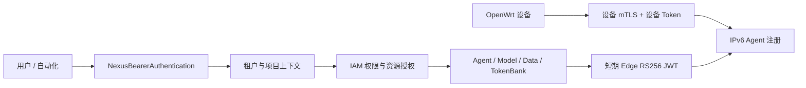

# 身份与请求路径

Nexus 不把所有凭据合并成一种 Token。云端用户、自动化程序和 OpenWrt 设备的失陷范围不同，因此共享租户与 Agent 身份声明，但使用不同凭据和签名边界。

## 五类身份

| 身份 | 典型用途 | 凭据 |
| --- | --- | --- |
| 浏览器用户 | Nexus Console | HttpOnly 会话 Cookie + CSRF |
| 用户 API 客户端 | CLI 或短期自动化 | 30 分钟 access JWT |
| API Key | Gateway、Agent MCP、项目集成 | 一次显示的 `sk-nexus-...` |
| 服务账号 | 无人值守后台任务 | `sa-nexus-...`，可限制有效期和来源 IP |
| OpenWrt 设备 | 注册与续租 IPv6 Agent | 设备 Token + mTLS 设备证书 |

## 为什么用户 JWT 与 Edge JWT 不合一

用户 JWT 默认使用云端登录发行者，面向 Nexus API；Edge JWT 使用专用 RS256 密钥，只在云端调用已绑定的边缘 Agent 时签发，并限制 audience、Agent、租户和短有效期。设备泄露不会变成云端用户登录，用户令牌泄露也不能伪造设备身份。

## 租户和项目不是可选注释

受保护 API 通常要求 `X-Nexus-Tenant`；项目资源还可带 `X-Nexus-Project`。服务端会把凭据所属租户、请求头和资源归属交叉验证。不要仅依赖 JWT 中由客户端选择的项目声明。

## 取舍

多凭据体系增加部署配置和排错成本，但缩小了失陷范围，也允许设备证书、用户会话和自动化密钥按各自生命周期撤销。具体请求格式见 [API 约定](../reference/api.md)。
