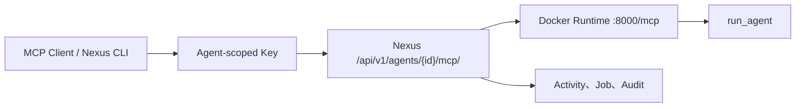

# 完成第一个 Agent 工作流

本教程使用仓库内的确定性 FastMCP Agent，不需要 Provider Key，也不会调用外部模型。在依赖和 Python 基础镜像已可用时，目标是在 15 分钟内完成 Docker 构建、Nexus 部署和第一次 `run_agent` 调用。

## 需要准备

- 已完成[第一个 Workspace 和 Project](first-workspace.md)，顶部选中具体 Project。
- Nexus API 以 `NEXUS_AGENT_RUNTIME_RUNNER=docker` 启动，Docker daemon 可用。
- 当前用户有 Agent 创建、Runtime 部署和 Agent Key 权限。
- 仓库目录 `nexus_server/examples/first_agent/`。

## 请求路径



## 1. 构建并本地验证镜像

```powershell
cd nexus_server\examples\first_agent
docker build -t nexus-first-agent:local .
docker run --rm -d --name nexus-first-agent-smoke -p 18000:8000 nexus-first-agent:local
python smoke.py --url http://127.0.0.1:18000/mcp
docker stop nexus-first-agent-smoke
docker save -o nexus-first-agent.tar nexus-first-agent:local
```

`smoke.py` 会执行 MCP `tools/list`，确认存在 `run_agent`，再执行 `tools/call`。镜像使用 MCP 1.25+ 支持的构造方式监听 `0.0.0.0:8000/mcp`。

## 2. 创建 Agent

1. 打开 **Agents**，确认页面显示具体 Workspace 和 Project。
2. 点击 **Create agent**，输入 `first_agent`。
3. 创建后保持 private；Provider 留空，因为示例不调用模型。

此时只有 Agent 身份，还没有可调用 Runtime。

## 3. 上传并部署 Runtime

打开 **Runtime**：

1. 上传 `nexus-first-agent.tar`，版本填写 `v1`；或者在 Server 与构建命令共享同一 Docker daemon 时注册 `nexus-first-agent:local`。
2. 把镜像设为 Current，点击 **Deploy**。
3. 等待 Deployment `active`，再执行 **Health** 并确认 `healthy`。

Server 会用只读文件系统、临时 `/tmp`、丢弃 capabilities、内存/PID 限制和随机宿主端口启动容器。镜像必须带显式 tag/digest，并在 `/mcp` 接受 Streamable HTTP MCP。

## 4. 创建访问凭据并调用

在 **Access** 创建 Agent Key，立即保存一次性明文并导出 MCP 配置。支持 MCP 的客户端会先列出 `run_agent`，随后可用：

```json
{
  "task": "first call",
  "context": "source=nexus-docs",
  "mode": "verify"
}
```

也可以安装仓库 CLI 并使用 Console 中显示的 UUID：

```powershell
cd nexus_client
python -m pip install -e ".[dev]"
nexus init --base-url http://127.0.0.1:8000
nexus login --email <admin-email> --password <password>
nexus tenant use <workspace-uuid>
nexus project use <project-uuid>
nexus agent mcp call <agent-uuid> --task "first call" --context "source=nexus-docs" --mode verify
```

返回内容应包含 `mode=verify`、`task=first call` 和 `attachments=0`。

## 5. 验证运行、审计与费用

1. 回到 Agent **Activity**，找到本次 MCP 调用或错误事件。
2. 在 **Observability → Jobs/Audit** 按时间和 Request ID 核对部署、Health 和调用。
3. 打开 **Billing → Usage → Public Agents**。私有、无价格的本地调用没有 Usage 是正常的；发布并产生受计量调用后才应出现记录。

## OpenWrt IPv6 替代路径

有自有 IPv6 Router 时，可以跳过 Docker 镜像租用：获取一次性配对码，让 OpenWrt 注册，选择未绑定注册并绑定到 Agent，再执行 Health。边缘进程由 OpenWrt 管理；云端验证 IPv6、Edge JWT 和 Device TLS。详细步骤见[接入 OpenWrt IPv6 Agent](../guides/connect-openwrt.md)。

## 状态与资金影响

| 动作 | 成功状态 | 是否产生平台费用 |
| --- | --- | --- |
| 创建 Agent/上传镜像 | Agent private、Image current | 否 |
| Deploy/Health | active、healthy | 本地控制动作本身不产生 Marketplace Usage |
| 私有示例调用 | `run_agent` 返回结果 | 默认无公开 Agent Usage |
| Publish + 消费调用 | public/listed + 调用成功 | 可按价格产生 Spending/Earnings |

## 权限边界

- Agent Key 只用于该 Agent 调用；Gateway Key 和 Remote CLI Key 不能混用。
- 镜像不能内置 Provider Key、密码、Token 或证书私钥。
- 只读 Resource Share 不允许替换镜像、部署或创建 Key。
- OpenWrt 绑定只选择当前 Workspace/Project 可见且尚未绑定的注册。

## 验证清单

- 本地 smoke 同时通过 `tools/list` 和 `tools/call`。
- Agent 出现在 **My agents**，Deployment active、Health healthy。
- 经 Nexus 调用返回确定性内容，Activity/Audit 有对应证据。
- 私有无价格调用没有 Billing Usage 时，文档能解释原因。

## 排错

- **镜像本地 smoke 失败**：确认 MCP 版本 ≥1.25、构造参数包含 host/port/path，并查看容器日志。
- **没有 Deploy**：镜像未设 Current，或用户没有管理权限。
- **部署提示 MCP endpoint did not become ready**：容器没有监听 `0.0.0.0:8000/mcp`，或启动时间超过等待窗口。
- **MCP 返回 401/403**：检查 Agent Key、Workspace、Project 与 Key Policy。
- **OpenWrt 没有可用注册**：注册过期、已绑定，或 Router 尚未完成 Device TLS 注册。

## 当前限制与下一步

示例是确定性连通性 Agent，不代表模型推理、持久 Memory 或多模态媒体托管。下一步可走通 [Provider→Router](../tutorials/provider-router-api.md)，或把 Agent [发布到 Marketplace 并核对 Billing](../tutorials/marketplace-billing.md)。
