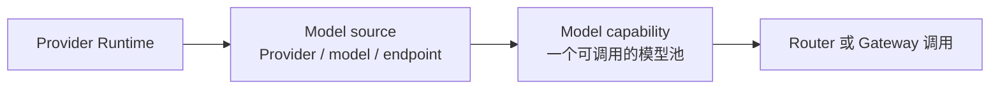

# Model Pool

Model Pool 把“调用哪个模型能力”和“由哪个 Provider Endpoint 提供容量”分开。一个 **Model capability（Model Group）** 是调用方看到的模型池；一个 **Model source（Deployment）** 是池中的 Provider-backed Endpoint。

## 添加模型源

1. 先在 [Providers](../providers/index.md) 中启动 Provider Runtime，并确认健康检查通过。
2. 打开 **Model Pool → Add model source**。
3. 选择未绑定模型源的活动 Runtime，填写 Provider、Model、Endpoint、价格与可见性。
4. 选择已有 Model capability，或创建对应的能力池。
5. 保存后执行源健康检查。

启动 Provider Runtime **不会**自动创建 Model source。一个 Runtime 同一时间只能对应一个活动 Source；它不在可选列表时，先检查是否已被其他 Source 使用。

## 配置池内路由

Model capability 的策略只决定该池内部如何选择 Source：

| 策略 | 行为 |
| --- | --- |
| `fallback` | 按 `fallback_order` 依次尝试 |
| `best_health` | 优先当前健康状态更好的源 |
| `lowest_cost` | 优先价格更低的可用源 |
| `lowest_latency` | 优先延迟更低的可用源 |
| `weighted` | 按权重在可用源之间分配 |

每条 Source 绑定还可设置 `enabled`、`priority`、`weight` 和 `fallback_order`。禁用的绑定不会参与路由。Router 跨多个池选池；选中池后，仍由本页策略选具体 Source。

## 运维与生命周期

- 池中至少有一个健康 Source 时，能力池可保持可用；所有 Source 禁用时显示为 disabled。
- 编辑 Source 可以更新 Provider、Model、Endpoint、价格和可见性，但 Source ID 不变。
- **Disable** 适合临时摘流；**Delete** 会软删除 Source、池绑定和 Community 关联，并清除 Runtime 的绑定引用。
- 删除 Source 不会删除 Provider Account 或 Provider Runtime。
- Provider Runtime 必须先成为 Model Pool Source，才能从 Providers 发布为 Community Provider Listing。

## 验证与排错

添加或修改后，检查 **Model capabilities** 与 **Model sources** 两张表：能力池应显示预期策略，Source 应显示 healthy，价格与可见性应正确。

常见问题：

- **Runtime 不可选**：确认 Runtime 为 active，且没有活动 `deployment_id`。
- **池仍不健康**：逐个运行 Source Health Check，并检查 Provider Account、Endpoint 与凭据。
- **请求没有走预期源**：同时检查池策略、Source 的 enabled/priority/weight/fallback order，以及上层 [Router](../routers/index.md) 的选池策略。
- **删除后 Marketplace 不再可见**：这是预期行为；Source 删除会移除对应 Community 关联。

当前不提供 Provider 凭据轮换、Provider 原生配额强制执行或脱离 Workspace/Tenant 上下文的公共模型目录。访问控制与单资源共享见 [Access](../access/index.md)。
