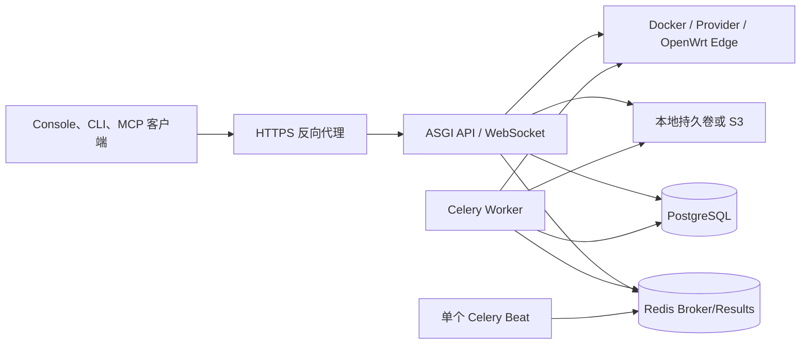

# 生产就绪架构

生产 Nexus 不是单个 Web 进程。API、异步任务、周期调度、数据库、对象存储和边缘证书共同组成一个控制面；遗漏其中任一状态组件，Console 仍可能能登录，但部署、健康、计费或恢复会悄悄失效。

## 组件和数据流

| 组件 | 保存或处理什么 | 停止后的用户影响 |
| --- | --- | --- |
| ASGI API | REST、Console Session、Computer WebSocket | 登录、Console 和调用不可用 |
| PostgreSQL | Workspace、资源、权限、账本、审计和任务状态 | 控制面不可用；这是首要恢复对象 |
| Redis | Celery Broker 与 Result Backend | 新 Job 堆积，后台完成状态不更新 |
| Worker | 部署、健康、指标和其他异步工作 | API 可能接受请求，但工作不完成 |
| Beat | 周期健康、指标、告警和结算触发 | 定时流程停止；多实例会重复触发 |
| Dataset 存储 | 上传对象、Release 文件内容 | 元数据存在但文件无法读取 |
| Edge PKI | Device TLS 与 Edge JWT 信任 | OpenWrt 注册或调用失败 |

## 上线门禁

- **身份**：生产 Secret 已替换；Secure Cookie、CSRF Origin、Allowed Hosts 正确。
- **状态**：PostgreSQL 和 Dataset 存储有持久化、加密、备份与恢复演练。
- **任务**：`CELERY_TASK_ALWAYS_EAGER=0`，至少一个 Worker，恰好一个 Beat。
- **网络**：HTTPS、WSS、Provider 出站和 Edge IPv6/mTLS 路径分别验证。
- **可观测性**：API、Worker、Beat、队列深度、任务失败、数据库和存储有告警。
- **发布**：迁移由单一 Release Job 执行，Console/API 版本一致，并有回滚制品。

## 容量和高可用

API 可以横向扩容，但所有实例必须使用相同 Secret、数据库、Redis 和共享存储。Worker 可按任务量扩容；Beat 保持单实例或使用具备 leader election 的外部调度方案。Docker Runtime 若绑定本机 Docker daemon，API/Worker 调度位置会影响容器可见性，不能假定任意副本都能管理其他主机上的容器。

先用负载测试确定 API 与 Worker 数量。重点观察请求 P95、数据库连接、Redis 队列等待、Job duration、Provider 延迟和 Dataset 吞吐，而不是只看 CPU。

## 安全边界

- 反向代理终止公网 TLS；Edge Device TLS 必须只信任设备 CA，并把验证结果安全传给 Server。
- Provider Key、支付 Secret、Dataset 凭据和私钥分开轮换，避免共用单个万能 Secret。
- Runtime 运行器能启动外部进程或容器，应与普通 API 用户权限隔离。
- Audit 是操作证据，不是 Secret 存储；日志必须脱敏。

## 验证

在上线审批中保存一份证据包：部署版本、迁移记录、健康响应、Worker/Beat 心跳、测试 Job、WebSocket 101、对象读写、备份 ID、恢复演练时间和告警测试结果。

## 排错

- **API 正常但任务不完成**：按 ASGI → Redis → Worker → 外部 Runtime 顺序定位。
- **任务执行两次**：检查 Beat 副本和运维系统是否也触发同一周期命令。
- **多实例偶发文件丢失**：确认所有副本使用同一个持久卷或 S3 Bucket。
- **OpenWrt 只有部分实例可用**：比较每个实例的 CA bundle、客户端证书和 Edge JWT Key ID。

## 当前限制

项目不内置 Kubernetes Operator、分布式锁服务、数据库复制或跨区域灾备。部署者必须用基础设施能力实现这些目标，并用[生产部署](../guides/production-deployment.md)、[备份恢复](backup-and-restore.md)和[升级回滚](upgrade-and-rollback.md)验证结果。
