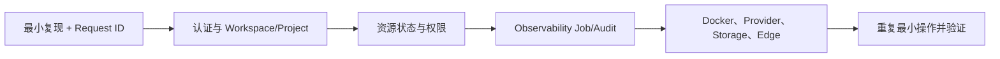

# 常见故障排查

先缩小故障层级，再修改配置。一次有效排错需要：UTC 时间、操作人、Workspace/Project UUID、资源 ID、HTTP 状态、业务错误码、`X-Request-ID`、目标资源状态和相关 Job ID。不要复制 JWT、API Key、Cookie、密码、证书私钥或完整用户数据。

## 统一排错顺序

## 登录、Session 与 CSRF

| 现象 | 查询证据 | 常见原因 | 修复 |
| --- | --- | --- | --- |
| Console 登录 403 | Network login 响应、Origin、Request ID | 密码错误，或 Web CSRF Origin/Cookie 不匹配 | 先区分 `AUTHENTICATION_FAILED` 与 CSRF；统一主机名并配置可信 HTTPS Origin |
| 刷新后变成未登录 | whoami、Cookie Secure/SameSite、代理协议 | Cookie 未保存、域名变化或代理未传递 HTTPS | 修正外部 URL、Secure Cookie 与反向代理协议 |
| API 401 | Authorization 与凭据状态 | 缺失、过期、撤销或类型错误 | 使用该用途的有效 JWT/API Key/Service Token |

## Workspace、Project 与 403/404

| 现象 | 查询证据 | 常见原因 | 修复 |
| --- | --- | --- | --- |
| `X-Nexus-Tenant header is required` | 实际请求头 | 自动化没有发送 Workspace UUID | 设置 `X-Nexus-Tenant` |
| 已知资源返回 404 | 顶部选择器、两个请求头、资源归属 | 上下文错误或资源已软删除 | 切换到资源 Workspace/Project 后重试 |
| 403 | Access Explain、Role、Share、Key Policy | 身份有效但动作不在授权内 | 找到缺失能力，用最小 Role/Share/Policy 修复 |

## Docker Agent Runtime

| 现象 | 查询证据 | 常见原因 | 修复 |
| --- | --- | --- | --- |
| 没有 Deploy | Current Image、用户权限 | 未选择镜像或只有只读访问 | 设 Current，或由资源管理员部署 |
| `MCP endpoint did not become ready` | Deployment last_error、容器日志 | 未监听 `0.0.0.0:8000/mcp`、启动失败或镜像无 tag | 用示例 smoke 验证 `tools/list/call`，修正镜像契约 |
| Job 一直 queued | Observability Job、Worker/Redis | 生产 Worker 未运行或 Broker 不通 | 恢复 Redis/Worker；不要打开 eager 掩盖故障 |
| Health unhealthy | 容器 running、MCP initialize、Job | 进程退出或 MCP 不可响应 | 检查容器、端口和只读文件系统兼容性 |

## OpenWrt IPv6 与 Device TLS

| 现象 | 查询证据 | 常见原因 | 修复 |
| --- | --- | --- | --- |
| 没有可绑定注册 | Registration lease、bound Agent | 注册过期、已绑定或上下文不同 | 重新配对并选择当前 Workspace 的未绑定注册 |
| 云端无法访问 IPv6 | 数字 IPv6、端口、防火墙、路由 | 不是全球单播，或入口被阻断 | 修复 IPv6 路径，不用 DNS/IPv4 绕过校验 |
| TLS/JWT 拒绝 | SNI、CA bundle、证书指纹、JWKS `kid` | CA/客户端证书/Edge JWT Key ID 不一致 | 成套校对 Device CA、mTLS 和 RS256 配置 |

## Provider、Model Pool 与 Router

| 现象 | 查询证据 | 常见原因 | 修复 |
| --- | --- | --- | --- |
| Provider Health 失败 | Runtime error、Endpoint、Account | 上游 Key、模型或网络错误 | 先修 Account/Runtime，再处理 Pool |
| Runtime 不在 Add source 列表 | Runtime status、已有 deployment_id | 未 active 或已绑定活动 Source | 启动 Runtime，或处理旧 Source |
| `MODEL_NOT_FOUND` | Router 绑定、Pool Source enabled/health | 模型名错误或没有健康候选 | 对齐 capability 名称并恢复 Source |
| Custom Router 失败 | Runtime error、候选与返回 ID | `router.py` 未部署或返回池外 ID | 部署版本，或切回内置策略验证基础链路 |

## Computer WebSocket

| 现象 | 查询证据 | 常见原因 | 修复 |
| --- | --- | --- | --- |
| 握手返回 200 | 代理上游和 Server 类型 | 流量进入 WSGI/静态服务 | 使用 `config.asgi:application` 并转发 Upgrade |
| 握手 403 | Session、Origin、Workspace/Project、Machine Access | 已到 ASGI，但身份/权限不满足 | 校对上下文和 Computer 授权 |
| 连接后立即断开 | ASGI/代理日志、SSH Test | 代理超时或目标 SSH 不可达 | 调整 WebSocket timeout，并单独测试 Computer |

## Data Asset 与存储

| 现象 | 查询证据 | 常见原因 | 修复 |
| --- | --- | --- | --- |
| 上传后 404 | Asset ID、Backend、对象是否存在 | 上下文错误或对象未持久化 | 对齐 Workspace/Project 和存储根/Bucket |
| Index Job 失败 | `UNSUPPORTED_CONTENT_TYPE`、`FILE_TOO_LARGE`、`DECODE_FAILED`、`READ_FAILED` | 格式、大小、编码或权限 | 转换/减小文件，修复对象权限后重新索引 |
| 多实例偶发丢文件 | 每个实例的 storage root | 使用了各自本地临时目录 | 改用共享持久卷或 S3-compatible 后端 |

## Billing 与 Marketplace

| 现象 | 查询证据 | 常见原因 | 修复 |
| --- | --- | --- | --- |
| `BALANCE_NOT_ENOUGH` | Workspace Wallet、失败 Order/Usage | 余额不足 | 充值成功并确认 Ledger 后重试 |
| 充值订单有但余额不变 | Payment Order、Webhook 验签 | Checkout 不是入账；Webhook 未成功 | 修复 Provider/Webhook，不要手工加余额 |
| 调用成功但无 Usage | 资源类型、价格、调用路径 | 私有无价格调用，或没走受计量路径 | 判断是否本应计量，再核对 Gateway/Marketplace |
| Listing 搜索不到 | Visibility、健康、版本、Moderation | 发布门禁未满足 | 修复门禁并重新发布 |

## Worker、Beat 与周期任务

- **Job queued**：检查 Redis、`CELERY_BROKER_URL`、Worker 进程和队列积压。
- **周期任务停止**：检查 Beat、时钟和 `CELERY_BEAT_SCHEDULE`。
- **任务重复**：确认只有一个 Beat，基础设施没有重复触发同一任务。
- **同步请求成功但最终失败**：以 Job 终态和 `error_code` 为准，提交成功不是执行成功。

## 修复后的验证

重复最小失败操作，确认 HTTP、资源终态、Job、Audit Request ID 和外部依赖全部恢复。涉及调用、购买或发布时，再核对 Activity、Gateway Log、交付物与 Billing Usage。完整码表见[状态与错误](../reference/statuses-and-errors.md)。

## 当前边界

Nexus 不替代 Docker、PostgreSQL、Redis、S3、Provider 或 IPv6 网络自身的监控。需要跨组件证据时，从 Server Request ID/Job ID 向外关联，不要在没有证据时反复删除和重建资源。
