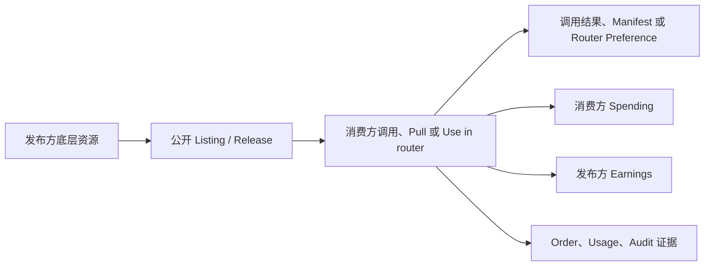

# 从 Marketplace 发布到 Billing 对账

这条教程用“发布方 Workspace”和“消费方 Workspace”解释 Marketplace。你将发布一个已经健康的资源，使用另一个上下文获取或调用它，再从 Usage、Order 和 Audit 证明交付和费用属于正确双方。

## 适用角色与前置条件

- Marketplace 运营者、资源发布者、Workspace Admin 或财务核对人员。
- 两个可区分的 Workspace；如果只有一个，也可以演练发布与浏览，但无法证明跨方收益。
- 以下至少一种已通过发布门禁的资源：健康 Agent Runtime、不可变 Data Asset Release、或已成为 Model Pool Source 的 Provider Runtime。
- 消费方有权限、具体 Project 和足够 Wallet 余额。

## 资源、权利与资金流

Listing 不是资源副本。取消发布会阻止新的发现或获取，但不会删除历史 Order、Usage、Audit 或已交付的不可变 Release 记录。

## 1. 选择产品并完成发布门禁

| 产品 | 发布前必须满足 | 消费动作 | 交付结果 |
| --- | --- | --- | --- |
| Agent | Runtime active/healthy、说明、价格和 Visibility | 调用/使用 Agent | 运行结果与调用记录 |
| Data Asset | Collection、不可变 Release、扫描/授权/脱敏门禁 | Pull Release | 文件 Manifest 与授权记录 |
| Provider | Runtime 已成为健康 Model Pool Source、价格/容量/运营证据 | Use in router 后调用 | Router Preference 与模型响应 |

本教程推荐先用已完成[第一个 Agent 工作流](../getting-started/first-agent.md)的示例 Agent，因为它不依赖外部模型费用。

## 2. 从发布方 Workspace 发布

1. 选中发布方 Workspace 和具体 Project。
2. 打开资源详情，补齐公开说明、版本/Runtime、价格、可见性和必要声明。
3. 点击 **Publish**，确认 Marketplace 详情只显示公开运营证据，不显示 Key、内部 Endpoint 或用户数据。
4. 记录 Listing/资源 ID、价格、货币和发布时间。

发布动作本身不移动资金。

## 3. 从消费方 Workspace 获取

1. 切换到消费方 Workspace 和具体 Project。
2. 打开对应 Marketplace 分类，用发布者或名称找到资源。
3. 重新确认购买时价格、交付物、健康、版本和数据/SLA 条款。
4. 执行产品动作：调用 Agent、Pull Data Asset Release，或把 Provider **Use in router** 后发起模型调用。
5. 保存响应、Manifest 或 Router Preference，以及对应 Request ID。

浏览公开页面不收费。是否移动资金取决于实际消费动作和产品价格。

## 4. 双方对账

消费方打开 **Billing → Usage → Spending**，发布方切回自己的 Workspace 后打开 **Earnings**。按资源类型、时间和资源 ID 对照：

- 消费/收益金额和货币一致；
- 价格使用购买或调用时捕获的版本；
- Usage 指向正确资源和双方 Workspace；
- Order/Invoice 只在相应产品流程创建时出现，不要求每次调用都有 Invoice；
- Audit 能解释 Publish、获取和撤销动作。

## 状态与动作影响

| 动作 | 资源状态 | 资金/权利变化 |
| --- | --- | --- |
| Publish | private/draft → public/listed | 不扣款；获得公开发现资格 |
| Agent call | Runtime 执行 | 可产生 Spending/Earnings；交付运行结果 |
| Data Asset Pull | Release 保持不可变 | 可产生费用；交付 Manifest 中的 Release 权利 |
| Provider Use in router | 创建 Preference | 加入本身通常不代表已调用；实际模型请求才计量 |
| Unpublish | 停止新发现/获取 | 不回滚历史交易或交付 |

## 权限边界

- Public 表示可发现，不表示消费者可以管理底层 Agent、Dataset 或 Provider Secret。
- 发布、定价和取消发布需要资源管理权限；消费还受 Key Policy、Project、Wallet 和产品授权限制。
- 财务人员可以核对 Usage，但不应因此获得 Provider Credential 或 Runtime 管理权限。
- TokenBank 处理授信、资金与金融结算，不替代本教程中的平台 Billing Usage。

## 验证

- 匿名或其他 Workspace 能看到公开 Listing，但看不到 Secret。
- 消费方得到明确交付物，并可用 Request ID 在 Audit/Observability 找到操作。
- 消费方 Spending 与发布方 Earnings 能按资源、时间和金额匹配。
- 取消发布后新的发现/获取停止，历史证据仍保留。

## 排错

- **发布后搜索不到**：检查 Visibility、当前版本/Runtime、发布门禁和 Moderation 状态。
- **能浏览但不能消费**：登录并选择具体 Workspace/Project，检查权限与 Wallet。
- **Provider 已加入 Router 但无费用**：Preference 不是调用；发起实际请求并检查两层路由。
- **双方金额不匹配**：比较 Workspace、筛选、价格快照、货币和请求是否成功计量。
- **取消发布后历史仍存在**：这是审计和不可变交付的预期行为。

## 当前限制与下一步

Billing 当前不支持 Refund、Tax Calculation、Invoice PDF、Plan Cancellation 或统一的跨模块 Quota Enforcement。金融授信与外部清算边界见 [TokenBank 用户指南](/tokenbank/)，产品规则见 [Marketplace](../marketplace/index.md) 与 [Billing](../billing/index.md)。
