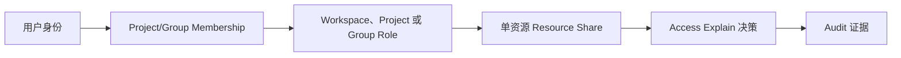

# 成员访问与离职撤权

你将让一名成员只访问指定 Project 和 Agent，验证允许/拒绝结果，再完成不遗漏 API Key、Share 或机器身份的撤权。这个流程适合正式入职、外部协作和离职审计。

## 适用角色与前置条件

- Workspace Owner/Admin 或具有 Access 管理能力的委派管理员。
- 已创建 Workspace、Project 和一个测试 Agent。
- 被邀请用户已经有 Nexus 账号；记录其邮箱。
- 准备一个该成员不应访问的第二资源，用于负向验证。

## 权限路径

Nexus 当前使用 allow-based 模型：命中任一有效授权就可能允许操作，没有通用显式 Deny。因此撤销一条 Membership 并不等于已经撤销所有路径。

## 1. 邀请到 Project

1. 打开 **Access → Invite people**。
2. 选择目标 Project，输入邮箱并分配满足任务的最低 Membership Role。
3. 在 **People with direct access** 确认成员、范围和角色。

不要为了单个 Agent 的短期协作直接授予 Workspace Admin。

## 2. 添加长期 Role 或单资源 Share

- 若成员长期维护 Project 中一类资源，使用 **Assign roles** 并把 Scope 设为该 Project。
- 若只需要一个 Agent，打开 Agent 详情的 **Share**，创建精确 Resource Share。

两种方式只选符合需求的一种。重复授权会让后续撤权难以证明。

## 3. 验证允许和拒绝

在 **Access → Check access** 输入 Principal、Action、Resource type 和 ID：

1. 对目标 Agent 检查读取或调用动作，应显示允许及匹配来源。
2. 对第二个未授权资源执行同一检查，应显示拒绝。
3. 让成员登录，选中同一 Workspace/Project，并完成相同正负操作。
4. 在 **Recent access changes** 和 Observability Audit 保存变更与验证证据。

## 4. 配置机器身份时的分支

只有无人值守 CI/后台程序才创建 Service Account：先赋最小 Role/Share，再创建带过期时间和来源 IP Allowlist 的 Token。`sa-nexus-...` 明文只显示一次。不要把个人 API Key 当作团队服务账号。

## 5. 完成离职撤权

1. 打开成员详情和 Offboard/Review，列出 Membership、Role、Share、API Key 使用、创建资源与费用。
2. 转移仍需保留的 Agent、Router、Data Asset 或运营责任。
3. 撤销 Resource Share、Role Binding、Group/Project Membership。
4. 撤销由该成员管理或专用的 API Key、Service Account Token 和 Machine Access。
5. 再次执行目标和第二资源的 Access Explain，结果都应拒绝。
6. 保存 Audit Request ID 和撤权时间。

撤权不会自动转移资源所有权，也不会取消未结费用或外部 Provider 凭据。

## 状态与资金影响

| 动作 | 访问变化 | 是否移动资金 |
| --- | --- | --- |
| Invite/Membership | 获得范围内基础访问 | 否 |
| Role Binding | 获得一组长期能力 | 否 |
| Resource Share | 获得单资源例外 | 否 |
| Token 创建/撤销 | 自动化调用开始或停止 | 否；后续调用可能产生费用 |
| Offboard | 汇总并移除访问路径 | 否；不处理既有账务 |

## 权限边界

- 可见资源不代表可以修改、调用或导出 Secret。
- Workspace/Project 请求上下文先于 Role 计算；错误上下文可能表现为 404。
- Service Account Token 不代表创建者本人，必须有自己的最小授权和轮换周期。
- 高风险 Role 与撤权动作会进入 Audit，应使用个人管理员身份执行。

## 验证

- 入职后目标资源允许、对照资源拒绝，Access Explain 能指出具体授权来源。
- 离职后没有 Membership、Role、Share 或有效专用 Token 残留。
- 资源所有者和运营责任已转移，CI 没有意外中断。
- Audit 能串起邀请、授权、验证、撤销和最终检查。

## 排错

- **撤销后仍能访问**：检查其他 Group Membership、继承 Role、Resource Share、Service Account 和缓存的上下文。
- **Access Explain 允许但 UI 403**：比较 Action、Workspace/Project 和实际 UI 请求的资源 ID。
- **删除 Membership 导致资源无人管理**：先恢复临时管理员并完成资源转移，再继续撤权。
- **CI 突然失败**：确认是否撤销了共享 Service Account；为每个集成使用独立 Token。

## 当前限制与下一步

IAM 当前不支持显式 Deny、时间窗/预算条件策略，也不提供所有自定义 Role 的更新/删除 API。更细的授权模型见 [Access](../access/index.md)，自动化凭据见[身份与请求路径](../concepts/identity-and-request-path.md)。
