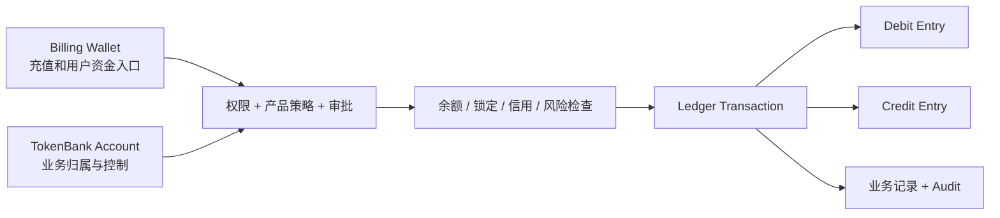

# 账本与控制模型

TokenBank 不靠直接修改一个“总余额数字”解释业务。它把用户入口、业务账户、资金移动、业务对象和审计拆开：这样既能回答“钱现在在哪里”，也能回答“为什么移动、由谁批准、对应哪个合同”。

## Billing Wallet 与 TokenBank Account

| 对象 | 主要用途 | 不应误解为 |
| --- | --- | --- |
| Billing Wallet | 充值、购买、出资、保证金和用户可见余额入口 | 所有业务归属的唯一账本 |
| TokenBank Account | Credit、Funding Pool、Risk Reserve、Settlement、Revenue Share、Provider 等内部归属 | 外部银行账户或托管账户 |

一个操作可以从 Billing Wallet 取资金，再在 TokenBank 中形成专用账户和 Ledger 证据。例如 SLA Provider 发布 Plan 时，从 Provider Billing Wallet 转入该 Plan 的 Risk Reserve；客户 Premium 是另一条业务流，不会自动扩大 Provider 的承保准备金。

## 账户中的四个数

- `balance`：账户已经拥有的余额，不能小于零。
- `locked_balance`：已为订单、Margin、合同或转移预留、暂时不能再次使用的部分。
- `credit_limit`：允许的信用上限。
- `credit_used`：已经使用、尚未偿还或核销的信用。

简化理解：现金可用额约为 `balance - locked_balance`；未用信用约为 `credit_limit - credit_used`。真正可动用金额还要经过产品是否允许用信、账户状态、Unit、风险限额和业务状态检查。

### 示例

账户有 1,000 USD，买单锁定 300 USD，并获批 2,000 USD 信用、已用 500 USD：

- 可再次使用的现金为 700 USD；
- 未用信用为 1,500 USD；
- 但某个只允许现金、不允许信用的动作仍只能使用 700 USD。

## 双分录为什么重要

一笔 25 USD 转账会创建一个 Transaction 和两条方向相反的 Entry：

| Entry | Account | Amount |
| --- | --- | --- |
| Debit | Source | 25 USD |
| Credit | Destination | 25 USD |

两条 Entry 必须平衡。业务对象保存 Transaction Reference，Audit 保存操作者和动作。只看到业务状态变化却找不到账本，或只看到账本却找不到业务引用，都需要调查。

不同 Unit 的账户不能直接互转。`USD`、`CNY`、`token_credit` 与 `usage_unit` 不是可自动换算的同一种余额。

## 锁定、结算与释放

锁定不是扣款。它先把一部分余额保留给特定订单或合同：

1. Order/RFQ 创建后锁定资金或 Margin。
2. 成交或结算时，锁定金额被 Capture 并形成真实转账。
3. 取消、失败或结算剩余时，未使用部分被 Release。

因此“余额足够”仍可能失败：余额可能已被其他记录锁定，或锁定属于错误的合同、币种或账户。

## 产品策略与审批

产品策略决定写操作能否进入：

| Mode | 含义 |
| --- | --- |
| `open` | 满足权限、状态和资金条件后可执行 |
| `approval_required` | 还必须引用已批准且匹配该业务的 Approval |
| `disabled` | 拒绝产品写操作，即使提供 Approval 也不放行 |

当前代码默认 Core、Prepaid、Derivatives、Agent Market 和 Provider Market 为 `open`；Enterprise Credit、Token Lending、Price Lock、SLA、Agent Finance 和 Provider Finance 为 `approval_required`。Tenant/Jurisdiction Policy 可以覆盖默认值，因此运行时以 Product Policy API 返回值为准。

## 幂等键

幂等键是“同一个业务动作的唯一编号”。Server 已经接受某次结算后，即使客户端因超时没收到响应，用同一个 Key 重试也应返回原交易，而不是再次过账。

- 同一次业务重试复用原 Key。
- 新业务动作使用新 Key。
- 不要把时间戳当作自动重试的新 Key。
- Key 不是 Secret，但应和业务 Reference 一起保存用于排错。

## 取舍与边界

双分录、多状态和多层门控让操作比“改余额”更慢、更严格，但换来对账、权限撤销、风险解释、幂等恢复和审计。TokenBank Ledger 是内部会计事实，不替代银行流水、法律合同、税票或外部支付确认。

继续阅读[资金与权利如何流动](money-and-rights-flow.md)；字段和错误码见[状态与错误码](../reference/statuses-and-errors.md)。
