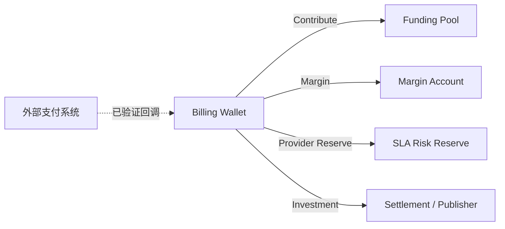
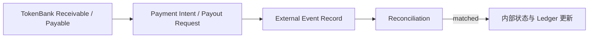

# 资金与权利如何流动

TokenBank 同时处理“钱”和“权利”，但两者不是一回事。理解四种变化，可以避免把 Lock 当扣款、把权利转移当融资、把 External Settlement Record 当真实银行付款。

## 四类变化

| 类型 | 发生了什么 | 典型证据 |
| --- | --- | --- |
| 余额移动 | 从一个 Wallet/Account 转到另一个 Account | Ledger Transaction + Debit/Credit Entries |
| 资金锁定 | 暂时保留给订单、Margin 或合同，所有权未最终转移 | `locked_balance`、Lock/Order/Call |
| 信用占用 | 余额不足时使用已批准额度，形成待偿还责任 | `credit_used`、Usage、Receivable |
| 权利转移 | Service/Revenue Right 的持有人改变 | Trade、Settlement、Transfer Registry |

## Billing Wallet 到业务账户

TokenBank 不直接把外部支付变成可用余额；Billing 在验证 Provider Signature、Amount、Currency 和 Event Idempotency 后才充值 Wallet。TokenBank 从已激活 Wallet 开始执行内部业务流。

## 从锁定到结算

以 Market Buy Order 为例：

1. 买方创建 Order，Billing Wallet 资金被锁定。
2. Match Run 找到符合 Limit Price 的 Listing。
3. Trade 进入 `pending_settlement`。
4. Complete Transfer 将资金交给卖方并登记权利转移。
5. 未使用 Lock 被释放。

取消未成交 Order 只释放 Lock，不应向卖方转账。存在 Dispute 或 Freeze 时，Settlement 会被阻止。

## 信用不是充值

Credit Approval 只设置 `credit_limit`。真实 API Usage 同步后，系统才增加 `credit_used`、形成双分录与 Receivable。Mark Paid 或已验证的 External Payment Event 会减少 `credit_used`。

坏账核销把 Receivable 标为 `written_off` 并减少信用占用，但不是客户付款，也不应被当作现金回收。

## 权利不是股权

Agent/Provider Finance 形成的是内部 Service Right 或 Revenue Right。Market Transfer 改变这些单位的持有人，并可能影响后续收入分配；它不发行公司股权、证券、存款或公开投资产品。

## External Settlement 的位置

当前 External Settlement 是控制面集成层：保存 Stripe、Alipay、WeChat、Bank、Manual 或 ERP 等 Channel 的标准化 ID、事件和对账结果。除非部署方实现真实 Adapter，它不会自己调用银行、出具合法发票或完成税务申报。

## 用证据判断发生了什么

- 只有 `locked_balance` 变化：资金被预留，没有最终转移。
- 有 Ledger Entries：发生了内部余额移动。
- 有 Receivable 但未 Paid：存在应收责任，不代表收到现金。
- 有 Registry Transfer：内部权利持有人改变。
- External Run 为 `matched`：记录匹配，不等于 TokenBank 是支付机构。

账户字段见[账本与控制模型](ledger-and-controls.md)，具体业务路径见[八个 Desk](../reference/desks-and-products.md)。
