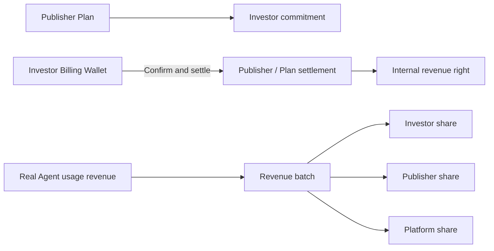
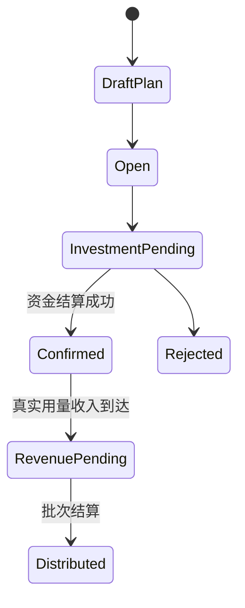

# Agent Finance｜Agent 融资与收入分配

Agent Finance Desk 让 Publisher 为 Agent 建立内部融资计划，投资者通过 Billing Wallet 提供一次性资金，并按计划分享该 Agent 后续真实使用收入。它登记的是内部服务收入权利，不是公司股权或公开募资。

## 参与角色与前置条件

- Publisher 拥有或运营可识别的 Agent，并创建融资与 Revenue Policy。
- Investor 使用有足够可用余额的 Billing Wallet 投资。
- Approver/Finance 确认一次性资金结算；Revenue operator 处理真实用量收入。
- `agent_financing` 默认需要审批；参与方、比例、上限和 Unit 必须在确认前固定。

## 资金与权利流

融资确认移动一次性资金并形成收入权利；后续分配只来自已确认的真实使用收入，不能用新增投资伪装经营收入。

## Queue 含义

| Queue | 关注对象 | 典型下一步 |
| --- | --- | --- |
| Revenue policies | 分配比例、上限和有效期 | Create publisher plan |
| Sponsorships | 投资意向和待确认交易 | Invest、Confirm & settle |
| Pending revenue | 已产生但未分配的真实收入 | 核对来源事件 |
| Batches | 单笔或批量分配结果 | Settle selected/all |

## 逐步操作

1. Publisher 执行 **Create publisher plan**，绑定 Agent、目标金额、Unit 和 Revenue Policy。
2. Investor 执行 **Invest in Agent**，系统校验 Wallet、计划状态和租户可见性。
3. Finance 执行 **Confirm & settle**：一次性资金完成内部结算，投资权利生效；系统会为后续 Agent Market 建立对应资产记录。
4. 真实 Agent 用量收入进入 Pending revenue 后，核对来源账单与参与方。
5. 执行 **Settle selected** 或 **Settle all** 生成 Revenue Batch 并按策略分配。

## 状态流转

## 哪些动作会移动资金或权利

| 动作 | 影响 | 说明 |
| --- | --- | --- |
| Create publisher plan | 不移动 | 定义计划和收入分配规则 |
| Invest in Agent | 通常不移动 | 创建待确认投资意向 |
| Confirm & settle | 移动资金与登记权利 | Investor Wallet 完成一次性结算 |
| Settle selected/all | 移动收入 | 分配已确认的真实使用收入 |

## 金额示例

Investor 投入 `5,000 USD`，计划约定真实净收入的 `30%` 进入 Investor pool、`60%` 给 Publisher、`10%` 给 Platform。某批次确认收入为 `1,000 USD`，则分别分配 `300/600/100 USD`。比例合计、舍入差额和累计上限都必须可从 Revenue Batch 解释。

## 权限边界

Publisher 只能创建自己有权运营的 Agent 计划；Investor 只能使用自己可访问的 Wallet；确认和收入批次结算需要独立 Capability。跨租户公开可见性不等于跨租户写权限。

## 验证

确认后检查 Investor Wallet 扣减、一次性结算 Journal、投资状态和自动生成的 Agent Market Asset。收入分配后检查来源 Usage/Invoice、Batch 明细、各参与方入账、舍入项、Audit Event 和幂等重试。

## 排错

| 现象 | 查询证据 | 修复方法 |
| --- | --- | --- |
| 无法创建计划 | Agent 归属、产品策略、Capability | 使用 Publisher 身份并补齐计划字段 |
| Confirm 失败 | Investor Wallet、Unit、计划容量 | 补足余额或调整未确认投资 |
| 没有 Pending revenue | 使用账单、计划生效时间、Agent ID | 修正来源映射后重放可信事件 |
| 分配金额不符 | Revenue Policy、净额、舍入与上限 | 按批次明细对账，不手改余额 |

## 当前限制与安全边界

Agent Finance 不发行股权、证券或保本产品，不承诺 Agent 收入。只有真实、已确认的 Nexus 使用收入可以进入分配；外部收款与税务处理不由 TokenBank 自动完成。

## 计划目录与确认

公共计划目录支持服务端搜索和分页；它与当前账号的投资工作列表是不同范围。确认前核对记录的 Maker-checker 提示和 `record_version`，避免在其他成员修改投资后使用旧详情结算。确认投资与分配 Revenue Batch 是两次不同业务动作，分别检查资金和收入证据。
