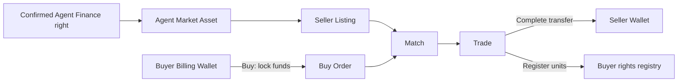
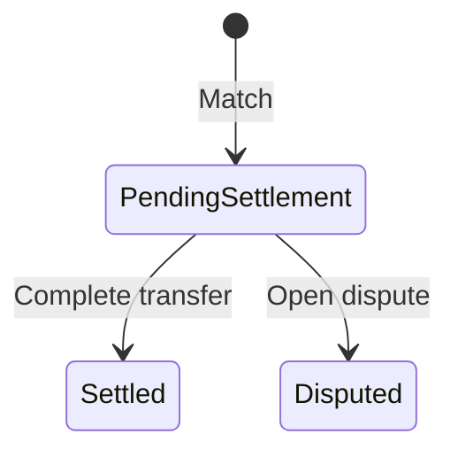

# Agent Market｜Agent 权利市场

Agent Market Desk 让已确认的 Agent Finance 内部收入权利在受控范围内挂牌、购买和转移。交易对象是系统登记的服务/收入权利单位，不是 Agent 所属公司的股权，也不是面向公众的证券交易。

## 参与角色与前置条件

- Seller 必须持有可转移的 Agent Asset 和足够未冻结单位。
- Buyer 使用有足够余额的 Billing Wallet 下单。
- Market operator 运行撮合；Settlement/Operations 完成权利转移并处理争议。
- Asset 通常由 Agent Finance 的已确认投资生成；`agent_secondary_market` 当前默认开放，但 Tenant Override 可能限制。

## 资金与权利流

下单时先锁定 Buyer 资金；撮合只建立交易关系；完成转移时才向 Seller 结算并把单位登记给 Buyer。争议中的 Trade 不应继续结算。

## Queue 含义

| Queue | 关注对象 | 典型下一步 |
| --- | --- | --- |
| Assets | 权利总量、持有人、可售与冻结单位 | Open sale |
| Listings | 卖价、数量和有效状态 | Buy 或 Cancel |
| Orders | Buyer 锁款与未成交数量 | Cancel、Sync matches |
| Trades | 已撮合待结算或争议交易 | Complete transfer |

## 逐步操作

1. 核对 Agent Finance 投资已 Confirmed，Agent Market 中已经生成对应 Asset。
2. Seller 执行 **Open sale**，输入单位数量与单价；系统不得允许出售超过可用持仓的单位。
3. Buyer 执行 **Buy**，系统从 Billing Wallet 锁定订单最大应付金额。
4. Market operator 执行 **Sync matches**，按当前撮合规则生成 Trade。
5. Settlement 执行 **Complete transfer**，完成资金结算和权利登记。未成交订单可 **Cancel** 并释放剩余锁款。

## 状态流转

上图是 Trade 状态，订单取消和剩余数量释放属于 Order 流程。当前 Trade 没有 `cancelled` 枚举；不要把订单取消当成已成交 Trade 的撤销。争议会阻止结算，不应假设关闭争议就自动恢复或退款。

## 哪些动作会移动资金或权利

| 动作 | 影响 | 说明 |
| --- | --- | --- |
| Open sale | 锁定权利单位 | 防止 Seller 重复出售 |
| Buy | 锁定资金 | Buyer Wallet 可用余额下降，总余额尚未结算给 Seller |
| Cancel | 释放未成交锁款/单位 | 已结算部分不能取消 |
| Sync matches | 通常不移动 | 创建 Match/Trade |
| Complete transfer | 移动资金与权利 | Seller 收款、Buyer 获得单位 |

## 金额示例

Seller 挂牌 `100` 单位，每单位 `12 USD`。Buyer 购买 `40` 单位时锁定 `480 USD`。若撮合并结算 `30` 单位，则 `360 USD` 转给 Seller、Buyer 获得 `30` 单位；余下 `120 USD` 继续锁定或在取消未成交数量后释放。

## 权限边界

挂牌、下单、撮合和结算分别受 Capability 控制。Seller 不能转移冻结或不属于自己的单位；Buyer 不能使用别人的 Wallet。Tenant tape 只能显示经过授权和脱敏的市场信息，不能泄露对手方敏感账务。

## 验证

核对 Asset 持仓、Listing/Order 剩余数量、Wallet `available/locked`、Trade 状态、权利登记、Journal Entry 和 Audit Event。完成转移必须保持“资金成功且权利成功”或“二者都不成功”。

## 排错

| 现象 | 查询证据 | 修复方法 |
| --- | --- | --- |
| Asset 不存在 | Agent Finance 投资状态、自动创建 Audit | 先完成 Confirm & settle，再修复失败任务 |
| Buy 提示余额不足 | Wallet available、其他订单锁款 | 补足余额或取消无用订单释放锁款 |
| 一直未撮合 | 价格、剩余数量、Sync checkpoint | 调整订单或重跑撮合任务 |
| Complete transfer 被阻止 | Trade dispute、锁款、持仓冻结 | 先解决争议或余额/持仓不一致 |

## 当前限制与安全边界

Agent Market 是租户受控的内部权利登记与结算功能，不提供公开市场、价格发现承诺、托管牌照或法律上的证券所有权。外部转账与合同执行不由本 Desk 完成。

## 下单前刷新报价

**Buy open sale** 会先调用 `market/quote-preview/`，再携带 `quote_version` 提交订单。搜索结果或旧详情中的数量不能视为已预留。遇到 `MARKET_QUOTE_STALE`，重新加载挂牌并确认最新价格和可售数量，不要直接重放旧订单。

目录允许浏览经授权的跨组织挂牌，不代表获得卖方账户的管理权。写动作仍按产品、调用者和记录参与方检查。
