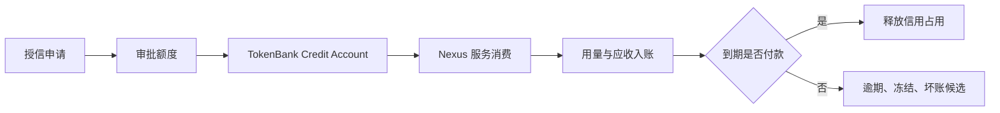
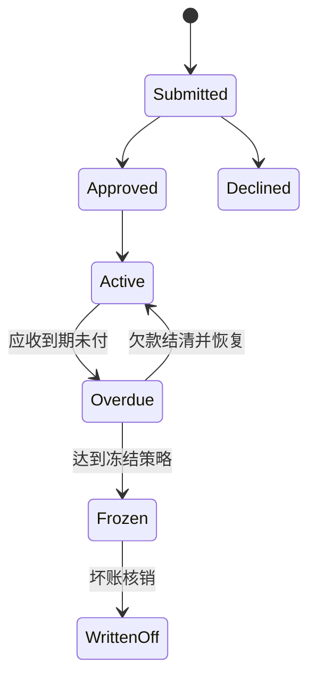

# Credit｜企业授信

Credit Desk 管理企业客户的内部服务信用额度。它把“先使用 Nexus 服务、后结算账单”变成可审批、可追踪、可冻结的控制流程。它不是银行贷款，也不会向外部银行账户发放现金。

## 参与角色与前置条件

- 申请人提交额度、用途和期限；审批人独立决定是否授信。
- Billing/运营人员同步真实消费与应收，Risk/Admin 处理逾期和坏账。
- 租户、主体和计价 Unit 必须明确；写操作需要对应 Capability。
- 同一业务事件必须使用稳定的幂等键，避免重复入账。

## 资金与权利流

授信审批创建的是内部信用权利；真正消费后才形成信用占用和应收。还款降低占用，坏账核销只是确认损失，不能伪装成客户付款。

## Queue 含义

| Queue | 关注对象 | 典型下一步 |
| --- | --- | --- |
| Applications | 新申请和待审批申请 | Approve 或 Decline |
| Usage billing | 尚未同步或待核对的消费 | Sync spending & invoices |
| Overdue cases | 已超过到期日的应收 | 催收、冻结或恢复 |
| Bad debt candidates | 满足坏账候选条件的应收 | 复核后 Write off |

## 逐步操作

### 1. 申请与审批

1. 申请人执行 **Apply for credit**，填写额度、Unit、期限和用途。
2. 审批人在 Applications Queue 核对主体、历史欠款和风险证据。
3. 执行 **Approve** 后额度进入可用状态；执行 **Decline** 不会创建可消费额度。

### 2. 消费、应收与还款

1. 真实 Nexus 用量产生后，执行 **Sync spending & invoices**。
2. 系统以双分录记录信用占用与应收；超过可用额度的事件应失败，而不是生成负的可用额度。
3. 客户还款入账后，应收减少、`credit_used` 下降、可用额度恢复。

### 3. 逾期与坏账

执行 **Run overdue automation** 更新逾期状态并产生相应控制动作。达到策略阈值的账户可被冻结并进入 Bad debt candidates；只有经过高风险复核后才执行 **Write off**。

## 状态流转

状态名以 Console/API 返回值为准；策略可按租户覆盖。不要仅凭按钮是否可见推断业务已经完成。

## 哪些动作会移动资金

| 动作 | 是否移动/占用价值 | 说明 |
| --- | --- | --- |
| Apply / Approve / Decline | 否 | 创建或决定信用权利 |
| Sync spending & invoices | 是 | 增加信用占用并形成应收 |
| 客户还款入账 | 是 | 降低应收和信用占用 |
| Run overdue automation | 通常否 | 更新状态、告警和冻结控制 |
| Write off | 是 | 将应收转为损失，不代表收到付款 |

## 金额示例

某客户获批 `10,000 USD`，已消费 `3,200 USD`，则可用额度为 `6,800 USD`。随后同步 `1,000 USD` 用量，可用额度变为 `5,800 USD`。客户支付 `2,500 USD` 后，信用占用从 `4,200 USD` 降至 `1,700 USD`。四个数字应能在账户、应收、Journal Entry 和 Audit Event 中相互解释。

## 权限边界

申请、审批、账单同步、坏账核销应由不同 Capability 控制。跨租户用户不能看到或修改本租户记录；核销和人工恢复属于高风险动作，应保留原因、操作者和关联证据。

## 验证

操作成功后同时核对：Record 状态、账户 `balance/credit_used/available`、对应应收、Journal Entry 借贷平衡、Audit Event，以及相同幂等键重试不会重复记账。

## 排错

| 现象 | 查询证据 | 修复方法 |
| --- | --- | --- |
| Approve 不可用 | Capability、记录状态、租户 | 使用审批角色或修正前置状态 |
| 同步提示额度不足 | 可用额度、未入账付款、Unit | 先完成还款/调额，不要强行改余额 |
| 逾期后仍可消费 | 自动化任务、冻结策略、最近 Audit | 重跑逾期任务并处理失败 Alert |
| 重试产生重复单据 | 幂等键、来源事件 ID | 固定业务键并人工冲正重复分录 |

## 当前限制与安全边界

Credit 只管理 Nexus 内部服务信用和应收，不提供现金贷款、征信服务或法律催收。冻结、坏账阈值和产品策略可能有 Tenant Override；上线前应以当前 Console/API 和策略配置为准。
