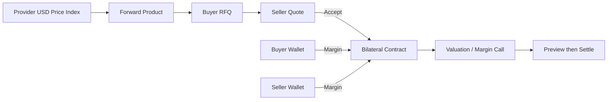
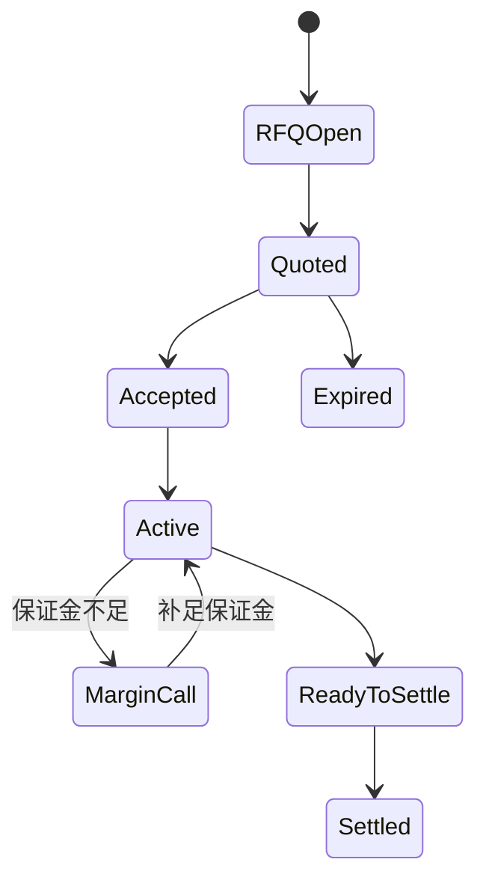

# Derivatives｜价格锁定与远期

Derivatives Desk 用 Provider 的 USD 计价指标创建内部 Forward，通过 RFQ 和双边报价锁定未来 Nexus API/算力服务价格。当前 Console 聚焦 Forward；它不是公共衍生品交易所或中央清算机构。

## 参与角色与前置条件

- Market operator 维护 Provider USD/1K token 等价格指数和产品。
- Buyer 发起 RFQ；Seller 报价；双方均需有足够 Billing Wallet 资金满足保证金要求。
- Risk/Settlement 负责估值、追加保证金、预览和最终结算。
- `price_lock` 默认需要审批；租户和司法辖区策略可以覆盖。

## 资金与权利流

## Queue 含义

| Queue | 关注对象 | 典型下一步 |
| --- | --- | --- |
| Products | Forward 产品定义 | 创建或停用产品 |
| Price indexes | Provider USD 基准 | 更新可信价格 |
| RFQs | 买方询价 | Seller 提交 Quote |
| Quotes | 报价与有效期 | Accept 或等待失效 |
| Active contracts | 已接受的双边合约 | 刷新估值、补保证金 |
| Risk alerts | 保证金缺口 | Add margin |
| Settlements | 到期或可结算合约 | Preview、Settle |

## 逐步操作

1. 创建 Marketplace Provider USD price index，明确 Provider、Unit 和每 1K token 等计价口径。
2. 创建 Forward Product，配置期限、合约规模和保证金规则。
3. Buyer 执行 **Create RFQ**；Seller 执行 **Generate quote**。
4. Buyer 执行 **Accept selected quote**。报价即使能保存，双方资金不足时也不能成功接受。
5. 对活动合约执行 **Refresh risk**；出现缺口时从相关 Wallet 执行 **Add margin**。
6. 到期先执行 **Preview settlement**，核对最新估值、付款方、保证金抵扣和剩余应付；确认后才执行 **Settle**。

## 状态流转

## 哪些动作会移动资金

| 动作 | 是否移动/锁定资金 | 说明 |
| --- | --- | --- |
| Create index/product/RFQ/Quote | 否 | 建立市场与报价数据 |
| Accept selected quote | 是 | 建立合约并锁定双方初始保证金 |
| Refresh risk | 否 | 估值并开立/更新/关闭 Margin Call |
| Add margin | 是 | 从产生缺口的一方 Wallet 精确补足 |
| Preview settlement | 否 | 只生成结算预览 |
| Settle | 是 | 先使用付款方保证金，再完成差额和释放剩余保证金 |

## 金额示例

Buyer 锁定未来 `100,000` 个单位，Forward 价格为 `2.00 USD/1K`，到期指数为 `2.30 USD/1K`，差额为 `30 USD`。若付款方已有 `20 USD` 可用保证金，结算先消耗该保证金，再要求 `10 USD` 差额；不足时结算必须阻止，而不是生成负余额。

## 权限边界

指数维护、产品创建、报价、风险和结算分别受 Capability 限制。报价只能由合格对手方操作；结算人员不得修改历史指数来迎合结果。所有估值输入和审批证据应留在 Audit Event 中。

## 验证

检查 Quote 与 RFQ 条款一致，Accept 后双方 Wallet 锁定额正确，Margin Call 缺口与最新估值一致，Preview 与最终 Settlement 金额一致，Journal Entry 平衡，重试不会重复结算。

## 排错

| 现象 | 查询证据 | 修复方法 |
| --- | --- | --- |
| Quote 可见但无法接受 | 双方 Wallet、Quote 有效期、策略 | 补足资金或重新报价 |
| Risk refresh 无变化 | 指数时间、活动合约、Checkpoint | 更新可信指数后重跑 |
| Add margin 失败 | 缺口方、Wallet 可用额、Unit | 向正确一方 Wallet 补足相同 Unit |
| Settle 被阻止 | Preview、保证金、差额付款方 | 补足短缺后使用同一结算幂等键重试 |

## 当前限制与安全边界

系统不提供公共撮合、中央对手方担保、外部现金清算或法律合约执行。当前仅应描述 Console 已支持的 Forward 工作流，不能把未来产品当作现有能力。

## 当前报价和结算控制

RFQ 发起人不能给自己的 RFQ 报价；只有发起人可取消对应 RFQ 或接受其报价。当前按钮名为 **Generate quote**、**Accept selected quote**、**Cancel selected RFQ**。确认前检查 `is_executable`、双方 `funding_shortfall` 和有效期；保存报价不代表资金条件已经满足。

Preview settlement 只展示计算结果，随后仍需独立执行 Settle。记录变化导致 `TOKENBANK_RECORD_STALE` 时先刷新，不要复用旧的确认摘要；最终资金状态仍由结算事务检查。
