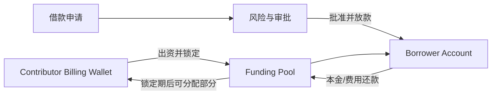
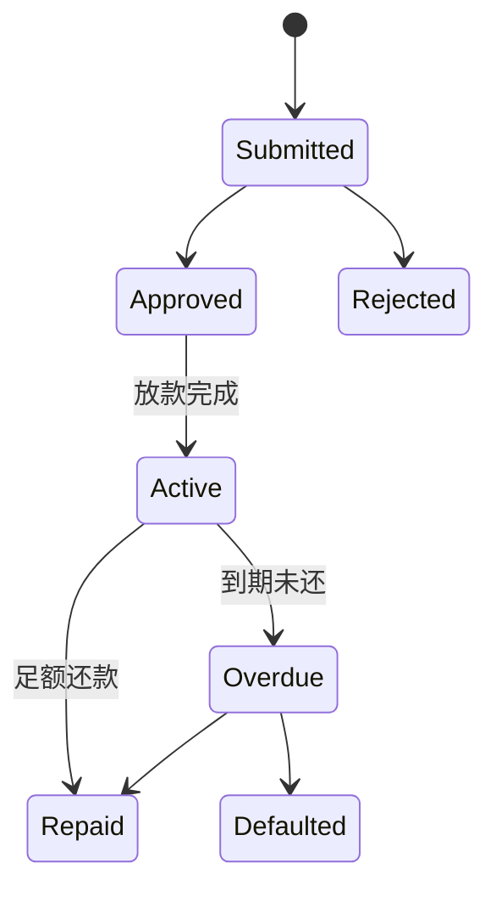

# Funding｜资金池与借款

Funding Desk 把 Billing Wallet 中已存在的内部结算余额投入租户资金池，再按审批流程向合格借款方提供内部借款。它用于 Nexus 生态内的资金调度，不接受外部存款，也不承诺收益。

## 参与角色与前置条件

- Contributor 决定出资金额并确认风险与锁定期。
- Borrower 提交借款申请；Approver/Risk 审核用途、期限和偿付能力。
- Operations 处理还款、逾期、违约与对账。
- 出资人 Billing Wallet 必须有足够可用余额，Unit 必须一致；`token_lending` 默认需要审批且可被租户策略覆盖。

## 资金与权利流

出资会减少 Wallet 可用余额并形成资金池权益；批准借款同时可能发生放款。池中已分配资金不能因为出资人申请退出而被重复提取。

## Queue 含义

| Queue | 关注对象 | 典型下一步 |
| --- | --- | --- |
| Fund account | 出资、锁定期和可分配余额 | Move Billing balance to pool |
| Lending | 申请、审批中和活动借款 | Submit、Approve 或 Reject |
| Returns | 到期还款、收益/费用和异常 | Submit repayment、对账 |

## 逐步操作

### 1. 向资金池出资

在 Fund account 中执行 **Move Billing balance to pool**，输入 USD 金额和锁定期，并确认风险提示。成功后检查 Wallet 扣减、Pool 增加和出资权益记录。

### 2. 申请与放款

Borrower 执行 **Submit loan application**。Approver 核对资金池可用余额、用途与期限；**Approve** 会批准并按当前契约放款，**Reject** 只关闭申请，不移动资金。

### 3. 还款、到期和违约

在 Returns 选择合同并执行 **Submit repayment**，从 Borrower Billing Wallet 扣款后补充资金池。到期分配只能使用未被借款占用且满足锁定条件的余额。逾期任务会标记 overdue/default 并可能冻结 Borrower。

## 状态流转

## 哪些动作会移动资金

| 动作 | 是否移动/锁定资金 | 说明 |
| --- | --- | --- |
| Move Billing balance to pool | 是 | Wallet 转入资金池并形成锁定权益 |
| Submit / Reject | 否 | 只改变申请状态 |
| Approve | 是 | 审批通过并放款 |
| Submit repayment | 是 | Borrower 还款进入资金池 |
| 逾期/违约任务 | 通常否 | 更新状态、冻结和告警 |

## 金额示例

出资人从 Billing Wallet 投入 `20,000 USD`，池可用余额为 `20,000 USD`。批准一笔 `8,000 USD` 借款后，池可用余额为 `12,000 USD`，已分配为 `8,000 USD`。Borrower 偿还 `8,400 USD` 后，资金池增加本金与约定费用；如何向出资人分配收益必须由当前策略明确，未配置时不能自行假设比例。

## 权限边界

出资、申请、审批和人工还款使用不同 Capability。审批人不能绕过余额、Unit、策略或租户边界；Submit repayment 从 Borrower Billing Wallet 扣款并补充池流动性，不是仅登记外部证明。

## 验证

核对 Billing Wallet、Funding Pool、借款记录、锁定/可分配余额、Journal Entry、Audit Event 和幂等键。批准后的放款金额应与 Borrower 入账完全一致，借贷合计应平衡。

## 排错

| 现象 | 查询证据 | 修复方法 |
| --- | --- | --- |
| 无法出资 | Wallet 可用余额、Unit、产品策略 | 补足余额或选择一致 Unit |
| Approve 后未放款 | Pool 可用余额、任务/Journal、Alert | 不要重复审批；先判断事务是否整体回滚 |
| 无法退出资金池 | 锁定到期时间、allocated 金额 | 等待锁定期并仅提取未分配余额 |
| Submit repayment 重复 | 幂等键、Wallet Ledger、合同 | 核对是否已成功，不为同次还款创建新键 |

## 当前限制与安全边界

Funding 不是存款、理财、众筹或对外贷款平台；不保证本金、流动性或收益。当前收益分配以已配置策略和实际记录为准，不能从示例推导产品承诺。

## 当前平台操作限制

资金池出资必须来自平台超级管理员所属 Organization 的 Billing Wallet，同时满足出资 Capability；普通租户 Admin 不能仅凭角色名执行。当前 Console 的借款批准/拒绝也按平台超级管理员能力开放。

出资为 USD，精确到美分；锁定期为 0–3650 的整数天数，必须明确确认风险。当前 Console 的收益分配规则标记为 `not_configured`，不要从余额增长推算固定收益。

**Submit repayment** 立即执行钱包扣款和内部还款过账。重试先核对原幂等键、Wallet Ledger 与合同记录，避免为同一次还款创建新业务键。到期返还由 `funding_pool_maturity_payout` 处理可返还资金。
