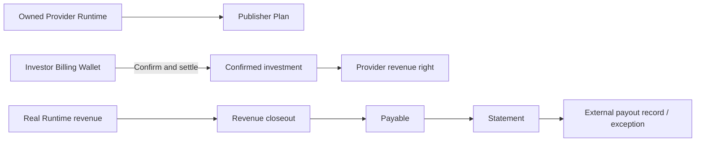
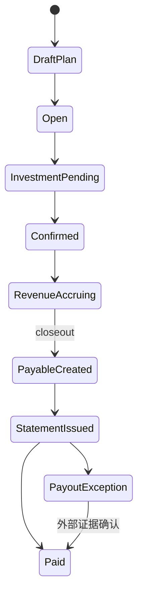

# Provider Finance｜Provider 融资与结算

Provider Finance Desk 为 Nexus Provider Runtime 建立内部融资计划，把一次性投资、真实 Provider 收入、应付账款和出款证据串成可审计流程。它不代替外部支付服务商，也不保证投资收益。

## 参与角色与前置条件

- Publisher 必须拥有可验证的 Provider Runtime；系统据此派生参与方，不能任意指定无关 Provider。
- Investor 使用 Billing Wallet 投资；Finance 确认并结算投资。
- Revenue/Payables operator 关闭收入周期、生成 Payable/Statement，并处理 Payout Exception。
- `api_provider_financing` 默认需要审批；跨租户可见计划仍须遵守独立写权限和策略。

## 资金与权利流

TokenBank 负责内部确认、分配和应付证据；真正离开系统的法币出款需要已配置的 Provider adapter 或人工外部结算记录。

## Queue 含义

| Queue | 关注对象 | 典型下一步 |
| --- | --- | --- |
| Plan worklist | Runtime 融资计划 | Create publisher plan |
| Investment worklist | 待确认投资 | Invest、Confirm & settle |
| Revenue closeout | 收入、Payable、Statement、异常 | Close out、Payout exception |

## 逐步操作

1. Publisher 执行 **Create publisher plan**，选择自己拥有的 Runtime，填写 Unit、目标和 Revenue Policy。
2. Investor 执行 **Invest in Provider**；Finance 核对 Wallet、计划容量和参与方后执行 **Confirm & settle**。
3. 等待该 Runtime 的真实、已确认收入进入 Revenue closeout。没有 Confirmed investment 时不能提前分配投资者收益。
4. 关闭收入周期，生成参与方 Payable 和 Statement。
5. 外部出款失败、缺少 adapter 或需人工确认时，执行 **Payout exception**，记录原因和后续恢复动作。

## 状态流转

## 哪些动作会移动资金

| 动作 | 是否移动资金 | 说明 |
| --- | --- | --- |
| Create plan / Invest | 通常否 | 建立计划和待确认意向 |
| Confirm & settle | 是 | Investor Wallet 一次性内部结算 |
| Revenue closeout | 是 | 分配已确认收入并生成应付 |
| Issue Statement | 否 | 固化对账凭据 |
| Payout exception | 否 | 记录外部结算异常，不伪造已付款状态 |
| 外部 payout confirmation | 取决于 adapter | 用可信外部编号更新出款证据 |

## 金额示例

Investor 投入 `20,000 USD`。某周期 Runtime 确认净收入 `8,000 USD`，策略为 Investor `25%`、Publisher `65%`、Platform `10%`，则 Payable 分别为 `2,000/5,200/800 USD`。若 Publisher 的 `5,200 USD` 外部出款失败，应保留 Payable 并创建 Payout Exception，而不是标成 Paid。

## 权限边界

Runtime 所有权决定谁能建计划；投资、确认、收入关闭和异常处理各有 Capability。公开计划只扩大经策略许可的读取范围，不允许任意跨租户修改。Statement 发布后变更必须通过冲正或新周期处理。

## 验证

检查 Runtime 归属、投资结算 Journal、真实收入来源、Revenue Batch、Payable、Statement 总额、外部结算编号、Payout Exception 和 Audit Event。各参与方金额与舍入项之和必须等于可分配净收入。

## 排错

| 现象 | 查询证据 | 修复方法 |
| --- | --- | --- |
| Runtime 不可选 | 所有权、租户、Runtime 状态 | 修正 Provider 归属或使用正确 Publisher |
| Revenue 无法关闭 | 投资是否 Confirmed、来源收入、Checkpoint | 补齐前置记录后幂等重跑 |
| Statement 与 Payable 不同 | 批次版本、舍入、冲正 | 以同一 closeout 批次重建对账链 |
| Payout 长期异常 | adapter 日志、外部编号、Alert | 人工确认后恢复，不直接改成 Paid |

## 当前限制与安全边界

Provider Finance 不是股权融资、保本产品或外部支付网络。TokenBank 只能证明内部账务状态和已登记的外部证据，不能证明银行最终到账，除非支付 Provider 返回可验证确认。

## 投资确认者与记录版本

**Confirm & settle investment** 由 Publisher Organization 的授权成员执行，且不能是提交该投资的用户。先检查记录的 `can_confirm` 和控制提示，切换到符合条件的账号后再确认。

确认动作携带 `record_version`；遇到 `TOKENBANK_RECORD_STALE` 时重新核对计划、投资金额和状态。公共计划可搜索、可浏览，不等于任何浏览者都能确认或修改计划。
