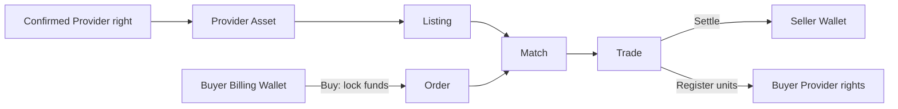
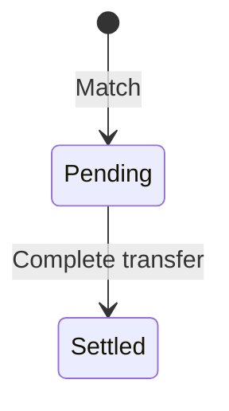

# Provider Market｜Provider 权利市场

Provider Market Desk 支持在受控租户范围内转移 Provider Runtime 相关的内部服务/收入权利。挂牌、下单、撮合和结算都有独立证据链；它不是 Provider 公司的股权市场或公共交易所。

## 参与角色与前置条件

- Seller 持有可转移 Provider Asset；Buyer 使用自己的 Billing Wallet。
- Market operator 执行撮合；Settlement operator 完成资金和权利原子转移。
- Asset、参与方、Unit 和可转移数量必须已登记，冻结/争议单位不可出售。
- `api_provider_market` 当前默认开放，租户或司法辖区策略可以覆盖。

## 资金与权利流

资金锁定、撮合和最终结算是三个阶段。只有最终结算成功后，Seller 才收到资金且 Buyer 才获得 Provider 权利单位。

## Queue 含义

| Queue | 关注对象 | 典型下一步 |
| --- | --- | --- |
| Assets | Provider 权利持仓 | Open sale |
| Listings | 有效卖单 | Buy、Cancel |
| Orders | Buyer 订单与锁款 | Cancel、Sync matches |
| Trades | 待结算、已结算或争议交易 | Complete transfer |

## 逐步操作

1. 在 Assets 核对 Provider、权利类型、Unit、持有人和可售数量。
2. Seller 执行 **Open sale**，输入数量、价格与有效期。
3. Buyer 执行 **Buy**；系统校验并锁定 Billing Wallet 资金。
4. 执行 **Sync matches** 生成匹配 Trade。
5. 执行 **Complete transfer**，原子完成 Seller 收款和 Buyer 权利登记。取消未成交订单会释放相应锁款和单位。

## 状态流转

## 哪些动作会移动资金或权利

| 动作 | 影响 | 说明 |
| --- | --- | --- |
| Open sale | 锁定 Seller 单位 | 避免重复挂牌 |
| Buy | 锁定 Buyer 资金 | 余额尚未付给 Seller |
| Cancel | 释放未成交资源 | 不回滚已结算 Trade |
| Sync matches | 通常不移动 | 只建立匹配关系 |
| Complete transfer | 移动资金与权利 | 更新 Wallet、持仓和权利登记 |

## 金额示例

Provider Asset 共 `1,000` 单位，Seller 以 `5 USD` 挂牌 `200` 单位。Buyer 购买 `80` 单位时锁定 `400 USD`；撮合并完成转移后 Seller 收到 `400 USD`、Buyer 持仓增加 `80`、Seller 可售持仓减少 `80`。任何手续费都必须作为独立分录可见。

## 权限边界

Seller 只能出售自己的可用单位，Buyer 只能使用授权 Wallet。市场可见性由租户策略决定，撮合与结算需要服务 Capability；争议冻结期间不允许通过管理员按钮绕过结算保护。

## 验证

检查 Asset、Listing、Order、Trade、Wallet locked/available、双方权利登记、费用分录和 Audit Event。相同 Trade 结算重试不得重复付 Seller 或重复增加 Buyer 持仓。

## 排错

| 现象 | 查询证据 | 修复方法 |
| --- | --- | --- |
| 无法挂牌 | Asset 所有人、可用/冻结数量、策略 | 解除合法冻结或减少数量 |
| 下单后余额异常 | Order 锁款、其他活动订单、Unit | 先对齐锁款明细，不手工补差 |
| Match 未产生 | 买卖价格、数量、Checkpoint | 修正订单或重跑撮合 |
| 结算停在 pending | Trade、订单锁款、余额和权限 | 核对参与方与资金条件后完成转移 |

## 当前限制与安全边界

Provider Market 只登记 Nexus 内部 Provider 服务/收入权利，不代表公司所有权，不提供公共市场流动性、托管担保或法律过户。Tenant Override 可能关闭或收紧该产品。

## 下单前刷新报价

**Buy open sale** 会先调用 `market/quote-preview/`，再携带 `quote_version` 提交订单。搜索结果或旧详情中的数量不能视为已预留。遇到 `MARKET_QUOTE_STALE`，重新加载挂牌并确认最新价格和可售数量，不要直接重放旧订单。

目录允许浏览经授权的跨组织挂牌，不代表获得卖方账户的管理权。写动作仍按产品、调用者和记录参与方检查。

## Provider 交易状态

只能购买 `active` 挂牌，不能购买自己创建的 Provider sale；只能取消 `open` 订单。Complete transfer 仅处理 `pending` Trade，完成后为 `settled`。Provider Trade 当前没有 Agent Trade 的 `disputed` 状态，排错时应使用本产品的状态和锁款证据。
