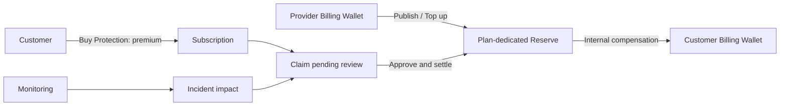
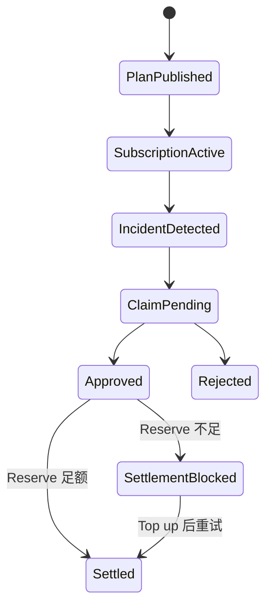

# SLA｜服务保障与补偿

SLA Desk 把 Provider 的服务承诺、专用准备金、客户购买、监控事件、Claim 审核和内部补偿连接起来。它用于 Nexus 服务等级治理，不是保险产品，也不代表现金赔偿承诺。

## 参与角色与前置条件

- Provider 发布 SLA Plan，并从自己的 Billing Wallet 预存专用 Reserve。
- Customer 购买保护；Monitoring 产生可信探测和 Incident 证据。
- Claim reviewer 独立核对影响和策略；Settlement operator 从对应 Plan Reserve 结算补偿。
- `sla_protection` 默认需要审批；Plan、服务目标、窗口、补偿公式、Reserve Unit 和 Provider 必须明确。

## 资金与权利流

Premium 是购买保护的对价，不会自动增加 Provider 的承保准备金。Claim 补偿只能来自发行该 Plan 的专用 Reserve，不能借用无关 Provider 或其他 Plan 的余额。

## Queue 含义

| Queue | 关注对象 | 典型下一步 |
| --- | --- | --- |
| Plans | SLA 产品和补偿规则 | Publish Provider plan |
| Subscriptions | 客户购买和覆盖窗口 | Buy Protection |
| Provider plans | Provider 发行与状态 | Publish、停用 |
| Reserves | 专用准备金充足性 | 查看资金证据；在 Provider plans 中补充 |
| Workflow tasks | 指向源资源的阶段待办 | Review selected claim、Settle selected claim |
| Workflow cases | Incident、影响和 Claim 的进度 | 查看阶段和关联任务 |

## 逐步操作

1. Provider 执行 **Publish Provider plan**，同时从 Provider Billing Wallet 转入初始 Reserve。
2. Customer 执行 **Buy Protection**，确认服务对象、覆盖窗口、价格和补偿上限。
3. Provider 可执行 **Top up reserve** 补充专用准备金。
4. Monitoring 把 Target/Probe 结果聚合为 Incident 和订阅影响；系统据此生成待审核 Claim。
5. Reviewer 执行 **Review claim**，核对订阅有效性、时间窗口、影响值和补偿公式。
6. 批准后由 Settlement 执行 **Settle claim**，从该 Plan Reserve 转入 Customer Billing Wallet。

## 状态流转

自动生成 Claim 仍然属于可审计的审核流程；即使策略允许小额自动批准，最终结算也必须留下独立状态和分录。

## 哪些动作会移动资金

| 动作 | 是否移动资金 | 说明 |
| --- | --- | --- |
| Publish Provider plan | 是 | Provider Wallet 转入 Plan Reserve |
| Buy Protection | 是 | Customer 支付 Premium；不自动补 Reserve |
| Top up reserve | 是 | Provider Wallet 增加专用 Reserve |
| Incident / Review claim | 否 | 形成证据并决定 Claim |
| Settle claim | 是 | 对应 Plan Reserve 补偿 Customer Wallet |

## 金额示例

Provider 为 Plan 预存 `10,000 USD` Reserve。Customer 支付 `200 USD` Premium 后，Reserve 仍按专用入金规则保持 `10,000 USD`，不能把 Premium 当作 Reserve 增量。一次 Incident 经审核补偿 `750 USD`，结算后 Reserve 为 `9,250 USD`，Customer Billing Wallet 增加 `750 USD`。

## 权限边界

Provider 只能为自己的服务发布计划和补充准备金；Customer 只能购买有权访问的计划。监控证据、Claim 审核和结算需要不同 Capability。Reviewer 不应同时篡改 Probe 数据或补偿公式。

## 验证

核对 Plan 与 Provider 归属、Reserve Journal、Subscription 覆盖窗口、Probe/Incident 证据、Claim 计算、审批 Audit、Settlement 分录和 Customer Wallet。重复结算同一 Claim 必须返回既有结果而不是再次扣减 Reserve。

## 排错

| 现象 | 查询证据 | 修复方法 |
| --- | --- | --- |
| Plan 无法发布 | Provider Wallet、初始 Reserve、策略 | 补足余额和计划配置 |
| Incident 未生成 Claim | Subscription 窗口、Target/Probe、Checkpoint | 修复监控映射后幂等重跑 |
| Claim 金额不符 | 影响区间、补偿公式、上限 | 以原始 Probe 和规则重新计算 |
| Approved 但未结算 | Plan Reserve、Settlement Alert、Unit | Top up 对应 Reserve 后重试同一 Claim |

## 当前限制与安全边界

SLA Desk 不是保险、外部现金理赔或法律争议执行平台。它只按当前 Nexus 计划规则提供内部服务补偿；最终法律责任、税务和外部付款应由正式合同及外部系统处理。

## 从 Workflow tasks 处理 Claim

在 **Workflow tasks** 选择 `sla_review_claim` 待办，执行 **Review selected claim**；批准后选择 `sla_settle_claim` 执行 **Settle selected claim**。操作对象是待办指向的 Claim，不是 Case ID。**Workflow cases** 展示整体阶段，不提供通用领取或完成按钮。

**Top up plan reserve** 位于 **Provider plans** 的选中计划上。初次发布计划已经转入准备金，Reserves 中的记录是同一笔转账证据，不是第二次收费。
