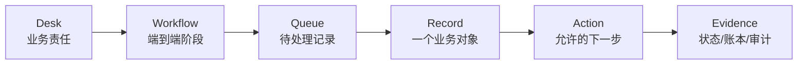

# TokenBank Console 导览

TokenBank 看起来有很多工作台和状态，但页面骨架只有一套。先学会读页面，再学习具体金融流程，会比背按钮更快。

## 六层页面模型

- **Desk**：一类完整业务，例如 Credit 或 SLA。
- **Workflow**：Desk 中的业务阶段，例如 Credit Approval、Usage Billing、Overdue Collections。
- **Queue**：当前角色可见的待处理记录。
- **Record**：一次申请、合同、订单、Claim 或结算记录。
- **Action**：当前用户、Queue 和状态允许执行的下一步。
- **Evidence**：执行后用于证明结果的业务状态、Ledger、Registry、Task 和 Audit。

## 页面区域

1. **Desk Navigation**：在 8 个有效 Desk 之间切换。
2. **Overview / Metrics**：当前角色可见的聚合，不是全 Tenant 的固定真相。
3. **Workflow Panel**：显示一条业务路径和下一步入口。
4. **Queue Workbench**：列出 Record；Queue 数量受权限和状态过滤。
5. **Detail Panel**：按 Summary、Risk、Financials、Settlement、Audit 等区块解释记录。
6. **Action Dialog**：收集字段并展示最终确认摘要。

## 第一次可见结果

打开 `/tokenbank/credit`，选择 Applications。即使没有申请，你也应看到 Empty State 和可用 Action。这个结果证明：

- 登录与 Tenant Context 有效；
- 你拥有 Credit 基础读取能力；
- Workbench 聚合 API 已正常返回。

接下来可以跟随[第一个授信工作流](first-workflow.md)创建一条真实 Record。

## Capability 决定你看到什么

Console 从 Server 返回的 `capabilities` 决定 Queue、字段和 Action。常见差异包括：

- 申请人只能 View Own 和 Create；
- 审批人可以 View All、Approve 或 Reject；
- 风险人员可以 Refresh/Preview，但不能 Settle；
- 结算人员可以 Settle，但不一定能改产品或风险参数。

因此同一个 Desk 在不同账号下看起来不同是正常的。Server 会再次校验，相关动作可以保持可见但禁用，并显示权限或 Maker-checker 原因；按钮可见不代表已获授权。

## 状态和刷新

Workbench 每 30 秒自动刷新。执行 Action 后通常会主动刷新，但后台 Task 可能稍后才完成。依次检查：

1. Toast/API Response；
2. Record Status；
3. Ledger/Registry；
4. Audit；
5. Task Run/Checkpoint。

## 不再使用的入口

`foundation`、`accounts-ledger`、`risk`、`settlement`、`finance`、`operations`、`policies`、`audit` 和 `market-surveillance` 已退役，会重定向到 Credit。账户、风险、结算和审计能力现在嵌入 8 个业务 Desk 与参考 API 中。

## 下一步

- 要实际完成一次操作：阅读[第一个授信工作流](first-workflow.md)。
- 要理解钱为什么没有“凭空变化”：阅读[账本与控制模型](../concepts/ledger-and-controls.md)。
- 要选择 Desk：阅读[如何选择金融流程](../guides/financial-flows.md)。

## 搜索、分页与记录控制

支持目录查询的 Queue 使用服务端搜索和游标分页，不只过滤已加载的几行。`queue`、`q`、`scope`、`status`、`side`、`cursor` 与 `snapshot` 可保存在页面 URL 中，具体筛选项依 Queue 而定。改变范围或筛选后从第一页重新查询。

Workbench 的 30 秒刷新更新聚合数据，不代表目录每次都重新载入全部记录。查看 `queue_scopes` 的 restricted 状态、当前筛选和分页，再判断“没有记录”；当前页数量也不等于总数。

选中记录后查看控制说明。Maker-checker 禁止创建者审批自己的记录；某些完成动作还要求操作者不同于申请人和审批人，以记录返回的 `can_approve`、`can_reject`、`can_complete` 为准。数据已被别人修改时刷新详情、重新核对，再提交。
