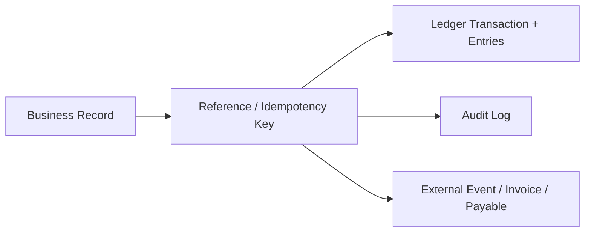

# 如何执行运营与风险操作

管理员的目标不是“让所有按钮都能点”，而是让每个资金或权利变化有正确权限、业务前置、账本证据、自动任务和可恢复路径。不要直接改数据库代替 Desk Action。

## 上线前检查

1. 确认 8 个有效 Desk 的 Product Policy 与 Tenant 业务范围一致。
2. 按职责分配申请、审批、风险、撮合、结算、坏账和 Payout 权限。
3. 激活需要的 Billing Wallet、TokenBank Account、Reserve 与 Settlement Account。
4. 检查 Scheduled Task 的 Enabled、Interval、Owner Role、是否修改 Ledger 和是否有外部副作用。
5. 为失败、Stale Checkpoint、Margin Default、Invoice Overdue 与 ERP Sync 配置告警处理人。
6. 用小金额完成 Credit、Funding 或 SLA 的端到端演练。

## 每日巡检

| 顺序 | 检查 | 处理原则 |
| --- | --- | --- |
| 1 | Operational Alerts | 先 Acknowledge，记录 Owner，再修根因，最后 Resolve |
| 2 | Task Runs / Checkpoints | 找 failed、stale、重复运行和长时间无进度 |
| 3 | Workflow Tasks / Cases | 处理待 Review、Settle、Exception 和 Dispute |
| 4 | Risk / Shortfall | 检查 Credit、Concentration、Margin、Reserve 和 Market Abuse |
| 5 | Reconciliation | 对齐业务记录、Ledger、External Event、Invoice/Payable |
| 6 | Audit 抽查 | 用同一 Reference/Idempotency Key 串起全过程 |

## 手动恢复任务

Console 的 **Sync** 或 **Run automation** 调用 Scheduled Task Run-now。手动运行适合故障恢复和验证，不应替代稳定调度。

1. 先看最近一次 Run、Checkpoint 和 Error。
2. 确认前一次没有仍在运行，避免并发处理同一批记录。
3. 修复依赖，例如 Wallet、Worker、Provider 数据或 External Event。
4. 运行一次并记录 Request ID。
5. 核对处理数量、Ledger 变化、Checkpoint 和 Alert 是否恢复。
6. 最后确认 Celery/Beat 或外部调度仍会持续触发。

完整任务目录见[自动化与外部结算](../reference/automation-and-settlement.md)。

## 高风险动作

坏账核销、Ledger 人工调整/冲正、Derivative Settlement、Margin 调整、Market Listing 审批、撮合/结算、Claim 补偿、External Payout Complete 和 Tax Rule 修改都应采用最小权限与双人复核。

当前代码提供细粒度 Permission、Approval、Audit 和记录级 Maker-checker 控制；部署方仍需分配合适的独立操作人员，并遵守记录返回的决策限制。不要把 Owner/Admin 的广泛权限当作日常操作角色。

## 对账方法

四类证据应在 Tenant、Unit、Amount、时间和业务 Reference 上一致。External Settlement 为 `matched` 只说明控制面记录匹配，不证明 TokenBank 自己执行了真实银行转账。

## 验证与排错

- 每次人工恢复都保存 Task Run ID、Request ID、处理数量和前后 Checkpoint。
- 失败三次后停止重复点击，检查幂等键、Record 状态和 Worker。
- 对账不平时不要补一笔“平衡转账”掩盖差异；先找出缺失或重复的业务事件。
- 高风险操作后检查 Audit 的 Actor、Reason、Before/After 与 Ledger Reference。

## 操作前检查当前控制条件

先查看选中记录的 `control_message` 和决策能力，安排符合独立审批条件的人员处理。资金池出资、借款决策不能仅凭租户 Admin 身份执行；按平台管理员能力和资金池归属检查。SLA 在 Workflow tasks 审核/结算，Case 用于进度跟踪。对账区分 `financial_balance_reconciliation` 内部余额校验和 External Reconciliation 外部证据核对。
