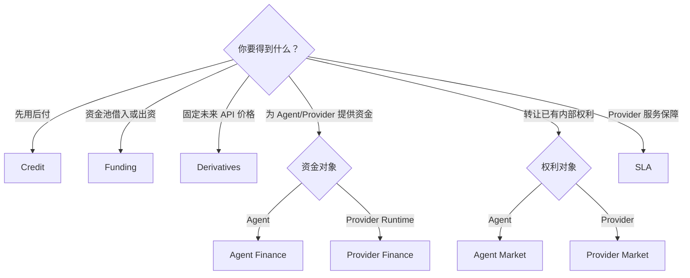

# 如何选择正确的金融流程

先回答“要解决什么业务问题”，再选择 Desk。不要从 Account Type 或 Ledger API 反推产品流程，因为基础转账不会自动创建申请、合同、应收、权利登记或 Claim。

## 决策路径

## 对比八种流程

| 目标 | 资金起点 | 最终交付 | 关键控制 | Desk |
| --- | --- | --- | --- | --- |
| API 先用后付 | Credit Account / Billing 还款 | Credit Limit、Receivable | 审批、账期、逾期、冻结 | [Credit](../desks/credit.md) |
| 投入共享流动性 | Billing Wallet | Funding Pool Contribution | 锁定期、未分配可取、集中度 | [Funding](../desks/funding.md) |
| 从资金池借款 | Funding Pool | Lending Contract / Disbursement | 审批、期限、还款、违约 | [Funding](../desks/funding.md) |
| 锁定未来 Provider 成本 | 双方 Billing Wallet / Margin | Bilateral Forward Contract | Quote 有效期、估值、Margin、短缺 | [Derivatives](../desks/derivatives.md) |
| 为 Agent 提供资金 | Investor Billing Wallet | 已确认 Investment + Revenue Right | Plan 份额、资金确认、真实收入 | [Agent Finance](../desks/agent-finance.md) |
| 为 Provider Runtime 提供资金 | Investor Billing Wallet | Provider Investment / Revenue Right | Runtime 所有权、Plan、Payable | [Provider Finance](../desks/provider-finance.md) |
| 转让 Agent/Provider 权利单位 | Buyer Billing Wallet | Transfer Registry 中的新持有人 | 锁款、撮合、争议、结算 | [Agent/Provider Market](../desks/agent-market.md) |
| Provider 服务故障补偿 | Provider Reserve + Customer Premium | Service Credit / Balance Refund / Discount | 覆盖期、事件、排除、Claim Review | [SLA](../desks/sla.md) |

## 选择时回答六个问题

1. 资金从哪个 Billing Wallet 或 TokenBank Account 来？
2. 结果是余额、信用、合同、服务权利、收入权利还是 Service Credit？
3. 谁发起、谁审批、谁承担风险、谁结算？
4. Product Policy 是 `open`、`approval_required` 还是 `disabled`？
5. 是否存在 Lockup、Locked Balance、Margin、Reserve、Dispute 或 Shortfall？
6. 成功后应在哪个业务记录、Ledger、Registry 和 Audit 中验证？

## 容易选错的场景

- 想为 Agent 提供新资金，应使用 Agent Finance；只有已经确认的权利单位才进入 Agent Market。
- 想为 Provider Runtime 融资，应使用 Provider Finance；Provider Marketplace 负责模型容量发现，不等于融资。
- 想保护 API 价格，使用当前只支持 Forward 工作流的 Derivatives；SLA 保护的是 Provider Block、Rate Limit、Outage 或 Policy Change。
- 想充值法币，先走 Billing Payment；TokenBank External Settlement 只是控制面记录，不自己调用银行完成转账。

## 验证与排错

选择后先打开对应 Desk 的 Overview。如果看不到目标 Queue，检查角色和 Product Policy；如果业务需要的最终证据在该 Desk 中不存在，通常说明流程选错。不要用基础 Ledger Transfer 绕过产品门禁。
