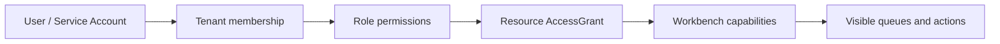

# 权限与 API 参考

TokenBank API 位于 `/api/v1/tokenbank/`。每次请求需要 Bearer Token 和 `X-Nexus-Tenant`；项目级请求还应带当前 `X-Nexus-Project`。完整 Endpoint、Request Schema 和枚举以 Server 的 `/api/v1/docs/swagger/` 或 `/api/v1/docs/redoc/` 为准。

## 权限如何决定页面

Server 先验证 Tenant 成员资格，再计算 Role、资源授权和细粒度 TokenBank Permission。非成员访问其他 Tenant 时返回 Not Found，避免泄露资源是否存在。

## 权限族

| 前缀 | 控制范围 |
| --- | --- |
| `tokenbank.read/account/ledger` | 基础读取、账户管理和账本过账 |
| `tokenbank.credit.*` | 申请、Own/All 可见性、审批、Usage、Collection、Bad Debt |
| `tokenbank.funding.*` / `tokenbank.lending.*` | 出资、Pool、申请、合同、还款、Returns 与 Overdue |
| `tokenbank.derivative.*` | 产品、Trade、Approve、Risk、Clear 与 Surveillance |
| `tokenbank.agent_financing.*` | Plan、Investment、Revenue Event、Settlement 与 Audit |
| `tokenbank.agent_market.*` | Asset、Listing、Order、Match、Transfer、Dispute 与 Surveillance |
| `tokenbank.api_provider.*` | Partner、Plan、Investment、Payable、Revenue 与 Payout |
| `tokenbank.api_provider_market.*` | Provider Asset、Listing、Order、Match 与 Transfer |
| `tokenbank.sla.*` | Plan、Subscribe、Risk、Claim、Compensate 与 Exclusion |
| `tokenbank.external_*` | Payment、Payout、Invoice、Tax、ERP 与 Reconciliation |
| `tokenbank.risk/compliance` | Risk Snapshot、Model、Stress、Limit 与 Compliance |

Owner/Admin 可能继承广泛能力，但生产环境应按申请、审批、风险、撮合和结算拆分角色。View Own 与 View All 是数据隔离，不只是 UI Filter。

## 请求安全

- 金融写操作发送稳定的 `idempotency_key`；同一业务重试复用原值。
- `approval_required` 产品使用与当前动作、资源、Tenant 匹配的已批准 Approval ID。
- 不在 `metadata`、Reason、Audit Note 中写 API Key、JWT、Cookie、银行凭据或支付 Secret。
- Amount 使用 API Schema 要求的 Decimal 字符串；不要依赖 JavaScript 浮点计算财务金额。
- 转账双方 Unit 必须相同，且 Source/Destination 必须属于允许的 Tenant/业务关系。

## 常见响应

| HTTP / Code | 含义 |
| --- | --- |
| 401 | Token 无效或登录失效 |
| 403 Permission Denied | 身份已确认，但缺少 Action Permission |
| 403 `TOKENBANK_POLICY_BLOCKED` | 产品 Disabled，或需要 Approval/Active Account |
| 404 `NOT_FOUND` | 资源不存在、不可见或属于其他 Tenant |
| 400 `TOKENBANK_INSUFFICIENT_BALANCE` | 可用余额/信用/准备金不足 |
| 400 Validation Error | 字段、Unit、状态、Quote、Lock、Margin 或业务关系不合法 |
| 409 | 记录已被推进、重复冲突或不允许当前状态转换 |

更多状态解释见[状态与错误码](statuses-and-errors.md)。

## API 使用原则

优先调用产品 Action API，而不是基础 Ledger Transfer。产品服务会同时验证 Policy、Approval、风险、状态和业务关系，并创建合同、Receivable、Registry 或 Claim；基础转账不能代替这些业务记录。

自动化任务使用 `/api/v1/tokenbank/scheduled-tasks/run-now/`，但调用者仍需要目标任务对应的 Capability。外部结算 API 记录标准化 Provider Event 和对账状态，不意味着 TokenBank 已经执行真实银行转账。

## 目录与版本 API

以下路径相对于 `/api/v1/tokenbank/`，不是新增 Console Desk：

| 方法与路径 | 当前用途 |
| --- | --- |
| `GET admin/catalog/{workbench}/{queue}/` | 查询受授权限制的目录；默认每页 50 条，`limit` 最大 100 |
| `POST market/quote-preview/` | 用 `market`（agent/provider）、`listing_id`、`quantity`、`limit_price` 预览订单 |
| `GET workflow-cases/` | 按 `product_type`、`lifecycle_status` 查询当前 Tenant 的业务 Case |
| `GET workflow-tasks/` | 按 `product_type`、`task_status` 查询当前 Tenant 的业务待办 |

目录响应包含 `items`、`loaded_count`、`total_count`、`count_is_exact`、`next_cursor`、`previous_cursor`、`snapshot` 和实际 `filters`。`include_total=false` 时总数可为 null；不要当作 0。搜索 `q` 最长 200 字符；排序与价格、Publisher、Model 等筛选仅在对应目录支持时使用。`snapshot` 是更新时间截点，不是永久保存的数据库快照。

购买挂牌时先预览，核对剩余数量、最低价格和 `maximum_order_value`，再把返回的 `quote_version` 带入订单。预览的 `valid_until` 不是锁价或库存预留承诺，Server 会再次校验挂牌状态与资金。

支持并发检查的记录动作应带最新 `record_version`（记录的 `updated_at`）；报价生成还可使用 `rfq_version`。这些字段不是幂等键。返回 409 时刷新并重新确认，不要删除版本字段来绕过冲突。
