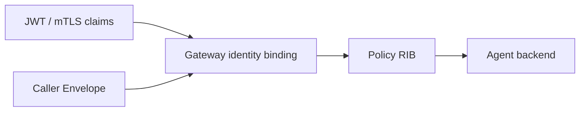

# Envelope, identity, and authentication boundaries

The Envelope separates routing intent from business payload. The SDK constructs and transports it; the Router remains the authority for identity and policy.

## Routing header and payload

Important fields include intent and major version, stable task ID, source Agent and tenant, optional exact target Agent, hop limit/deadline/constraints, and the business payload. MCP tools and A2A skills map into the same model so routing behavior remains consistent across protocols.

## Which fields are trustworthy

A caller may request an intent, target, constraints, and payload. It cannot gain identity by self-reporting tenant or source Agent. `agent-gw` verifies JWT or mutual TLS and replaces those fields with verified claims. The backend receives the bound Envelope, not the caller's Authorization or transaction token.

## Three token styles

- A fixed access token is simple but needs external rotation.
- A `TokenProvider` supplies tokens per request. A refreshable provider forces one refresh and one retry after a 401.
- A transaction token is one-task and mutually exclusive with access token/provider. It cannot authenticate a resumable reconnect.

401 becomes `NexusAuthenticationError`; 403 becomes `NexusAuthorizationError`. Do not collapse both into a generic network error.

## TLS identity and connect address

The IP address and certificate identity may differ. `tls_server_name` connects to a numeric IPv6 address while verifying an explicit DNS SAN, and requires HTTPS. Direct IPv6 helpers disable environment proxy use by default.

Plain HTTP direct mode accepts no TLS settings and adds no token automatically; use it only inside an explicitly controlled boundary. An HTTPS public endpoint is valid only when its address, port, TLS name, and CA bundle metadata are complete.

## Applications still validate input

Authentication proves who called, not that payload is safe. `input_validator` rejection returns 422 `INPUT_REJECTED`. Handlers must still enforce schema, size, finer authorization, and side-effect rules.

See [Authentication](../guides/authentication.md) and [Direct IPv6](../guides/direct-ipv6.md).
