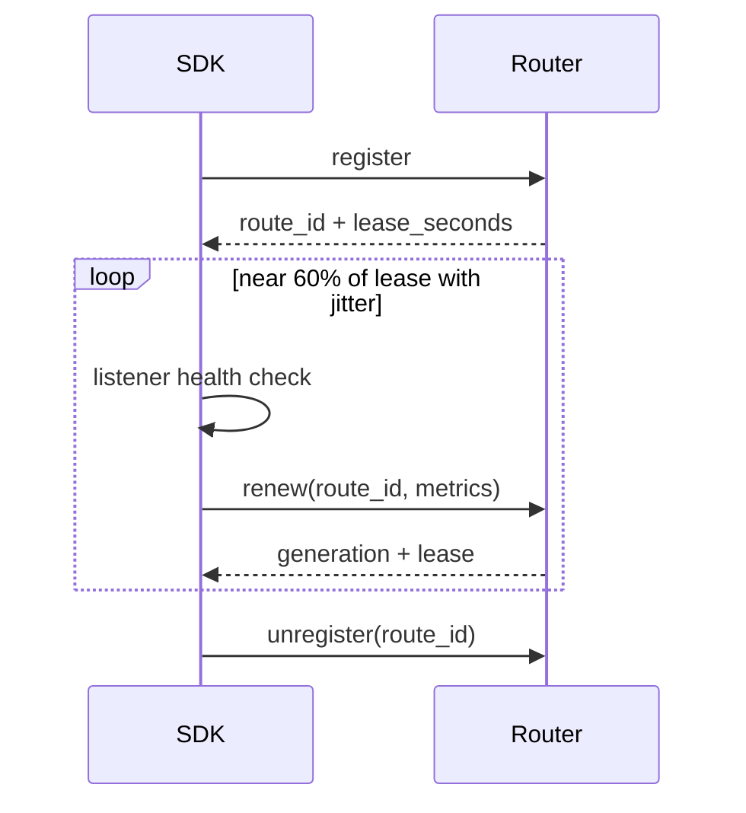

# Registration, renewal, and self-healing

Publishing a capability creates a renewable route lease, not a permanent catalog row. `AgentLease` combines route ID, renewal, health, self-healing, and withdrawal into one lifecycle object.

## What a registration describes

`CapabilityRegistration` includes intent, origin, endpoint, tenant, version, region, lease duration, cost, latency, load, trust, public IPv6, and optional backend TLS identity. The Router returns `LeaseInfo` with route ID, generation, effective lease, removal state, and an optional public endpoint.

High-level synchronous and streaming decorators produce the same registration model. If both handlers share one intent, their route options must be identical.

`renew_fraction` is 0.2 to 0.8 and defaults to 0.6. Each cycle adds 0.9–1.1 jitter. Transport failure uses bounded exponential backoff and remains visible through `last_error`.

## Why failed health withdraws

When the health callback returns false or raises, the renewal thread attempts unregister, records the failure, and stops. Renewing a known unhealthy handler would keep a bad route eligible.

## Self-healing after Router restart

A Router restart can lose in-memory leases. If a healthy Agent receives 404 from renew, the SDK normally re-registers the original declaration, receives a new route ID, and increments `reregister_count`. Updated latency/load values carry into the replacement.

The SDK does not re-register when renewal says `healthy=False` or when it lacks the original registration. Self-healing must not hide an application failure.

## Ownership and cleanup

`with client.register(...) as lease` unregisters on context exit. `NexusAgentHandle.close()` closes leases in reverse order, shuts down the server, and joins threads; repeated close is safe. Lease expiration is the fallback when abnormal exit prevents cleanup.

Observe route ID, lease duration, `last_error`, re-registration count, health-check failures, and Router generation. A running process alone is not proof of health.

See the [API reference](../reference/api.md) and OpenWrt [route lifecycle lab](/openwrt/tutorials/route-lifecycle-lab).
