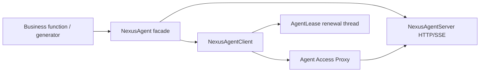

# SDK runtime mental model

The Python SDK contains both an invocation client and a callable Agent Server. High-level `NexusAgent` combines listening, registration, renewal, health, and cleanup. Lower-level classes remain available for existing services and frameworks.

## Three API layers

### `NexusAgent`

Use it for a new Agent. Decorators expose synchronous or streaming capabilities. `start()` opens the listener before registering every capability. `run()` blocks until Ctrl+C and withdraws leases during shutdown.

### `NexusAgentClient`

Use it to call Agents, manage registrations manually, or integrate an existing service. It handles JSON, SSE, TLS, token providers, typed errors, and one refresh retry after a 401. Its I/O model is synchronous.

### `NexusAgentServer`

Use it when you need direct control over handlers, bounds, authentication, or resume history. It parses an Envelope into `AgentEnvelope`, calls a handler, and serializes a bounded response.

## Why startup order matters

The facade first listens and confirms health, then registers the endpoint. Registering first could make the Router choose an unopened port. If one registration fails, the SDK closes earlier leases in reverse order and stops the server, avoiding a half-started Agent.

## Synchronous model and threads

The core has no third-party runtime dependency and supports Python 3.9+. The client is synchronous; the server handles requests with threads; each auto-renewed lease has a daemon thread; resumable streams separate producer lifetime from subscriber connections. CPU work and process isolation remain application choices.

## Auto-resolution is not implicit trust

`router="auto"` checks an environment URL, `nexus-router.local`, then the Linux default IPv4 gateway. `advertise_address="auto"` prefers a usable private or ULA address. These reduce address configuration but do not replace TLS, token, tenant, or Router policy.

| Need | Entry point |
| --- | --- |
| New ordinary Agent | `NexusAgent` |
| Invoke only | `NexusAgentClient` |
| Register an existing HTTP service | `CapabilityRegistration` + client |
| Custom handlers/resume capacity | `NexusAgentServer` |
| MCP/A2A framework | integration modules |

Continue with [Registration, renewal, and self-healing](registration-lifecycle.md), then build a [resilient Agent](../tutorials/resilient-agent.md).
