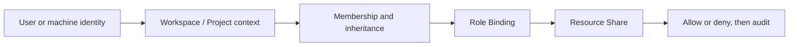

# Access

Access decides who can do what in Nexus. Use membership to add a person to a Project or Group, a Role for ongoing responsibility, a Resource Share for one-resource exceptions, and a Machine Identity for unattended software.

## Choose an access type

| Need | Mechanism | Start from |
| --- | --- | --- |
| Add a person to a Project or Group | Membership | **Invite people** |
| Ongoing responsibility across a scope | Role Binding | **Assign roles** |
| Temporary access to one Agent, Dataset, Router, or Model Pool | Resource Share / AccessGrant | **Share** on the resource |
| CI, backend jobs, CLI integrations | Service Account + Token | **Machine identity** |
| Understand allow or denial | Access Explain | **Check access** |

Nexus validates credential Workspace and request context, then evaluates membership, role bindings, resource grants, and machine identity. Visibility does not imply permission to change or invoke a resource.

The current model is allow-based. It has no explicit deny rule and no general time-, budget-, or network-conditional policies.

## Invite people

Open **Invite people**, choose a Project or Group, search by email, and assign a membership role. Member details summarize risk signals, access sources, resource shares, created resources, spend, and API-key use. Use Review/Offboard before removal; deleting one membership may not remove access inherited elsewhere.

## Assign roles and share resources

Use **Assign roles** for normal ongoing access at Workspace, Project, or Group scope. High-risk roles require confirmation. Revocation should account for other roles, group memberships, and shares.

Use **Share** from an Agent, Data Asset, Router, or Model Pool for an exact resource type and ID. Review and revoke all current exceptions under **Shared resources**. Prefer a Role when someone manages a whole class of resources.

## Create a machine identity

Create a Service Account under **Machine identity**, grant its minimum Role or Resource Share, then create a token with optional expiry and IP allowlist. Save the one-time `sa-nexus-...` plaintext immediately. Token plaintext and hash are never written to Audit.

Project API keys remain under **Settings → API Keys**. See [Identity and request paths](../concepts/identity-and-request-path.md).

## Explain an access decision

Under **Check access**, provide principal type/ID, action, resource type, and resource ID. The result lists matching Role Bindings, Resource Shares, and the decision reason. For a 403, also confirm the selected Workspace/Project, request headers, and actual resource ownership.

## Audit and offboarding

Access writes appear under **Recent access changes** and Observability Audit. Offboarding should cover Memberships, Roles, Shares, Service Accounts, API keys, created resources, and billing impact. Revoking access does not automatically transfer ownership.

## Current limits

- No explicit deny rules or general time-window/budget-aware conditions.
- No custom Role update/delete APIs.
- Not every future resource type has complete object-existence validation.

See [API conventions](../reference/api.md) and [API keys](../guides/api-keys.md).
