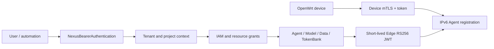

# Identity and request paths

Nexus does not merge every credential into one token. Cloud users, automation, and OpenWrt devices have different compromise boundaries. They share tenant and Agent identity claims, but not credentials or signing keys.

## Five identities

| Identity | Typical use | Credential |
| --- | --- | --- |
| Browser user | Nexus Console | HttpOnly session cookie + CSRF |
| User API client | CLI or short automation | 30-minute access JWT |
| API key | Gateway, Agent MCP, integrations | One-time `sk-nexus-...` secret |
| Service account | Unattended jobs | `sa-nexus-...`, optional expiry and IP allow-list |
| OpenWrt device | Publish and renew IPv6 Agents | Device token + mTLS certificate |

## Why user and Edge JWTs are separate

The login issuer creates user JWTs for Nexus APIs. A dedicated RS256 key creates Edge JWTs only when the cloud invokes a bound Agent, with a short lifetime and exact audience, Agent, and tenant. A device compromise cannot become a user login, and a user token cannot impersonate a device.

## Tenant and project context

Protected APIs normally require `X-Nexus-Tenant`; project resources may use `X-Nexus-Project`. The Server cross-checks the credential owner, headers, and resource ownership rather than trusting a client-selected project claim alone.

This adds configuration, but limits compromise and lets sessions, automation keys, and device certificates be revoked independently. See [API conventions](../reference/api.md).
