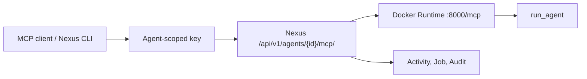

# Complete the first Agent workflow

This tutorial uses the repository's deterministic FastMCP Agent. It needs no Provider key and makes no external model call. With dependencies and the Python base image available, the target is a Docker build, Nexus deployment, and first `run_agent` result within 15 minutes.

## What you need

- A concrete context from [your first Workspace and Project](first-workspace.md).
- Nexus API started with `NEXUS_AGENT_RUNTIME_RUNNER=docker` and a reachable Docker daemon.
- Agent create, Runtime deploy, and Agent Key permission.
- The directory `nexus_server/examples/first_agent/`.

## Request path



## 1. Build and test the image locally

```powershell
cd nexus_server\examples\first_agent
docker build -t nexus-first-agent:local .
docker run --rm -d --name nexus-first-agent-smoke -p 18000:8000 nexus-first-agent:local
python smoke.py --url http://127.0.0.1:18000/mcp
docker stop nexus-first-agent-smoke
docker save -o nexus-first-agent.tar nexus-first-agent:local
```

`smoke.py` runs MCP `tools/list`, checks for `run_agent`, then runs `tools/call`. The image uses the MCP 1.25+ constructor to listen on `0.0.0.0:8000/mcp`.

## 2. Create the Agent

1. Open **Agents** and confirm a concrete Workspace and Project.
2. Click **Create agent** and enter `first_agent`.
3. Keep it private. Leave Provider empty because the sample does not call a model.

The Agent identity now exists, but no callable Runtime exists yet.

## 3. Upload and deploy the Runtime

Under **Runtime**:

1. Upload `nexus-first-agent.tar` as `v1`, or register `nexus-first-agent:local` when Server shares the build daemon.
2. Set it Current and click **Deploy**.
3. Wait for Deployment `active`, run **Health**, and confirm `healthy`.

Server runs it with a read-only filesystem, temporary `/tmp`, dropped capabilities, memory/PID limits, and a random host port. The image needs an explicit tag/digest and Streamable HTTP MCP at `/mcp`.

## 4. Create access and call

Under **Access**, create an Agent Key, save its one-time plaintext, and export MCP config. An MCP client lists `run_agent` and can call it with:

```json
{
  "task": "first call",
  "context": "source=nexus-docs",
  "mode": "verify"
}
```

Or install the repository CLI and use UUIDs from Console:

```powershell
cd nexus_client
python -m pip install -e ".[dev]"
nexus init --base-url http://127.0.0.1:8000
nexus login --email <admin-email> --password <password>
nexus tenant use <workspace-uuid>
nexus project use <project-uuid>
nexus agent mcp call <agent-uuid> --task "first call" --context "source=nexus-docs" --mode verify
```

The result should include `mode=verify`, `task=first call`, and `attachments=0`.

## 5. Verify runtime, audit, and charges

1. Find the call or error under Agent **Activity**.
2. Match deployment, Health, and call by time/Request ID in Observability Jobs/Audit.
3. Open **Billing → Usage → Public Agents**. No row is expected for a private unpriced local call; metered Usage begins after priced publication and consumption.

## OpenWrt IPv6 alternative

With your own IPv6 Router, skip rented Docker runtime: issue a pairing code, let OpenWrt register, bind the unclaimed registration, and run Health. OpenWrt manages the process while cloud validates IPv6, Edge JWT, and Device TLS. See [connect an OpenWrt IPv6 Agent](../guides/connect-openwrt.md).

## State and money impact

| Action | Success | Platform charge? |
| --- | --- | --- |
| Create Agent/upload image | Agent private, Image current | No |
| Deploy/Health | active, healthy | Control action does not create Marketplace Usage |
| Private sample call | `run_agent` result | No public Agent Usage by default |
| Publish + consumed call | public/listed and successful | Can create Spending/Earnings from price |

## Permission boundaries

- Agent Key is for this Agent. Gateway and Remote CLI keys are different credentials.
- Never bake Provider keys, passwords, tokens, or private certificates into the image.
- Read-only Share cannot replace images, deploy, or create keys.
- OpenWrt binding sees only unclaimed registrations visible in the current context.

## Verification checklist

- Local smoke passes both `tools/list` and `tools/call`.
- Agent appears under My agents with active Deployment and healthy status.
- The Nexus call returns deterministic content and Activity/Audit has evidence.
- The guide explains why private unpriced usage has no Billing row.

## Troubleshooting

- **Local smoke fails:** require MCP 1.25+, verify constructor host/port/path, and inspect container logs.
- **No Deploy:** no Current image or insufficient permission.
- **MCP endpoint did not become ready:** container is not listening on `0.0.0.0:8000/mcp` or starts too slowly.
- **MCP returns 401/403:** inspect Agent Key, Workspace, Project, and Key Policy.
- **No OpenWrt registration:** it expired, is already bound, or Device TLS registration is incomplete.

## Current limits and next step

The sample proves connectivity, not model inference, persistent Memory, or multimodal media hosting. Continue to [Provider→Router](../tutorials/provider-router-api.md) or [publish and reconcile Billing](../tutorials/marketplace-billing.md).
