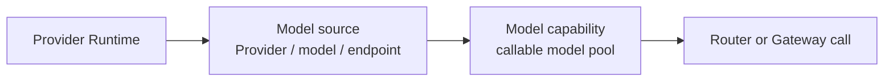

# Model Pool

Model Pool separates the model capability a client calls from the Provider endpoint that supplies capacity. A **Model capability (Model Group)** is the callable pool; a **Model source (Deployment)** is a Provider-backed endpoint inside that pool.

## Add a model source

1. Start a Provider Runtime in [Providers](../providers/index.md) and pass its health check.
2. Open **Model Pool → Add model source**.
3. Select an active runtime that is not already bound, then set Provider, model, endpoint, price, and visibility.
4. Select or create the target Model capability.
5. Save and run the source health check.

Starting a Provider Runtime does **not** create a source automatically. A runtime can have only one active source binding; if it is missing from the selector, check whether another source already uses it.

## Configure routing inside a pool

| Strategy | Behavior |
| --- | --- |
| `fallback` | Try sources in `fallback_order` |
| `best_health` | Prefer the source with better current health |
| `lowest_cost` | Prefer the lowest-cost available source |
| `lowest_latency` | Prefer the lowest-latency available source |
| `weighted` | Distribute across available sources by weight |

Each source binding also has `enabled`, `priority`, `weight`, and `fallback_order`. Disabled bindings are excluded. A Router chooses across pools; the selected pool still chooses its source with this policy.

## Operations and lifecycle

- A capability can remain healthy while at least one source is healthy; it is disabled when every source is disabled.
- Editing a source changes its Provider, model, endpoint, price, or visibility without changing the source ID.
- **Disable** temporarily removes capacity. **Delete** soft-deletes the source, pool and Community links, and clears the runtime reference.
- Deleting a source does not delete its Provider Account or Provider Runtime.
- A Provider Runtime must become a Model Pool source before it can be published as a Community Provider listing.

## Verification and troubleshooting

After a change, check both **Model capabilities** and **Model sources**: the capability should show the intended strategy, and the source should show the correct health, price, and visibility.

- **Runtime is not selectable:** it must be active and have no active `deployment_id`.
- **Pool is unhealthy:** health-check each source, then inspect the Provider Account, endpoint, and credential.
- **Unexpected source is selected:** inspect the pool strategy and source enabled/priority/weight/fallback order, plus the upstream [Router](../routers/index.md) strategy.
- **Marketplace entry disappears after deletion:** this is expected because deleting a source removes its Community links.

Current non-goals include Provider credential rotation, native Provider quota enforcement, and a public model catalog outside Workspace/Tenant context. See [Access](../access/index.md) for sharing and authorization.
