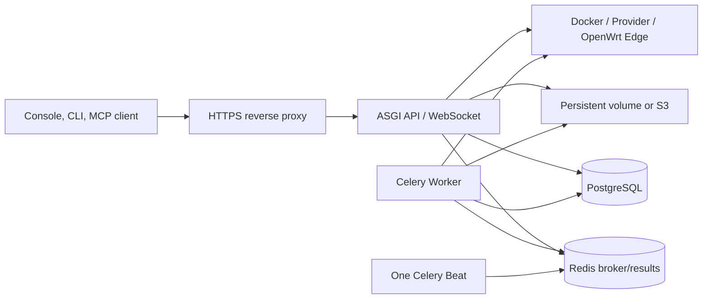

# Production readiness architecture

Production Nexus is not one web process. API, asynchronous jobs, scheduling, database, object storage, and edge certificates form one control plane. Omitting a stateful component can leave the Console login working while deployments, health, billing, or recovery silently stop.

## Components and data flow

| Component | State or work | User impact when stopped |
| --- | --- | --- |
| ASGI API | REST, Console session, Computer WebSocket | Login, Console, and calls fail |
| PostgreSQL | Workspaces, resources, access, ledgers, audit, jobs | Control plane stops; restore this first |
| Redis | Celery broker and result backend | New jobs queue and completion stops updating |
| Worker | Deployments, health, metrics, asynchronous work | API may accept work that never completes |
| Beat | Periodic health, metrics, alerts, settlement | Schedules stop; multiple Beats duplicate work |
| Dataset storage | Uploaded objects and Release content | Metadata exists but files cannot be read |
| Edge PKI | Device TLS and Edge JWT trust | OpenWrt registration or calls fail |

## Launch gates

- **Identity:** production secret replaced; secure cookies, CSRF origins, and allowed hosts are exact.
- **State:** PostgreSQL and Dataset storage are persistent, encrypted, backed up, and restore-tested.
- **Tasks:** `CELERY_TASK_ALWAYS_EAGER=0`, at least one Worker, exactly one Beat.
- **Network:** HTTPS, WSS, Provider egress, and Edge IPv6/mTLS paths are tested separately.
- **Observability:** alert on API, Worker, Beat, queue wait, job failure, database, and storage.
- **Release:** one migration job, matching Console/API artifacts, and retained rollback artifacts.

## Capacity and availability

API replicas must share the same secrets, database, Redis, and storage. Workers can scale with job volume. Beat stays single-instance unless an external scheduler provides leader election. A Docker runner tied to a local daemon cannot assume that any replica can manage containers created on another host.

Capacity tests should watch request P95, database connections, Redis wait, Job duration, Provider latency, and Dataset throughput, not CPU alone.

## Security boundaries

- The proxy terminates public TLS. Edge Device TLS trusts only the device CA and passes verified identity safely to Server.
- Rotate Provider, payment, Dataset, and PKI secrets separately.
- Runtime runners can start processes or containers and need isolation from ordinary API users.
- Audit is evidence, not secret storage; logs must stay redacted.

## Verification

Save a launch evidence bundle with version, migration record, health response, Worker/Beat heartbeat, test Job, WebSocket 101, object read/write, backup ID, restore test time, and alert test.

## Troubleshooting

- **API works but jobs do not:** follow ASGI → Redis → Worker → external runtime.
- **A job runs twice:** inspect Beat replicas and infrastructure schedules.
- **Files vanish intermittently:** verify every replica uses one persistent volume or bucket.
- **Only some replicas reach OpenWrt:** compare CA bundles, client certificates, and Edge JWT Key IDs.

## Current limits

Nexus does not include a Kubernetes Operator, distributed lock service, database replication, or cross-region disaster recovery. The deployment platform supplies those capabilities; verify them with [production deployment](../guides/production-deployment.md), [backup and restore](backup-and-restore.md), and [upgrade and rollback](upgrade-and-rollback.md).
