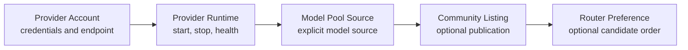

# Providers

Providers turn upstream model accounts into capacity Nexus can run, route, and bill. The page follows Connect → Operate → Publish, but it manages several independent objects.

## Object model

| Object | Contains | Deletion effect |
| --- | --- | --- |
| Provider Account | Provider, account ID, endpoint, authentication, commercial rate | Dependent runtimes may stop |
| Provider Runtime | Runtime type, model, status, health | Stops serving; unpublish first |
| Model Pool Source | Provider-backed source in one Model Group | Removes a routing source, not the account |
| Community Listing | Public price, quota, trust, and terms | Removes Marketplace/Router discovery |

## Connect an account

Use **Providers → Accounts → Add provider account**. API-key mode targets OpenAI-compatible endpoints. Interactive login selects Codex Proxy or CLIProxyAPI flows; username/password login uses CLIProxyAPI.

Server encrypts API keys, usernames, and passwords and never returns plaintext or encrypted values. The Console flow creates the first runtime, but it does not automatically create a Model Pool Source.

## Operate a runtime

Runtimes can be created, edited, started, stopped, health-checked, and exported:

| Runtime type | Typical use |
| --- | --- |
| Direct API | OpenAI-compatible provider endpoint |
| Codex Proxy | Interactive account login |
| CLIProxyAPI | CLI or username/password login |

Starting or logging in makes a runtime available. To route model traffic, explicitly use **Model Pool → Add source** and select the runtime and Model Group.

Exported `.env` and curl snippets may contain sensitive access material. Store them in a secret manager. Computer tool setup uses the same credentials-export flow and does not persist a separate copy.

## Publish capacity

A runtime must first become a Model Pool Source before Community publication. Configure price, currency, capacity, regions, capabilities, SLA, retention, and compliance. Marketplace exposes operational evidence and commercial terms, never credentials or private endpoints.

Consumers can filter by Official, Verified, Health, Quota, success rate, P95 latency, and price.

## Add to a Router

Open a Provider listing, click **Use in router**, select a Router and Preferred/Standard/Fallback priority, review price and evidence, then add the preference. Priority changes candidate order; it does not guarantee traffic. Router strategy, health, quota, price, and other sources still decide selection.

## Health, trust, and billing

Runtime Health describes current callability. Community listings add 30-day calls, success, latency, quota, trust, and moderation evidence. Provider Pool calls debit the consumer Billing Wallet and record provider earnings. Use [Billing](../billing/index.md) Usage to switch between Spending and Earnings.

## Current limits

- No Provider credential-rotation workflow; update the account to rotate.
- Claude Messages compatibility is available; supported fields and media behavior depend on the selected model and endpoint validation.
- Candidate selection considers available quota; this is not a universal guarantee covering every upstream plan. Model catalogs retain Workspace/Tenant context.

For failures, check context and account status, run Runtime Health, confirm an explicit Model Pool Source, verify publication requirements, then inspect Router strategy and evidence. See [Computer](../environments/computer.md) and [API conventions](../reference/api.md).

## Connection imports and compatibility APIs

Provider Connections supports batch imports: obtain capabilities/template, Preview row errors, then Commit. Preview is not completed creation. Check each committed connection, login state, model refresh and Runtime health; use Repair or configuration fixes instead of repeatedly submitting the whole batch. Import files may contain credentials and must not enter public repositories or screenshots.

Alongside the existing Gateway API, compatibility endpoints include `/api/v1/openai/v1/chat/completions`, `/api/v1/openai/v1/responses`, `/api/v1/claude/v1/messages` and model lists. Image generation, edits and variations are under `/api/v1/openai/v1/images/`; availability depends on model capability and Provider configuration. Compatibility does not promise every upstream feature.
