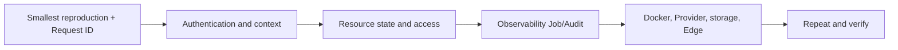

# Common troubleshooting

Narrow the failing layer before changing configuration. A useful evidence bundle contains UTC time, actor, Workspace/Project UUIDs, resource ID, HTTP status, business code, `X-Request-ID`, target state, and Job ID. Never copy JWTs, API Keys, cookies, passwords, private certificates, or complete user data.

## One investigation order

## Login, Session, and CSRF

| Symptom | Evidence | Common cause | Fix |
| --- | --- | --- | --- |
| Console login 403 | Login response, Origin, Request ID | Wrong password or Web CSRF/cookie mismatch | Separate `AUTHENTICATION_FAILED` from CSRF; use one hostname and trusted HTTPS origin |
| Refresh signs out | whoami, cookie flags, forwarded protocol | Cookie not stored, domain changed, or HTTPS not forwarded | Fix public URL, secure cookie, and proxy protocol |
| API 401 | Authorization and credential state | Missing, expired, revoked, or wrong credential type | Use a valid purpose-specific JWT/key/token |

## Workspace, Project, and 403/404

| Symptom | Evidence | Common cause | Fix |
| --- | --- | --- | --- |
| Tenant header required | Actual headers | Automation omitted Workspace UUID | Send `X-Nexus-Tenant` |
| Known resource returns 404 | Header selectors, headers, owner | Wrong context or soft deletion | Switch to the owner Workspace/Project |
| 403 | Access Explain, Role, Share, Key Policy | Valid identity lacks the action | Add the smallest Role/Share/Policy that fits |

## Docker Agent Runtime

| Symptom | Evidence | Common cause | Fix |
| --- | --- | --- | --- |
| No Deploy | Current Image, user access | No selected image or read-only access | Set Current or ask the manager to deploy |
| MCP endpoint not ready | Deployment error, container log | Not on `0.0.0.0:8000/mcp`, startup failed, no tag | Run sample `tools/list/call` smoke and fix the contract |
| Job stays queued | Job, Worker, Redis | Worker is down or broker unreachable | Restore Redis/Worker; do not hide it with eager mode |
| Health unhealthy | Container state, MCP initialize, Job | Process exited or MCP cannot respond | Fix container, port, and read-only filesystem use |

## OpenWrt IPv6 and Device TLS

| Symptom | Evidence | Common cause | Fix |
| --- | --- | --- | --- |
| No bindable registration | Lease and bound Agent | Expired, claimed, or wrong context | Pair again and select an unclaimed registration |
| Cloud cannot reach IPv6 | Numeric address, port, firewall, route | Not global unicast or ingress blocked | Repair IPv6; do not bypass validation with IPv4/DNS |
| TLS/JWT rejected | SNI, CA bundle, fingerprint, JWKS `kid` | CA/client cert/Edge JWT mismatch | Reconcile Device CA, mTLS, and RS256 as one set |

## Provider, Model Pool, and Router

| Symptom | Evidence | Common cause | Fix |
| --- | --- | --- | --- |
| Provider Health fails | Runtime error, endpoint, Account | Upstream key/model/network | Fix Account/Runtime before Pool |
| Runtime absent from Add source | Runtime and deployment_id | Not active or already bound | Start it or handle the old Source |
| `MODEL_NOT_FOUND` | Router bindings and Source health | Wrong model or no healthy candidate | Align capability and restore a Source |
| Custom Router fails | Runtime error, candidate/returned IDs | Not deployed or returned outside candidate set | Deploy it or verify with a built-in strategy |

## Computer WebSocket

| Symptom | Evidence | Common cause | Fix |
| --- | --- | --- | --- |
| Handshake returns 200 | Proxy upstream and server type | Routed to WSGI/static server | Use ASGI and forward Upgrade |
| Handshake 403 | Session, Origin, context, Machine Access | Reached ASGI but lacks identity/access | Fix context and Computer authorization |
| Disconnects immediately | ASGI/proxy log, SSH Test | Proxy timeout or target SSH failure | Adjust WebSocket timeout and test Computer separately |

## Data Asset and storage

| Symptom | Evidence | Common cause | Fix |
| --- | --- | --- | --- |
| Upload later returns 404 | Asset ID, backend, object | Context mismatch or nonpersistent object | Align context and storage root/bucket |
| Index Job fails | Content/size/decode/read code | Format, size, encoding, permission | Convert/reduce or fix storage and re-index |
| Files vanish on multiple instances | Per-instance root | Local temporary directories | Use shared persistent volume or S3-compatible storage |

## Billing and Marketplace

| Symptom | Evidence | Common cause | Fix |
| --- | --- | --- | --- |
| `BALANCE_NOT_ENOUGH` | Wallet and failed Order/Usage | Insufficient balance | Recharge, verify Ledger, retry |
| Payment Order but no balance | Order and webhook signature | Checkout is not credit; webhook failed | Fix provider/webhook, never credit manually |
| Success without Usage | Product, price, path | Private unpriced or unmetered path | Decide whether metering is expected, then inspect Gateway/Marketplace |
| Listing is absent | Visibility, health, version, moderation | Publication gate failed | Repair gate and republish |

## Worker, Beat, and schedules

- **Job queued:** inspect Redis, broker URL, Worker, and queue backlog.
- **Schedules stop:** inspect Beat, clock, and `CELERY_BEAT_SCHEDULE`.
- **Duplicate work:** run one Beat and remove duplicate infrastructure triggers.
- **Submit succeeds but work fails:** final Job state and `error_code` win over submit response.

## Verification after a fix

Repeat the smallest operation and verify HTTP, final resource state, Job, Audit Request ID, and external dependency. For calls, purchases, or publication, also check Activity, Gateway Log, deliverable, and Billing Usage. See [status and errors](../reference/statuses-and-errors.md).

## Current boundaries

Nexus does not replace monitoring for Docker, PostgreSQL, Redis, S3, Providers, or IPv6 networking. Correlate outward from Request ID/Job ID rather than repeatedly deleting and recreating resources without evidence.
