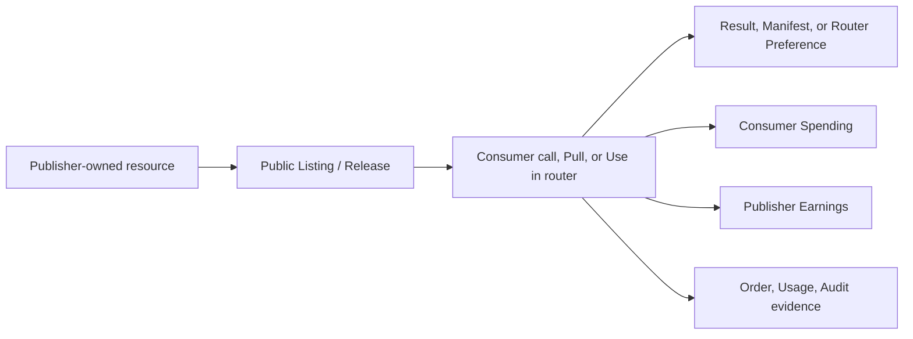

# From Marketplace publication to Billing reconciliation

This tutorial uses a publisher Workspace and consumer Workspace. You will publish a healthy governed resource, obtain or call it from the other context, then use Usage, Order, and Audit to prove delivery and charges belong to the correct parties.

## Roles and prerequisites

- Marketplace operator, publisher, Workspace Admin, or finance reviewer.
- Two distinguishable Workspaces. One is enough to rehearse publication and browsing but not cross-party earnings.
- At least one publishable resource: healthy Agent Runtime, immutable Data Asset Release, or Provider Runtime already represented by a Model Pool Source.
- Consumer permission, a concrete Project, and sufficient Wallet balance.

## Resource, right, and money flow

A Listing is not a resource copy. Unpublish blocks new discovery/acquisition but does not erase historical Orders, Usage, Audit, or immutable Release delivery records.

## 1. Select a product and pass its gate

| Product | Required before publication | Consumer action | Delivery |
| --- | --- | --- | --- |
| Agent | Active/healthy Runtime, description, price, visibility | Call/use Agent | Runtime result and call record |
| Data Asset | Collection, immutable Release, scan/consent/redaction gates | Pull Release | File Manifest and access record |
| Provider | Healthy Runtime as Model Pool Source, price/capacity/evidence | Use in router, then call | Router Preference and model response |

Start with the sample Agent from the [first Agent workflow](../getting-started/first-agent.md) because it needs no external model charge.

## 2. Publish from the publisher Workspace

1. Select the publisher Workspace and concrete Project.
2. Complete public description, version/Runtime, price, visibility, and required declarations.
3. Click **Publish** and verify Marketplace exposes operating evidence but no key, internal endpoint, or user data.
4. Record Listing/resource ID, price, currency, and publication time.

Publication itself does not move money.

## 3. Acquire from the consumer Workspace

1. Switch to the consumer Workspace and Project.
2. Find the resource by publisher or name in the matching Marketplace category.
3. Recheck price, deliverable, health, version, data, and SLA terms.
4. Call the Agent, Pull the Release, or add the Provider with **Use in router** and make a model request.
5. Save the response, Manifest, or Preference and its Request ID.

Public browsing is free. Money moves only when the product's priced consumption action executes.

## 4. Reconcile both parties

The consumer opens **Billing → Usage → Spending**. The publisher switches Workspace and opens **Earnings**. Match resource type, time, and ID:

- Amount and currency agree.
- Price is the version captured at purchase/call time.
- Usage names the correct resource and Workspaces.
- Orders/Invoices appear only for flows that create them; every call need not create an Invoice.
- Audit explains Publish, acquisition, and revocation actions.

## State and action impact

| Action | Resource state | Money/right change |
| --- | --- | --- |
| Publish | private/draft → public/listed | No charge; grants discoverability |
| Agent call | Runtime executes | Can create Spending/Earnings; delivers result |
| Data Asset Pull | Release stays immutable | Can charge; delivers Release rights in the Manifest |
| Provider Use in router | Creates Preference | Adding alone is not a call; model request meters usage |
| Unpublish | Stops new discovery/acquisition | Does not reverse history or delivery |

## Permission boundaries

- Public means discoverable, not permission to manage the underlying resource or secret.
- Publication/pricing needs resource management; consumption still checks Key Policy, Project, Wallet, and product access.
- Finance can reconcile Usage without receiving Provider credentials or Runtime management.
- TokenBank handles credit and financial settlement; it does not replace platform Billing Usage.

## Verification

- Anonymous or another Workspace sees the Listing but no secret.
- Consumer receives the deliverable and finds the operation by Request ID.
- Consumer Spending and publisher Earnings match by resource, time, and amount.
- After unpublish, new acquisition stops while historical evidence remains.

## Troubleshooting

- **Listing is absent:** inspect visibility, current version/runtime, publication gates, and moderation.
- **Can browse but not consume:** sign in, select context, and check permission and Wallet.
- **Provider is in Router but no charge exists:** Preference is not a call; send a real request and inspect both routing layers.
- **Amounts differ:** compare Workspace, filters, price snapshot, currency, and successful metering.
- **History remains after unpublish:** this is expected for audit and immutable delivery.

## Current limits and next step

Billing currently has no refund, tax calculation, invoice PDF, plan cancellation, or universal cross-module quota enforcement. See [TokenBank](/tokenbank/) for credit and external-settlement boundaries, plus [Marketplace](../marketplace/index.md) and [Billing](../billing/index.md) for product rules.
