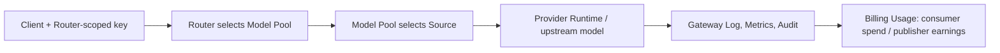

# From Provider to Router API call

You will turn an OpenAI-compatible Provider Account into a healthy Runtime, add it to a Model Pool, deploy a Router, and call it with a Router-scoped key. At the end, Observability and Billing will explain which source ran, whether it succeeded, and who paid.

## Roles and prerequisites

- Provider operator, Agent builder, or Workspace Admin.
- A concrete Workspace and Project plus a usable Billing Wallet.
- A valid OpenAI-compatible endpoint, model name, and API key.
- Permission to manage Provider, Model Pool, Router, and Gateway Key resources.

## Request and money flow



Creation and health checks do not create a model-call charge. Usage should appear only after an actual Gateway request enters metering. The upstream Provider can still bill its account separately.

## 1. Connect and verify the Provider

1. Open **Providers → Accounts → Add provider account**.
2. Choose API Key mode and enter endpoint, model, and credential.
3. Open the resulting Runtime and run **Start** and **Health**.
4. Continue only when it is active and healthy.

The Account owns the credential; Runtime represents callable capacity. Start does not create a Model Pool Source.

## 2. Build the Model Pool

1. Open **Model Pool → Add model source**.
2. Select the healthy Runtime and set model, endpoint, price, and visibility.
3. Create or select a Model capability such as `demo-chat`.
4. Save and run Source Health Check.

Model Pool chooses a Source inside the pool. Router chooses between pools. These are two separate routing decisions.

## 3. Create and deploy the Router

1. Open **Routers → Create router** and name it `demo_router`.
2. Bind `demo-chat` under **Configure router → Model Pools**.
3. Select the built-in **Priority** strategy and Apply.
4. Upload a version and **Deploy**; wait for `deployed`.

Custom `router.py` needs its own upload and deployment. Keep it out of the first end-to-end path.

## 4. Export and call

Click **Export access**, save the one-time Router-scoped key, and use the generated base URL, model, and Router ID. A minimal request looks like:

```bash
curl "$NEXUS_BASE_URL/api/v1/openai/v1/chat/completions" \
  -H "Authorization: Bearer $NEXUS_ROUTER_API_KEY" \
  -H "Content-Type: application/json" \
  -d '{"model":"demo-chat","messages":[{"role":"user","content":"Reply with: nexus ready"}]}'
```

Prefer the generated curl because its key policy is bound to this Router. A remote-operation key is not a Gateway/Router key.

## State transitions

| Object | Success state | Inspect when stuck |
| --- | --- | --- |
| Provider Runtime | active, healthy | Runtime error, Provider endpoint |
| Model Source | enabled, healthy | Account, Runtime, Health Check |
| Router | deployed | Version, Deployment, Job |
| Gateway Request | succeeded | Gateway Log, fallback/error code |
| Billing Usage | spending/earnings row | Wallet, price, successful metering |

## Permission boundaries

- Provider Secret stays on the Account and is absent from Marketplace, Router sandbox, and list responses.
- Export creates a Gateway Key restricted to the Router; plaintext appears once.
- Read-only Resource Share cannot deploy a Router or export credentials.
- Marketplace Provider Preference affects order but does not guarantee a traffic percentage.

## Verification

1. curl returns a model response rather than only a Job ID.
2. Observability finds the call by time and Request ID.
3. Gateway data shows Router, Pool, Source, latency, and success.
4. If priced, Billing Provider Pool Spending/Earnings contains the row.

## Troubleshooting

- **Export is disabled:** the Router is not deployed.
- **`MODEL_NOT_FOUND`:** model name differs from the capability or no healthy Source exists.
- **Provider 401/403:** fix Account key/endpoint; rotating the Router key cannot fix upstream auth.
- **`BALANCE_NOT_ENOUGH`:** recharge the Workspace Wallet and repeat the smallest request.
- **Success without Usage:** verify that the request used the metered Gateway path, price, and Workspace.

## Current limits and next step

Nexus provides OpenAI Chat Completions, Responses and Claude Messages compatibility endpoints. This does not imply every upstream field is supported; verify credentials, available quota and health for the selected Provider. For custom selection, continue with [Routers](../routers/index.md). [Swagger](../reference/api.md) remains authoritative for fields.
