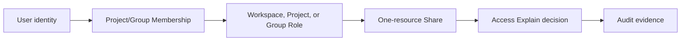

# Member access and offboarding

You will let one member access only a selected Project and Agent, prove allow/deny behavior, then revoke access without leaving an API Key, Share, or machine identity behind. Use this flow for onboarding, contractors, and offboarding audits.

## Roles and prerequisites

- Workspace Owner/Admin or a delegated access administrator.
- A Workspace, Project, and test Agent.
- The invited user already has a Nexus account and known email.
- A second resource that the member must not access for negative verification.

## Permission path

Nexus currently uses an allow-based model. Any valid path may allow the operation and there is no general explicit deny. Removing one Membership therefore does not prove complete revocation.

## 1. Invite to the Project

1. Open **Access → Invite people**.
2. Select the Project, enter the email, and choose the smallest Membership Role that fits the work.
3. Confirm member, scope, and role under **People with direct access**.

Do not grant Workspace Admin for short collaboration on one Agent.

## 2. Add a long-term Role or one-resource Share

- For long-term responsibility over a class of Project resources, use **Assign roles** with Project scope.
- For one Agent only, open its **Share** panel and create an exact Resource Share.

Use the path that matches the need. Duplicate grants make later revocation hard to prove.

## 3. Prove allow and deny

In **Access → Check access**, enter Principal, Action, Resource type, and ID:

1. Check read/call on the target Agent. It should allow and name the matching grant.
2. Run the same check on the unshared resource. It should deny.
3. Ask the member to select the same Workspace/Project and perform both operations.
4. Preserve change and verification evidence from Recent access changes and Audit.

## 4. Branch for machine identity

Create a Service Account only for unattended CI/background work. Grant the smallest Role/Share first, then issue a Token with expiry and source-IP allowlist. `sa-nexus-...` plaintext appears once. A personal API Key is not a team service identity.

## 5. Offboard completely

1. Open member details and Offboard/Review; list Memberships, Roles, Shares, API Key use, created resources, and costs.
2. Transfer Agents, Routers, Data Assets, and operational ownership that must remain.
3. Revoke Shares, Role Bindings, and Group/Project Memberships.
4. Revoke dedicated API Keys, Service Account Tokens, and Machine Access.
5. Repeat Access Explain for both resources. Both should deny.
6. Save Audit Request IDs and revocation time.

Revocation does not transfer resource ownership or settle existing charges and external Provider credentials.

## State and money impact

| Action | Access change | Moves money? |
| --- | --- | --- |
| Invite/Membership | Basic scoped access | No |
| Role Binding | A durable capability set | No |
| Resource Share | One-resource exception | No |
| Token create/revoke | Starts or stops automation | No; later calls can cost money |
| Offboard | Reviews and removes access paths | No; existing billing remains |

## Permission boundaries

- Resource visibility does not imply edit, call, or secret-export permission.
- Workspace/Project context is evaluated before Roles; a mismatch can look like 404.
- Service Account Tokens represent the service, not their creator, and need independent least privilege and rotation.
- High-risk Roles and revocations enter Audit and should use a personal admin identity.

## Verification

- Onboarding allows the target and denies the control resource, with a named Access Explain source.
- Offboarding leaves no Membership, Role, Share, or active dedicated Token.
- Resource ownership is transferred and CI is not accidentally interrupted.
- Audit links invitation, grant, verification, revocation, and final proof.

## Troubleshooting

- **Access remains after revocation:** inspect Group Membership, inherited Role, Share, Service Account, and selected context.
- **Access Explain allows but UI returns 403:** compare Action, context, and resource ID in the real request.
- **Resources have no owner:** restore a temporary admin and transfer responsibility before continuing.
- **CI stops:** a shared Service Account was revoked; use one Token per integration.

## Current limits and next step

IAM currently has no explicit deny or time/budget conditions, and not every custom Role has update/delete APIs. See [Access](../access/index.md) and [identity and request paths](../concepts/identity-and-request-path.md).
