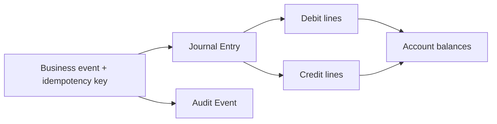

# Ledger and control model

TokenBank uses one shared control model across all eight desks. Learn it once, then apply the same questions to every financial action: who owns the value, what unit is used, is value available or locked, which policy permits the action, and what evidence proves completion?

## Billing Wallet versus TokenBank Account

| Object | Purpose | Typical contents |
| --- | --- | --- |
| Billing Wallet | Funding and spending entry point for a Nexus user or tenant | available and locked settlement balance |
| TokenBank Account | Purpose-specific internal ownership and control | credit, receivable, reserve, margin, pool, payable |

A wallet answers “what can this party fund?” An account answers “why is this amount held or owed?” They must reconcile but should not be treated as interchangeable.

## Balance, locked balance, and credit usage

- `balance` is the account total under its business meaning.
- `locked` cannot be reused while an order, margin requirement, or workflow holds it.
- `available` is derived from valid balance, locks, credit limit, and policy; it is not a free-form field.
- `credit_used` represents consumed credit and falls when receivables are paid or validly reversed.

## Double-entry journals

Every value movement produces balanced journal lines.

If business state changed without a balanced journal, or a journal exists without the expected business record, treat it as an incident.

## Locks are not settlements

Buying a market order, accepting a Forward, or reserving units may lock value. A lock reduces availability but does not yet pay the counterparty. Cancellation releases the unused lock; final settlement consumes it.

## Units never disappear

USD, token, API credit, service units, and market-right units are different. Any conversion requires a named rate, timestamp, source, rounding rule, and journal evidence. Never add balances in different units.

## Product policy and approval

Current service defaults are:

- Open: `core`, `prepaid_token`, `api_derivative`, `agent_secondary_market`, `api_provider_market`.
- Approval required: `enterprise_credit`, `token_lending`, `price_lock`, `sla_protection`, `agent_financing`, `api_provider_financing`.

Tenant and jurisdiction policy can override these defaults. Approval grants permission to proceed; it does not prove that a later settlement succeeded.

## Idempotency

One real-world action uses one stable key across retries. A timeout is a reason to query by that key, not to invent a new key. A proper retry returns or completes the original result without creating a second journal.

## Verification checklist

For every value-changing action, verify the record and status, source and idempotency key, relevant account balances and locks, balanced journal, audit event, and any downstream payable, statement, trade, claim, or external settlement evidence.

Continue with [money and rights flow](money-and-rights-flow.md) or the [status and error reference](../reference/statuses-and-errors.md).
