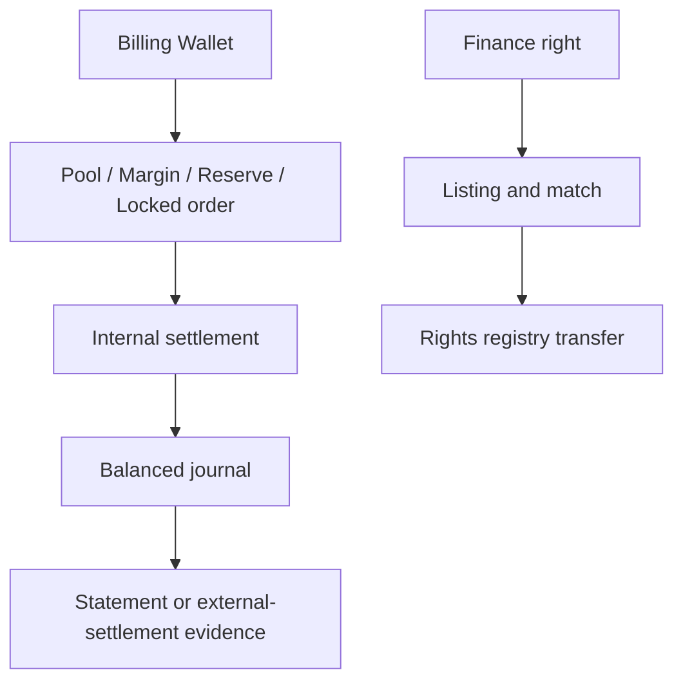

# Money and rights flow

TokenBank records several kinds of value. A clean workflow never silently turns one kind into another.

## The value map

| Value | Source | Destination | What it means |
| --- | --- | --- | --- |
| Billing balance | Nexus billing or trusted settlement event | pool, margin, reserve, order, counterparty | internal settlement capacity |
| Credit | approved limit | service usage and receivable | permission to consume before payment |
| Reserve | Provider Billing Wallet | one SLA plan | dedicated compensation capacity |
| Margin | contract party wallet | one Forward contract | collateral, not a fee |
| Receivable | confirmed service usage | customer payment or write-off | amount owed to Nexus |
| Payable | confirmed distributable revenue | participant statement/payout | amount Nexus owes internally |
| Market right | confirmed finance record | buyer rights registry | internal service/revenue entitlement |

## Three questions before an action

1. What is the source of value: wallet balance, approved credit, dedicated reserve, or confirmed revenue?
2. What is delivered: service, credit capacity, repayment, margin, compensation, or a registered right?
3. Is this action a decision, a lock, a journal settlement, or only external evidence?

## Internal versus external settlement

An internal journal can prove that TokenBank has recognized a payable. It cannot prove that a bank or payment Provider completed a fiat transfer. External settlement therefore needs a provider reference, status, timestamps, retry policy, and reconciliation evidence.

## Verification

Trace one amount end to end: source balance, lock or allocation, business record, journal, destination balance or rights registry, and final audit/external evidence. Any unexplained gap is a reconciliation issue.

## Troubleshooting

If totals differ, first group records by tenant, Unit, source event, and idempotency key. Then compare business state with journals and locks. Never combine currencies or manually overwrite a balance to make totals match.

## Boundaries

TokenBank rights are internal contractual/service records. They do not by themselves create bank deposits, securities, insurance policies, or legal title outside Nexus.

Review the [ledger model](ledger-and-controls.md) for account fields and the [eight-Desk reference](../reference/desks-and-products.md) for concrete flows.
