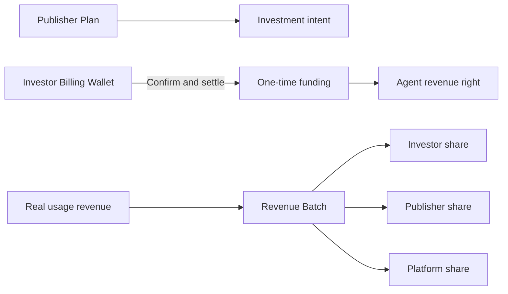
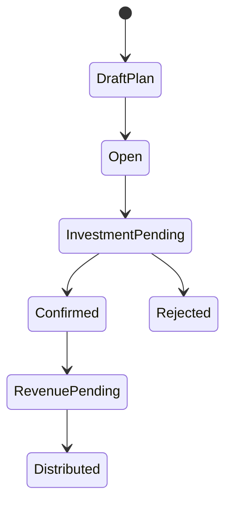

# Agent Finance

Agent Finance Desk lets a Publisher fund an Agent through one-time Billing Wallet settlement and share later verified Agent usage revenue under a Revenue Policy. It records internal service/revenue rights, not equity or public fundraising.

## Roles and prerequisites

Publisher operates an identifiable Agent; Investor funds from an authorized Wallet; Finance confirms investment; Revenue operator distributes real usage income. Fix participants, Unit, percentages, caps, and term before confirmation. `agent_financing` requires approval by default.

## Money and rights flow

## Queues

Revenue policies define distribution; Sponsorships hold investment intent/confirmation; Pending revenue holds verified but undistributed income; Batches record selected/all settlement.

## Step-by-step

1. Publisher **Creates publisher plan** for an owned Agent and Revenue Policy.
2. Investor **Invests in Agent**.
3. Finance **Confirms & settles** the one-time funding; the right becomes effective and an Agent Market Asset is created.
4. Reconcile pending revenue to real Usage/Invoice evidence.
5. **Settle selected** or **Settle all** into a Revenue Batch.

## Status flow

## Actions that move value or rights

Create plan and investment intent usually do not move value. Confirm & settle moves one-time funding and registers the right. Revenue settlement moves only verified usage revenue among participants.

## Amount example

An Investor contributes `5,000 USD`. A `1,000 USD` verified net revenue batch with `30%` Investor, `60%` Publisher, and `10%` Platform distributes `300/600/100 USD`. Percentages, rounding, and cumulative caps must reconcile to the batch.

## Permission boundaries

Publisher can plan only for an Agent it operates; Investor can use only an authorized Wallet. Confirmation and revenue settlement need separate Capabilities. Public visibility does not grant cross-tenant write access.

## Verification

Check Investor Wallet, one-time settlement journal, confirmed investment, generated Agent Market Asset, source usage, Revenue Batch, participant postings, audit, and idempotency.

## Troubleshooting

Plan failure: inspect Agent ownership and policy. Confirmation failure: inspect Wallet/Unit/capacity. Missing pending revenue: inspect Agent ID and effective time. Wrong distribution: inspect net amount, policy, rounding, and cap; never edit balances.

## Current limitations and boundaries

No equity, security, guaranteed return, or invented revenue. External collection and tax treatment are outside TokenBank.

## Plan catalog and confirmation

Public plans support server search and pagination, separately from the current caller's investment worklist. Before confirmation, inspect maker-checker controls and `record_version` to avoid settling stale details after another member changes an investment. Investment confirmation and Revenue Batch allocation are separate actions with separate funding and revenue evidence.
