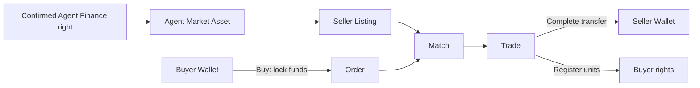
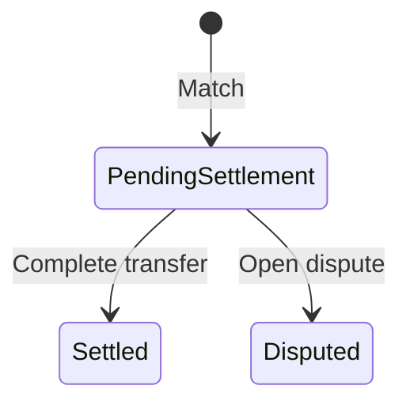

# Agent Market

Agent Market Desk transfers confirmed Agent Finance service/revenue rights within a controlled scope. The asset is an internal right unit, not company equity or a public security.

## Roles and prerequisites

Seller owns transferable Agent Asset units; Buyer uses an authorized Billing Wallet; Market operator matches; Settlement transfers; Operations handles disputes. Assets normally originate from confirmed Agent Finance investments. `agent_secondary_market` is open by default but tenant policy may restrict it.

## Money and rights flow

## Queues

Assets show ownership and available/frozen units; Listings show sell offers; Orders show buyer locks and remaining quantity; Trades show matched, disputed, and settled transfers.

## Step-by-step

1. Confirm Agent Finance investment is settled and its Asset exists.
2. Seller uses **Open sale** for no more than available units.
3. Buyer uses **Buy**; maximum payable amount is locked automatically.
4. **Sync matches** creates a Trade under the current matching rules.
5. **Complete transfer** settles money and rights atomically. **Cancel** releases unmatched funds/units.

## Status flow

This diagram describes Trade states. Order cancellation and release of unfilled quantity belong to the Order workflow. Trades have no `cancelled` enum; cancelling an order does not reverse its completed trades. Disputes block settlement; do not assume closing one automatically resumes settlement or refunds funds.

## Actions that move value or rights

Open sale locks units. Buy locks Buyer funds. Cancel releases only unmatched locks. Sync matches normally creates Trade state without settlement. Complete transfer pays Seller and registers units to Buyer.

## Amount example

Seller lists `100` units at `12 USD`. Buying `40` locks `480 USD`. If `30` settle, Seller receives `360 USD`, Buyer receives `30` units, and `120 USD` remains locked or is released when the remainder is cancelled.

## Permission boundaries

Seller cannot transfer frozen or foreign units; Buyer cannot use another party's Wallet. Matching and settlement use service Capabilities. Tenant tape must expose only authorized, sanitized market data.

## Verification

Verify Asset holdings, Listing/Order remainder, Wallet available/locked, Trade, rights registry, journal, and audit. Settlement must complete both money and rights or neither.

## Troubleshooting

Missing Asset: inspect Agent Finance confirmation and asset-creation task. Insufficient funds: inspect other locks. No match: inspect price/quantity/Checkpoint. Transfer blocked: resolve dispute, lock, or holding inconsistency first.

## Current limitations and boundaries

This is an internal rights registry and settlement feature, not a public exchange, custodian, liquidity promise, or legal securities register.

## Refresh the quote before ordering

**Buy open sale** calls `market/quote-preview/` before submitting an order with `quote_version`. Quantities in search results or older details are not reserved. On `MARKET_QUOTE_STALE`, reload the listing and confirm current price and availability rather than replaying the old order.

Authorized cross-organization catalog visibility does not grant administration of the seller's account. Writes still enforce product, caller, and record-participant checks.
