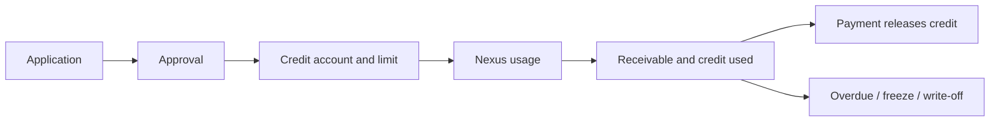
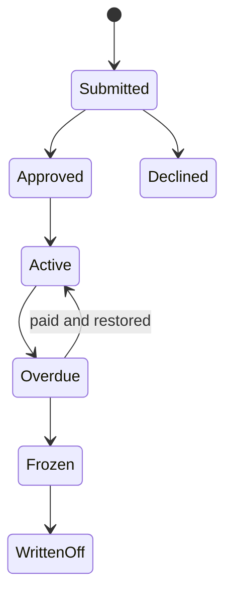

# Credit

Credit Desk controls internal Nexus service credit: an enterprise can consume approved services before paying the resulting receivable. It does not issue cash or provide a bank loan.

## Roles and prerequisites

Applicants request a limit; independent approvers decide; Billing synchronizes real usage and receivables; Risk/Admin handles overdue and write-off. Confirm tenant, Unit, Capabilities, and stable idempotency identity.

## Money and rights flow

Approval creates a credit right. Usage creates exposure and a receivable. Payment reduces both; write-off recognizes loss and is not payment.

## Queues

| Queue | Meaning | Action |
| --- | --- | --- |
| Applications | submitted decisions | Approve or Decline |
| Usage billing | usage awaiting sync/review | Sync spending & invoices |
| Overdue cases | receivables past due | collect, freeze, restore |
| Bad debt candidates | exposure eligible for review | Write off |

## Step-by-step

1. **Apply for credit** with limit, Unit, term, and purpose.
2. Approver checks identity, existing exposure, and risk evidence, then **Approve** or **Decline**.
3. After real usage, run **Sync spending & invoices**. Insufficient available credit must fail.
4. Post trusted payment evidence to reduce receivable and `credit_used`.
5. **Run overdue automation**; review freeze and bad-debt candidates before **Write off**.

## Status flow

## Actions that move value

| Action | Value effect |
| --- | --- |
| Apply / Approve / Decline | no cash movement; decides credit right |
| Sync spending & invoices | increases credit usage and receivable |
| Payment | reduces receivable and credit usage |
| Overdue automation | usually state, Alert, and freeze control only |
| Write off | transfers receivable to loss; not customer payment |

## Amount example

An approved `10,000 USD` limit with `3,200 USD` usage leaves `6,800 USD` available. Another `1,000 USD` usage leaves `5,800 USD`. A `2,500 USD` payment reduces usage from `4,200` to `1,700 USD`. Accounts, receivable, journal, and audit must explain all four amounts.

## Permission boundaries

Application, approval, billing sync, and write-off use separate Capabilities. No cross-tenant writes. Write-off and manual restoration require reason and audit evidence.

## Verification

Verify status, limit/used/available, receivable, balanced Journal Entry, Audit Event, and that the same idempotency key cannot post usage twice.

## Troubleshooting

Missing Approve: inspect Capability and state. Insufficient credit: inspect available value, payments, and Unit. Overdue without freeze: inspect task, policy, and Alert. Duplicates: trace the source event/key and compensate explicitly.

## Current limitations and boundaries

Credit handles Nexus internal service exposure, not cash lending, credit reporting, or legal collection. Tenant policy can change approval and freeze rules.
