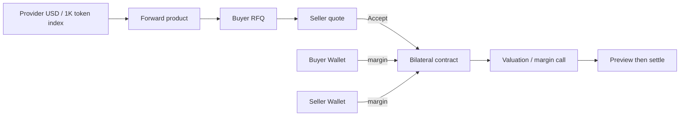
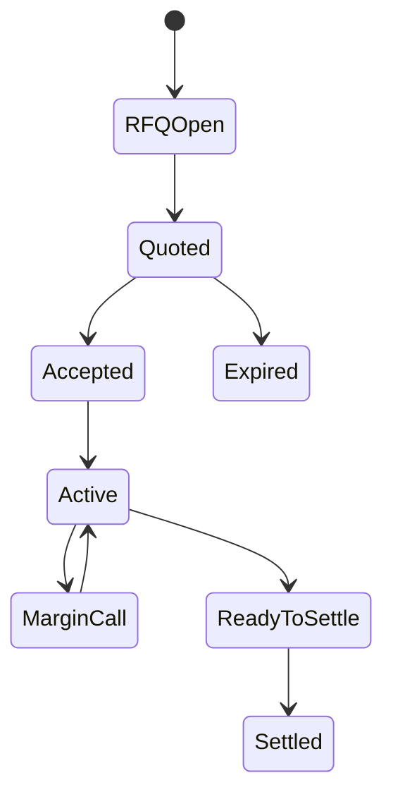

# Derivatives

Derivatives Desk uses Provider USD pricing indexes and bilateral Forward contracts to lock future Nexus API or compute service prices. The current Console focuses on Forward; it is not a public exchange or central clearer.

## Roles and prerequisites

Market operators maintain an index and product; Buyer opens an RFQ; Seller quotes; Risk and Settlement value and settle. Both parties need sufficient Billing Wallet funding for margin. `price_lock` is approval-required by default.

## Money and rights flow

## Queues

Products, Price indexes, RFQs, Quotes, Active contracts, Risk alerts, and Settlements separate product setup, bilateral negotiation, exposure, and finality.

## Step-by-step

1. Create a Provider USD price index with Provider, Unit, quotation basis, and trusted source.
2. Create a Forward product with tenor, size, and margin rules.
3. Buyer **Creates RFQ**; Seller uses **Generate quote**.
4. Buyer uses **Accept selected quote**. An underfunded quote may exist but cannot be accepted.
5. **Refresh risk**; use **Add margin** from the deficient party's Wallet.
6. **Preview settlement**, verify valuation and payer, then **Settle**.

## Status flow

## Actions that move value

Index/product/RFQ/Quote do not move value. Accept locks initial margin. Risk refresh only values and opens/updates/closes calls. Add margin transfers exact shortfall. Preview does not move value. Settle applies payer margin, transfers difference, and releases remaining margin; shortfall blocks settlement.

## Amount example

For `100,000` units, a Forward at `2.00 USD/1K` and final index `2.30 USD/1K` produces a `30 USD` difference. If payer margin available to settlement is `20 USD`, the remaining `10 USD` must be funded; settlement cannot create a negative Wallet.

## Permission boundaries

Index, product, quote, risk, margin, and settlement have separate Capabilities. Settlement operators must not rewrite historical index data to alter outcomes.

## Verification

Verify RFQ/Quote terms, both margin locks, valuation input, Margin Call shortfall, Preview versus final Settlement, balanced journal, released margin, and idempotency.

## Troubleshooting

Cannot accept: check both Wallets, expiry, and policy. No risk change: check index time and Checkpoint. Add margin failure: identify correct deficient party and Unit. Settlement blocked: fund Preview shortfall and retry the same settlement identity.

## Current limitations and boundaries

No public matching, central counterparty guarantee, external cash clearing, or legal contract enforcement is provided.

## Current quote and settlement controls

RFQ requesters cannot quote their own RFQs. Only the requester can cancel an RFQ or accept its quote. Current buttons are **Generate quote**, **Accept selected quote**, and **Cancel selected RFQ**. Check `is_executable`, both funding shortfalls, and expiry before confirmation; saving a quote does not establish funding readiness.

Preview settlement displays calculations; Settle remains a separate action. On `TOKENBANK_RECORD_STALE`, refresh rather than reuse an old confirmation summary. The settlement transaction still checks final funding state.
