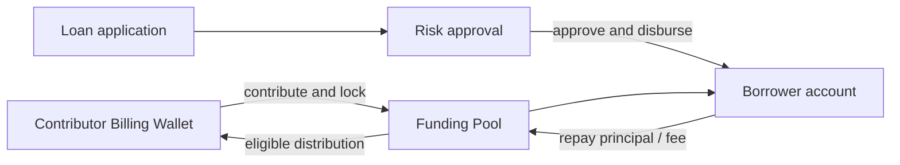
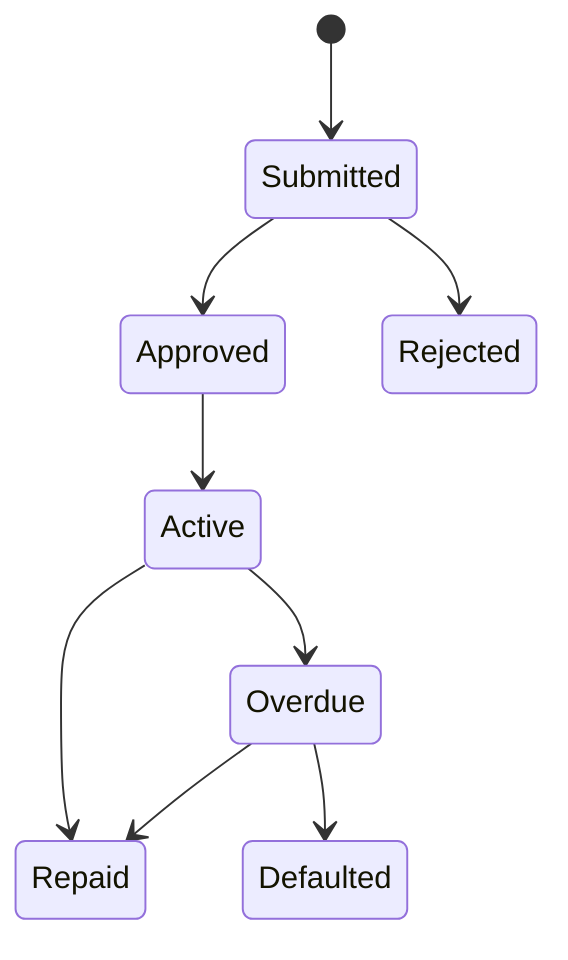

# Funding

Funding Desk moves existing Billing Wallet balance into an internal tenant pool and lends eligible value through approval. It does not accept deposits or promise principal, liquidity, or yield.

## Roles and prerequisites

Contributors acknowledge risk and lock-up; Borrowers apply; Approver/Risk decides; Operations reconciles repayment and default. Wallet available balance and Unit must be sufficient. `token_lending` is approval-required by default.

## Money and rights flow

## Queues

| Queue | Meaning | Action |
| --- | --- | --- |
| Fund account | contribution, lock-up, distributable value | Move Billing balance to pool |
| Lending | applications and active loans | Submit, Approve, Reject |
| Returns | repayment, fee, and exceptions | Submit repayment, reconcile |

## Step-by-step

1. Use **Move Billing balance to pool** and confirm amount, Unit, lock-up, and risk.
2. Borrower uses **Submit loan application**.
3. Approver verifies pool availability and terms. **Approve** also disburses; **Reject** does not move funds.
4. Use **Submit repayment** to debit the Borrower Billing Wallet and replenish pool liquidity.
5. Distribute only unallocated value after applicable lock-up. Run overdue/default controls for unpaid loans.

## Status flow

## Actions that move value

Contribution moves Wallet balance to the pool. Submit/Reject do not. Approve disburses. Repayment replenishes the pool. Overdue automation normally changes state, freeze, and Alerts rather than value.

## Amount example

A `20,000 USD` contribution gives the pool `20,000 USD` available. An approved `8,000 USD` loan leaves `12,000 USD` available and `8,000 USD` allocated. A `8,400 USD` repayment returns principal and agreed fee; contributor distribution must follow configured policy, never an assumed example yield.

## Permission boundaries

Contribution, application, approval, and manual repayment use separate Capabilities. Submit repayment debits the Borrower Billing Wallet; it is not merely an external-evidence entry.

## Verification

Verify contributor Wallet, pool available/allocated, borrower receipt, lock-up, loan, balanced journal, audit, and idempotent approval/repayment.

## Troubleshooting

Contribution failure: check Wallet/Unit/policy. Approval without visible disbursement: determine whether the transaction rolled back before retrying. Withdrawal blocked: inspect lock-up and allocated value. Duplicate repayment: inspect the original key, Wallet Ledger, and contract before retrying.

## Current limitations and boundaries

Funding is not a deposit, savings, crowdfunding, or external loan product. No return is promised unless an active policy explicitly defines it.

## Current platform controls

Pool contributions must use an Organization Billing Wallet belonging to the platform super administrator, with the contribution Capability. A tenant Admin role alone is insufficient. The current Console also gates loan approval/rejection on platform super-administrator capabilities.

Contributions use USD settled to cents, an integer lock-up of 0–3650 days, and explicit risk acknowledgement. The current Console records the yield distribution rule as `not_configured`; balance changes do not imply a fixed return.

**Submit repayment** immediately debits the wallet and posts internal repayment. Before retrying, check the original idempotency key, Wallet Ledger, and contract instead of creating a new business key. `funding_pool_maturity_payout` processes eligible maturity returns.
