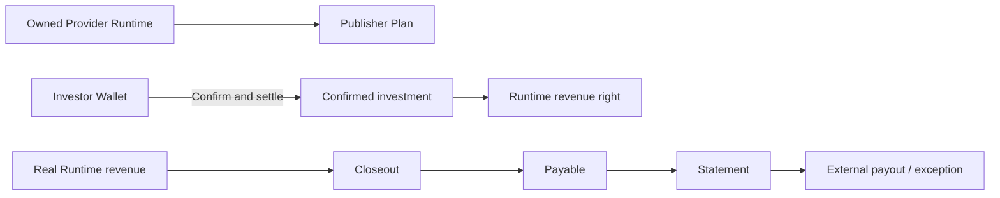
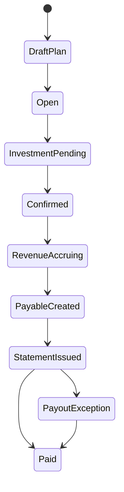

# Provider Finance

Provider Finance Desk connects investment in an owned Nexus Provider Runtime with verified Runtime revenue, Payables, Statements, and payout evidence. TokenBank does not replace the external payment Provider.

## Roles and prerequisites

Publisher must own a verifiable Provider Runtime; participants derive from that relationship. Investor funds from a Billing Wallet; Finance confirms; Revenue/Payables operators close periods and handle Payout Exceptions. `api_provider_financing` requires approval by default.

## Money and rights flow

## Queues

Plan worklist manages Runtime plans; Investment worklist manages intent and confirmation; Revenue closeout manages verified income, Payables, Statements, and external payout exceptions.

## Step-by-step

1. Publisher **Creates publisher plan** for an owned Runtime.
2. Investor invests; Finance **Confirms & settles** after Wallet, capacity, and participant checks.
3. Wait for real, confirmed Runtime revenue; no confirmed investment means no investor distribution.
4. Close the revenue period and create Payables/Statements.
5. Record **Payout exception** when the external adapter fails or manual proof is required.

## Status flow

## Actions that move value

Plan/investment intent usually does not move value. Confirm & settle moves one-time investment. Revenue closeout allocates confirmed revenue and creates Payable. Statement issuance does not pay externally. Exception records uncertainty; trusted Provider confirmation establishes external evidence.

## Amount example

A `20,000 USD` investment and `8,000 USD` period net revenue with `25%` Investor, `65%` Publisher, `10%` Platform creates `2,000/5,200/800 USD` Payables. If the `5,200 USD` payout fails, retain the Payable and Payout Exception; do not mark it Paid.

## Permission boundaries

Runtime ownership gates plan creation. Investment, confirmation, closeout, and exception handling use separate Capabilities. A cross-tenant visible plan is not cross-tenant write authorization. Issued Statements require explicit correction, not silent edits.

## Verification

Verify Runtime ownership, investment journal, source revenue, Revenue Batch, Payable, Statement, Provider reference, exception, audit, and that participant plus rounding totals equal distributable revenue.

## Troubleshooting

Runtime unavailable: inspect ownership/tenant/state. Closeout blocked: inspect confirmed investment, source revenue, and Checkpoint. Statement mismatch: compare batch version and correction. Long payout exception: reconcile adapter/provider evidence before changing state.

## Current limitations and boundaries

No equity, principal guarantee, or external payment finality. TokenBank proves internal state and recorded Provider evidence only.

## Investment confirmer and record version

**Confirm & settle investment** requires an authorized member of the Publisher Organization who did not submit the investment. Inspect `can_confirm` and the record's control message, then use an eligible account.

Confirmation carries `record_version`. On `TOKENBANK_RECORD_STALE`, recheck the plan, investment amount, and state. Searchable public plans do not grant every viewer permission to confirm investments or edit plans.
