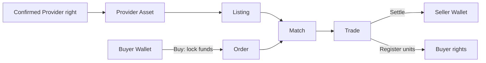
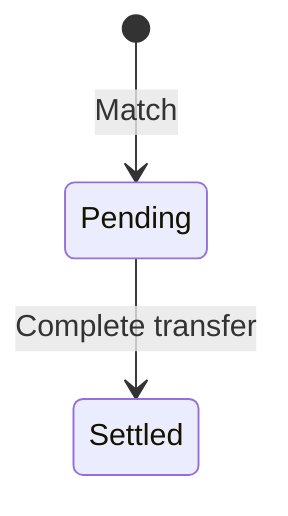

# Provider Market

Provider Market Desk transfers registered Provider Runtime service/revenue rights inside controlled tenant policy. It is not Provider company equity or a public exchange.

## Roles and prerequisites

Seller owns transferable Provider Asset units; Buyer uses its Billing Wallet; Market operator matches; Settlement transfers money and rights. Only available units may be sold. `api_provider_market` is open by default, subject to tenant and jurisdiction override.

## Money and rights flow

## Queues

Assets track holdings; Listings track sell offers; Orders track buyer locks; Trades track pending and settled transfers.

## Step-by-step

1. Verify Provider, right type, Unit, owner, and available units.
2. Seller uses **Open sale** with quantity, price, and expiry.
3. Buyer uses **Buy**; Billing Wallet value is locked.
4. **Sync matches** creates a matching Trade.
5. **Complete transfer** atomically pays Seller and registers Buyer rights. Cancelling unmatched quantity releases locks.

## Status flow

## Actions that move value or rights

Open sale locks Seller units; Buy locks Buyer funds; Cancel releases unmatched resources; Sync matches normally does not settle; Complete transfer changes Wallets and the rights registry.

## Amount example

Seller lists `200` of `1,000` units at `5 USD`. Buying `80` locks `400 USD`. Settlement gives Seller `400 USD`, Buyer `80` units, and reduces Seller available holdings by `80`; any fee appears as a separate journal line.

## Permission boundaries

Seller can list only owned available units; Buyer can fund only from authorized Wallet. Matching and settlement require service Capabilities. Dispute controls cannot be bypassed by an admin shortcut.

## Verification

Verify Asset, Listing, Order, Trade, Wallet available/locked, both holdings, fee journal, audit, and idempotent Trade settlement.

## Troubleshooting

Listing rejected: inspect owner/frozen units/policy. Unexpected Wallet: reconcile all order locks and Unit. No Match: inspect price, quantity, and Checkpoint. Pending transfer: inspect participant permissions, order locks, and balances before settlement.

## Current limitations and boundaries

Internal rights only: no corporate ownership, public liquidity, custody guarantee, or legal title transfer. Tenant Override may close the product.

## Refresh the quote before ordering

**Buy open sale** calls `market/quote-preview/` before submitting an order with `quote_version`. Quantities in search results or older details are not reserved. On `MARKET_QUOTE_STALE`, reload the listing and confirm current price and availability rather than replaying the old order.

Authorized cross-organization catalog visibility does not grant administration of the seller's account. Writes still enforce product, caller, and record-participant checks.

## Provider trade states

Only `active` sales can be bought, and callers cannot buy their own Provider sales. Only `open` orders can be cancelled. Complete transfer accepts `pending` trades and produces `settled`. Provider trades do not currently have Agent trades' `disputed` state; investigate using this product's states and locked-fund evidence.
