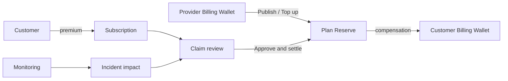
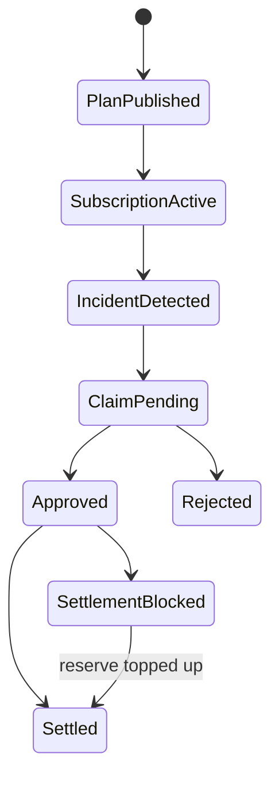

# SLA

SLA Desk connects Provider service commitments, plan-dedicated reserves, customer purchases, monitoring incidents, Claim review, and internal compensation. It is not insurance or an external cash indemnity promise.

## Roles and prerequisites

Provider publishes a Plan and prepays Reserve from its Billing Wallet; Customer buys protection; Monitoring supplies trusted incident evidence; Reviewer decides; Settlement pays from that Plan Reserve. `sla_protection` requires approval by default.

## Money and rights flow

A premium purchases protection but does not automatically increase underwriting Reserve. Compensation comes only from the issuing Plan's dedicated Reserve.

## Queues

Plans define terms; Subscriptions track customer coverage; Provider plans track issuance; Reserves track dedicated capacity; Workflow tasks track work; Workflow cases connect Incident, impact, Claim, review, and settlement.

## Step-by-step

1. Provider **Publishes Provider plan**, transferring initial Reserve from its Wallet.
2. Customer **Buys Protection** for an eligible service and window.
3. Provider may **Top up reserve**.
4. Monitoring turns Target/Probe evidence into Incident and subscription impact, generating reviewable Claims.
5. Reviewer validates coverage, window, impact, formula, and cap.
6. Settlement **Settles claim** from that Plan Reserve to Customer Billing Wallet.

## Status flow

Auto-generated Claims remain auditable review workflow. Even if policy auto-approves a small Claim, settlement is a separate recorded transition.

## Actions that move value

Publish transfers initial Reserve. Buy Protection charges Premium but does not automatically top up Reserve. Top up moves Provider Wallet value to Reserve. Incident/Review does not move value. Settle Claim moves compensation from the issuing Plan Reserve to Customer Wallet.

## Amount example

Provider prepays `10,000 USD` Reserve. Customer pays `200 USD` Premium; Reserve remains `10,000 USD` under the dedicated funding rule. An approved `750 USD` Claim leaves Reserve `9,250 USD` and adds `750 USD` to Customer Billing Wallet.

## Permission boundaries

Provider can publish for its own service; Customer can buy accessible plans. Monitoring, review, and settlement require distinct Capabilities. Reviewer must not rewrite Probe evidence or formulas.

## Verification

Verify Plan ownership, Reserve journal, Subscription window, Probe/Incident, Claim calculation, approval audit, Settlement journal, Customer Wallet, and idempotent Claim settlement.

## Troubleshooting

Publish blocked: check Provider Wallet, initial Reserve, and policy. No Claim: check coverage window, Target/Probe, and Checkpoint. Wrong amount: recompute from source impact/formula/cap. Approved but blocked: top up the correct Plan Reserve and retry the same Claim.

## Current limitations and boundaries

No insurance underwriting, external cash claim, or legal dispute enforcement. TokenBank provides internal service compensation under current Nexus plan rules only.

## Handle claims from Workflow tasks

Select a `sla_review_claim` task in **Workflow tasks** and run **Review selected claim**. After approval, select `sla_settle_claim` and run **Settle selected claim**. The action targets the referenced Claim, not the Case ID. **Workflow cases** shows overall progress without generic claim/complete-task buttons.

**Top up plan reserve** acts on a selected plan in **Provider plans**. Initial publication already transfers the reserve; its Reserves row is evidence of that same transfer, not a second charge.
